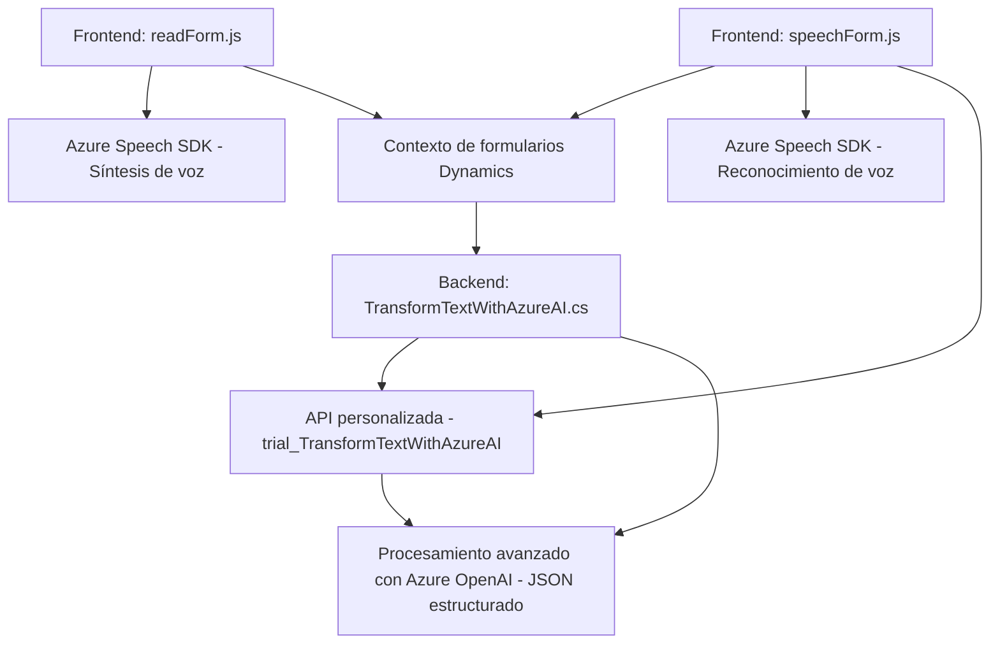

### Análisis del repositorio

---

#### **Breve resumen técnico**
El repositorio contiene diferentes componentes que interactúan entre sí para integrar funcionalidades de reconocimiento, síntesis y procesamiento de voz con datos dinámicos en un entorno de Microsoft Dynamics CRM, utilizando servicios externos de Azure Speech SDK y Azure OpenAI.

Los archivos analizados cubren tres áreas principales:
1. **Frontend:** Trabaja en la gestión de interacción del usuario con formularios dinámicos mediante síntesis y reconocimiento de voz.
2. **Backend Plugin:** Ejecuta transformaciones y procesamiento avanzado de texto usando Azure OpenAI para interpretar datos y generar respuestas estructuradas.

---

### **Descripción de arquitectura**
La arquitectura del sistema se basa en una combinación de integración externa, procesamiento dinámico y comunicaciones síncronas. Principalmente, sigue los siguientes patrones:
1. **Cliente-servidor extendido:** Los archivos de frontend funcionan como intermediarios entre el usuario y el framework subyacente (Dynamics 365). En el backend, los plugins amplían capacidades del servidor.
2. **Event-driven:** El procesamiento en Dynamics CRM se basa en eventos que activan los plugins al interactuar con formularios CRM.
3. **Service-Oriented Architecture (SOA):** Se utiliza Azure Speech SDK y Azure OpenAI como servicios externos para síntesis y análisis de texto.
4. **Componentes desacoplados:** Los archivos están organizados como módulos que cumplen roles específicos (reconocimiento de voz, síntesis y procesamiento en combinación con Dynamics CRM).

---

### **Tecnologías usadas**
1. **Frontend JS archivos:**
   - **Azure Cognitive Services - Speech SDK:** Para síntesis y reconocimiento de voz.
   - **JavaScript:** Lenguaje principal para el desarrollo dinámico del frontend.
   - **FormContext API de Dynamics CRM:** Para la manipulación del formulario dinámico.

2. **Backend plugin:**
   - **.NET Framework (C#):** Lenguaje principal para los plugins.
   - **Microsoft Dynamics CRM SDK:** Extensiones para integración nativa con Dynamics.
   - **Azure OpenAI + REST API:** Para procesamiento avanzado de texto.
   - **Newtonsoft.Json:** Manejo de estructuras JSON.

3. **Entorno general:**
   - **Microsoft Dynamics 365 CRM:** Plataforma base sobre la cual están diseñados los componentes.
   - **Azure (Speech & OpenAI):** Servicios externos utilizados como complementos de procesamiento inteligente.

---

### **Diagrama Mermaid**

---

### **Conclusión final**
El repositorio está claramente diseñado para integrar funcionalidades avanzadas de voz y procesamiento basado en IA dentro de Microsoft Dynamics CRM. Los componentes frontend gestionan la interacción del usuario con el formulario, mientras que el backend extiende el modelo de datos nativo del CRM con procesamiento avanzado proveniente de servicios cloud (Azure Speech y OpenAI).

Este enfoque sigue una arquitectura modular aplicando principios de integración SOA y event-driven. La elección de componentes es adecuada para entornos empresariales que buscan enriquecer sus capacidades dinámicas mediante servicios cognitivos.

La solución, aunque funcional, presenta dependencia explícita de Azure y Dynamics, lo que la hace altamente especializada. Sin embargo, esta misma especialización garantiza una integración fuerte en ecosistemas empresariales basados en Microsoft.