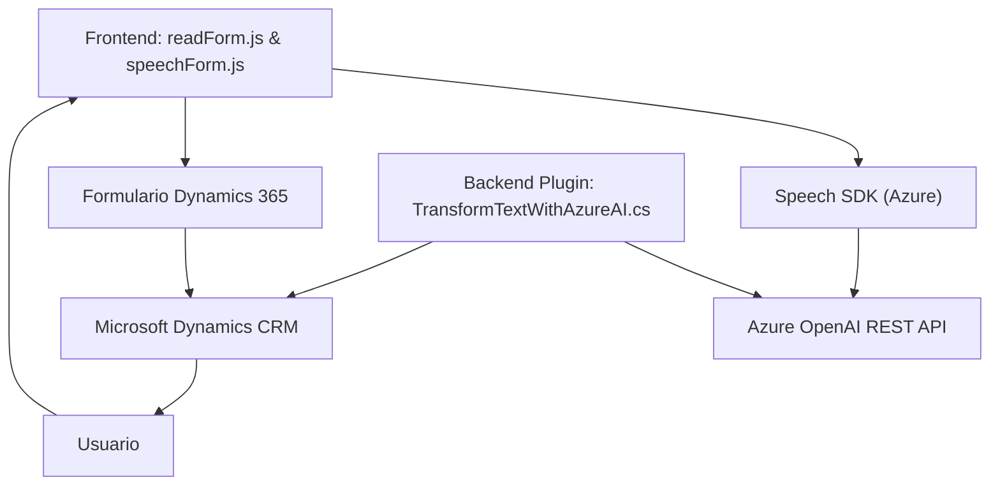

### Breve resumen técnico
El repositorio analiza tres archivos que definen diversas funcionalidades de una solución tecnológica integrada. La solución utiliza servicios de Azure como Speech SDK y OpenAI, combinado con Dynamics 365 para realizar tareas que permiten entrada y salida de datos mediante voz o texto. Los archivos presentan funcionalidades para la manipulación de formularios y uso de habilidades de IA en el backend.

---

### Descripción de arquitectura
1. **Tipo de solución:**  
   - Es una solución híbrida que integra frontend (entrada de voz y manipulación de formularios) con una lógica backend basada en plugins y servicios de API para procesar datos en la nube y en CRM Dynamics 365.

2. **Arquitectura utilizada:**  
   - La solución exhibe una **arquitectura de n capas** orientada a la modularidad:
     - **Capa de presentación:** Interfaz web que interactúa con Speech SDK para entrada/salida de voz. 
     - **Capa lógica:** Contiene scripts frontend (`readForm.js` y `speechForm.js`) para procesamiento de datos en formularios y generación de voz. También utiliza un plugin `.NET` para ejecutar AI en el backend.
     - **Capa de integración/APIs:** Servicios de Azure Speech y OpenAI conectados mediante HTTP.
     - **Capa de persistencia/Dynamics CRM:** Manejo de datos estructurados usando SDK de Dynamics 365.

---

### Tecnologías usadas:
1. **Frontend y lógica de cliente:**
   - **JavaScript** para manejar APIs del SDK de Azure Speech.
   - Integración con Dynamics 365 para manipular formularios (XRM SDK).

2. **Backend:**
   - **C# con .NET Framework**, implementando plugins que usan el `Dynamics CRM SDK`.

3. **Servicios externos:**
   - **Speech SDK (JavaScript Browser)** para reconocimiento de voz y síntesis de texto.
   - **Azure OpenAI (GPT)** para transformación avanzada de textos.

4. **Patrones de diseño y arquitectura:**
   - **Modularización:** El código está dividido claramente por responsabilidades.  
   - **Service-Oriented Architecture:** Conexión entre servicios de nube (Azure Speech y OpenAI).
   - **Plugin-Based Architecture:** Plugins de Dynamics CRM para extender funcionalidades CRM.

---

### Dependencias o componentes externos
1. **Azure SDKs:**
   - Speech SDK para JavaScript.
   - OpenAI GPT (mediante HTTP).

2. **Dynamics CRM SDK:**  
   - Gestión interna de datos y operaciones en formularios Dynamics 365. 

3. **Librerías auxiliares internas:**
   - `System.Net.Http` para peticiones HTTP en C#.
   - `Newtonsoft.Json` para manipulación JSON.

---

### Diagrama Mermaid válido para GitHub Markdown:

---

### Conclusión final
La solución se utiliza para integrar funcionalidades avanzadas de inteligencia artificial y capacidades de reconocimiento de voz con Dynamics CRM. Su arquitectura de n capas facilita la modularización y escalabilidad, mientras que los servicios de Azure (Speech SDK y OpenAI) complementan la capacidad de procesamiento avanzado remoto. Es un diseño sólido, bien estructurado y adecuado para organizaciones que busquen automatizar y potenciar procesos internos basados en IA.