### Breve resumen técnico
El repositorio implementa tanto una solución de interacción con formularios mediante síntesis de voz (frontend) como un plugin para integración con Microsoft Dynamics CRM y Azure OpenAI (backend). Los componentes trabajan en conjunto sobre una arquitectura modular.

---

### Descripción de arquitectura
La solución presenta una arquitectura híbrida, donde el frontend funciona como una capa externa de entrada y procesamiento en vivo, interactuando con servicios de Azure Speech SDK y APIs de Microsoft Dynamics CRM, lo cual se indica una arquitectura **orientada a servicios**. El backend consta de un **plugin basado en la arquitectura de Dynamics CRM**, que realiza el procesamiento avanzado de texto mediante Azure OpenAI.

Los componentes interactúan de la siguiente manera:

1. **Frontend**:
   - Utiliza el SDK de Azure Speech para la interacción mediante voz.
   - Procesa comandos y los comunica al sistema CRM.

2. **Plugin en el backend**:
   - Procesa las solicitudes de Dynamics CRM.
   - Envía datos a Azure OpenAI para transformación.

---

### Tecnologías, frameworks y patrones usados
1. **Frontend**:
   - **Azure Speech SDK (JavaScript)**: Para síntesis y reconocimiento de voz.
   - **JavaScript puro**: Para manipulación DOM y lógica personalizada.
   - **Asincronía** (`async/await`): Gestión y optimización de solicitudes a servicios externos.
   - **Separación de responsabilidades**: Funciones separadas para extracción de datos, validación, síntesis de voz, y aplicación al contexto del formulario.

2. **Backend**:
   - **Azure OpenAI**: Transformación avanzada de texto.
   - **Dynamics CRM Plugin Framework**: Extensión del CRM utilizando el patrón Plugin.
   - **Libraries**:
     - `Microsoft.Xrm.Sdk`: Integración con CRM.
     - `Newtonsoft.Json`: Serialización/Deserialización de JSON.
     - `System.Net.Http`: Para hacer solicitudes HTTP API.

3. **Patrones de diseño**:
   - **Integración externa**: A través de SDK de Azure Speech y OpenAI para ampliar la funcionalidad de la solución.
   - **Inyección de dependencias**: Uso de `IServiceProvider` en el plugin de Dynamics CRM.
   - **Modularidad**: Funciones bien separadas por responsabilidad.

---

### Dependencias o componentes externos
- **Frontend**:
  - Azure Speech SDK (JavaScript, cargado dinámicamente).
  - Microsoft Dynamics CRM Web API para aplicar los cambios en los formularios de usuario.

- **Backend**:
  - Azure OpenAI para transformación avanzada de texto.
  - Dependencias de Dynamics CRM (`Microsoft.Xrm.Sdk`, API `online.execute`).
  - API personalizable para buscar y aplicar valores a campos.

---

### Diagrama Mermaid

```mermaid
graph LR
    A["Frontend: User interaction via Speech SDK"]
    B["getVisibleFieldData() -> Extract form information"]
    C["Azure Speech SDK"]
    D["sendVoiceCommands to CRM API"]
    E["Microsoft Dynamics CRM Plugin"]
    F["Azure OpenAI -> Transform text"]
    G["Apply structured result to form from Plugin"]

    A --> B
    B -- Access SDK --> C
    C -- Voice Commands --> D
    D -- Process plugin logic --> E
    E -- Use external AI --> F
    F -- Return structured JSON --> G
    G -- Send updates --> D
```

---

### Conclusión final
El repositorio integra una solución modular y orientada a servicios para interacción basada en voz junto con procesamiento avanzado de texto mediante inteligencia artificial. La arquitectura combina el uso de SDKs externos (Azure Speech, OpenAI) y la plataforma de Dynamics CRM, permitiendo una comunicación fluida entre usuario y backend. Aunque funcional, la solución puede mejorar en términos de seguridad (como ocultar claves de API) y resiliencia ante fallos de conexión. Es una implementación adecuada para aplicaciones empresariales que requieran interacción por voz y transformación avanzada de datos.