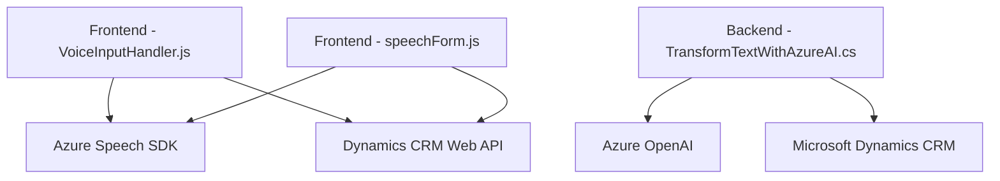

### Breve resumen técnico
El repositorio contiene componentes para un sistema de interacción entre Dynamics CRM y servicios de AI, dividido en funcionalidades frontend (integración con Azure Speech SDK para voz y transcripción) y backend (procesamiento dinámico de texto mediante Azure OpenAI). Se utiliza Dynamics CRM como plataforma base con integraciones a Azure para síntesis y procesamiento de voz, además de transformación de texto.

Esta solución presenta una arquitectura modular distribuida:
- **Frontend**: Usa JavaScript para sintetizar y transcribir información en tiempo real.
- **Backend**: Implementa un plugin `.NET` para procesar datos y conectarse a APIs externas de Azure OpenAI.

---

### Descripción de arquitectura
La arquitectura general es **de múltiple integración con servicios externos**:
1. **Frontend**: Modular, distribuido por funcionalidades.
   - Usa patrones como delegación, carga dinámica y adaptador para conectar a Azure Speech SDK y Dynamics.
2. **Backend**: Implementación basada en eventos para Dynamics CRM mediante un plugin `.NET` que actúa como puente para conectarse a Azure OpenAI.
3. Está orientada a **n-capas**, con:
   - Una capa de interacción visual (frontend).
   - Una capa de procesamiento (backend plugins en Dynamics CRM).
   - Una capa externa (servicios de Azure SDK y Azure OpenAI).

---

### Tecnologías usadas
1. **Frontend**:
   - JavaScript: Funciones asincrónicas, funciones para manejo dinámico de SDK y datos.
   - Azure Speech SDK: Cargado dinámicamente para síntesis y transcripción de voz.
   - Dynamics CRM APIs: Para la interacción con atributos de formularios.

2. **Backend**:
   - Plataforma: Microsoft Dynamics CRM.
   - Framework: `.NET` con C#, usando la interfaz `IPlugin`.
   - API REST externo: Azure OpenAI para procesamiento de texto avanzado.
   - Librerías .NET:
     - `Newtonsoft.Json.Linq` y `System.Text.Json` para manejo de datos en formato JSON.
     - `System.Net.Http` para conexiones HTTP.

---

### Dependencias o componentes externos
1. **Azure Speech SDK**: Para interacción de voz (lectura y transcripción).
2. **Azure OpenAI**: Para procesamiento avanzado de texto vía REST API.
3. **Dynamics CRM Web API**: Para la manipulación de datos contextuales del formulario mediante objetos como `executionContext`.
4. **Microsoft .NET SDK**:
   - Librerías para plugin básico y manejo de eventos.

---

### Diagrama Mermaid válido para GitHub

---

### Conclusión final
El repositorio implementa una solución basada en **n-capas con integración externa**, adaptada para mejorar la interacción entre usuarios y formularios de Dynamics CRM usando inteligencia artificial y síntesis de voz. 

Las tecnologías seleccionadas (Azure Speech SDK y Azure OpenAI) potencian la solución para voz y procesamiento avanzado de texto, permitiendo funcionalidades innovadoras y mayor automatización. La estructura organizada del código fomenta la modularidad y la extensibilidad, aunque se podrían incluir unidades de prueba más robustas para manejar las posibles fallas en los servicios de terceros. Esta solución refleja una alta capacidad de orquestación entre frontend, backend y servicios externos.