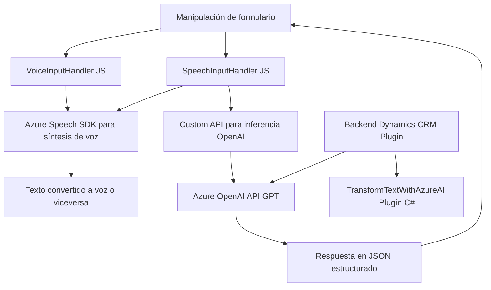

### Breve resumen técnico:

El repositorio presenta una solución híbrida que consiste en integrar un **frontend** basado en formularios de Microsoft Dynamics CRM con funcionalidades avanzadas de interacción por voz y texto, utilizando el **Azure Speech SDK** y **Azure OpenAI GPT**. Adicionalmente, incluye un plugin para Dynamics CRM que emplea OpenAI GPT para transformar textos según un conjunto de reglas.

---

### Descripción de arquitectura:

La arquitectura de la solución combina **integración de servicios externos (Azure)** con la capacidad de ejecución de lógica personalizada en **Dynamics CRM**, lo que constituye una arquitectura híbrida basada en módulos:
- **Frontend**: Escritos en JavaScript con integración directa en formularios de Dynamics CRM para entrada y salida de datos mediante voz.
- **Backend**: Plugin desarrollado en .NET para conectividad con Azure OpenAI, implementado como una solución complementaria en Dynamics.
- **Patrones Aplicados**:
  - **Servicio de integración externa**: Usa el SDK de Azure Speech y OpenAI para funciones avanzadas, como síntesis de voz, reconocimiento de voz y procesamiento de texto.
  - **Patrón modular**: Las funciones JavaScript están desglosadas siguiendo separación de responsabilidades y modularidad.
  - **Command Processing**: Manejo de comandos estructurados de voz para gestionar datos de formularios.
  - **Plugin Architecture**: El archivo C# utiliza el estándar de plugins de Dynamics CRM para conectarse con servicios externos.

---

### Tecnologías usadas:

1. **Frontend**:
   - **JavaScript estándar**: Para interacción con los formularios y manipulación de datos.
   - **Azure Speech SDK**: Para síntesis y reconocimiento de voz.
   - **Xrm.WebApi**: Para interacción con el modelo de datos de Dynamics CRM.
   - **Microsoft Dynamics 365**: Framework principal que encapsula los formularios utilizados.

2. **Backend Plugin**:
   - **C#/.NET Framework**: Desarrollo de plugins para Dynamics CRM.
   - **Azure OpenAI API (GPT)**: Para transformar textos según normas definidas.
   - **Newtonsoft.Json** y **System.Text.Json**: Manipulación JSON en APIs.

---

### Diagrama Mermaid:

Se presenta un diagrama Mermaid, donde se explican las interacciones entre los componentes principales de la solución:

---

### Conclusión final:

La solución de software combina tecnologías modernas (Azure Speech SDK y OpenAI GPT) con integraciones profundas en el ecosistema de Microsoft Dynamics CRM. La arquitectura es modular y sigue un enfoque híbrido que permite interacción de voz y texto en tiempo real con capacidades predictivas de IA. Aunque el enfoque principal está sobre API externas, se respeta una buena separación de responsabilidades con componentes reutilizables en JavaScript y un plugin bien estructurado en C#.