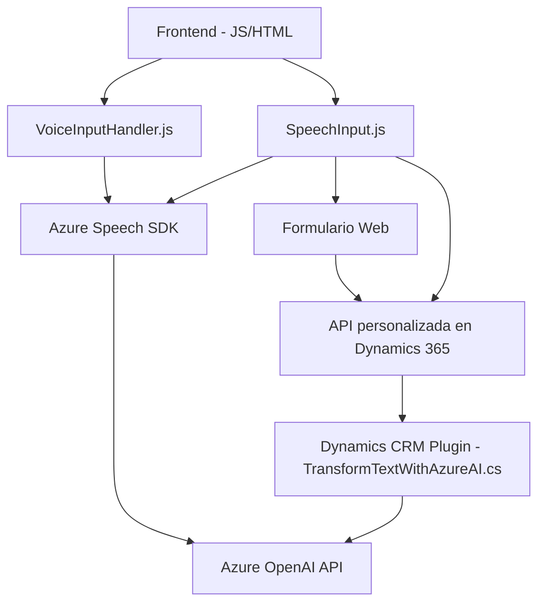

### Breve Resumen técnico
El repositorio descrito contiene archivos que implementan un solución basada en un **cliente-servidor**, integrando funcionalidades para entrada y salida de voz con capacidades de texto a voz y transcripción de voz a texto. Además, incluye un plugin para Dynamics CRM que utiliza Azure OpenAI API para transformar texto en objetos JSON estructurados. La solución permite una integración avanzada entre formularios web y sistemas Dynamics 365 mediante **Azure Speech SDK** y **Azure OpenAI API**, explotando la capacidad de crear experiencias basadas en asistente inteligente.

---

### Descripción de la arquitectura
La arquitectura de la solución es una combinación de **n capas** y **orientada a servicios**, ya que:
1. Las funcionalidades de frontend están claramente separadas entre el manejo de entrada de voz y lectura/formateo de textos del formulario.
2. La lógica backend está gestionada por un plugin, implementado como una capa adicional para interactuar con Dynamics CRM API y llamar a servicios externos como **Azure OpenAI API**.
3. Se emplea el patrón de **microfrontends**, con el uso modularizado de funciones que encapsulan tareas específicas (lectura de datos, procesamiento de transcripciones, síntesis por voz, etc.).
4. La solución utiliza componentes externos (API, SDK) para extender capacidades, lo que evoca algunos principios de **arquitectura hexagonal** al interactuar con servicios externos.

---

### Tecnologías utilizadas
1. **Frontend:**
   - **JavaScript:** Para la lógica de lectura de formularios y entrada/salida de voz.
   - **HTML/DOM API:** Acceso a campos del formulario y manipulación de valores.
   - **Azure Speech SDK**: Para síntesis de voz y transcripción de entrada.
   - **REST API invocations**: Comunicación entre el frontend y cualquier API personalizada (e.g., Dynamics APIs).

2. **Backend Plugin (Dynamics CRM):**
   - **C#/.NET Framework**: Desarrollo del plugin para Dynamics CRM.
   - **REST API (HTTP)**: Invocación a Azure OpenAI API para transformación de texto.
   - **JSON Processing:** Manejo de objetos JSON estructurados con librerías como Newtonsoft.Json o System.Text.Json.

3. **Cloud Services:**
   - **Azure Speech SDK:** Conversión de texto a voz y voz a texto.
   - **Azure OpenAI API:** Procesamiento inteligente de texto.

---

### Diagrama **Mermaid** válido para GitHub

---

### Conclusión Final
La solución presentada en el repositorio es un sistema **cliente-servidor modularizado** que incorpora capacidades avanzadas de reconocimiento y síntesis de voz junto con inteligencia artificial para el procesamiento del lenguaje. Se apoya en una arquitectura **orientada a servicios** que combina múltiples capas (frontend, backend y servicios externos). La solución hace uso de patrones de diseño como **carga dinámica de SDK**, **callbacks**, y la **modularidad funcional** para garantizar que sea eficiente, escalable y extensible. Su potencial de integración con **Dynamics 365** permite aplicaciones empresariales prácticas como asistentes virtuales para formularios inteligentes, mejora de accesibilidad y automatización avanzada.