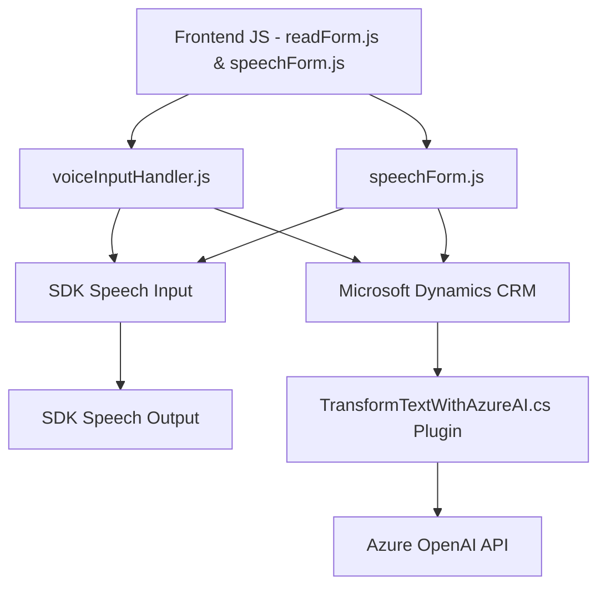

### Breve resumen técnico

El repositorio realiza diferentes tareas:
1. **Distinción de capas:** Frontend y backend se manejan como dos capas separadas, con interacción entre entrada/salida de voz y procesamiento del texto en Microsoft Dynamics CRM.
2. **Funcionalidad principal:** Uso del SDK de Azure Speech para el reconocimiento/síntesis de voz y la interacción con la API de Azure OpenAI desde un plugin en Dynamics CRM. Estas funcionalidades están enfocadas en mejorar la entrada/salida de datos mediante voz y el procesamiento y transformación de texto en formatos estructurados (JSON).

---

### Descripción de la arquitectura

La solución se adapta a una **arquitectura por capas** debido a la separación lógica y funcional entre el frontend y el backend. Las siguientes capas se pueden observar:
1. **Frontend Layer:** Implementa reconocimiento de voz, síntesis y mapeo dinámico con formularios utilizando JavaScript y Azure Speech SDK. Aquí destaca una implementación modular basada en funciones específicas para facilitar la comunicación con Dynamics 365.
2. **Backend Layer:** Utiliza un plugin basado en Microsoft Dynamics CRM, que delega a Azure OpenAI la tarea de procesar texto y devolver estructuras JSON válidas. El plugin sigue una arquitectura extensible de Dynamics CRM.
3. **Integration Layer:** La interacción con dos servicios externos, **Azure Speech SDK** y **Azure OpenAI API**, utiliza HTTP y manejo de estados dinámicos, lo que evidencia una arquitectura orientada a servicios (SOA) en términos funcionales.

---

### Tecnologías, frameworks y patrones utilizados

#### Tecnologías:
- **Azure Speech SDK**: Para la síntesis y reconocimiento de voz en el navegador.
- **Azure AI/OpenAI**: Para transformar texto con modelos basados en GPT a través de una API externa.
- **Microsoft Dynamics CRM**: Utilizado como la base del sistema de gestión empresarial.
- **JavaScript**: Implementación modular para frontend.
- **C#**: Backend para crear plugins en Dynamics CRM.
- Dependencias de integración: `System.Net.Http`, `JSON` (Newtonsoft.Json/JObject), `System.Text.Json`.

#### Patrones utilizados:
1. **Modularidad funcional:** Cada función se dedica a una tarea específica (segregación de responsabilidades en frontend).
2. **Lazy loading:** Inclusión dinámica de dependencias como el SDK de Azure Speech.
3. **Event-Driven Programming:** Para activar procesos basados en grabaciones o actividades asociadas al formulario (Azure SDK).
4. **Service delegation:** Uso de servicios API externos mediante HTTP requests en el backend para delegar el procesamiento complejo.
5. **Plugin-based architecture:** Integración directa y extensión que usa interfaces comunes en Microsoft Dynamics CRM.
6. **SOA (Service-Oriented Architecture):** Consulta de servicios en la nube para extraer valor del SDK (speech inputs) y modelos (OpenAI).

#### Características adicionales:
- Manejo de datos de entrada y salida.
- Validación de dependencias externas.
- Mecanismos de escritura dinámica en formularios.
- Manejo avanzado de controles en Microsoft Dynamics CRM.

---

### Diagrama Mermaid válido para GitHub

---

### Conclusión final

Este proyecto implementa una **multicapas (n-tier)** con influencia de componentes reutilizables y servicios externos. Se observa una integración estrecha entre frontend y backend, lo que lo hace adecuado para una solución CRM extendida. El uso del Azure Speech SDK y Azure AI incrementa las capacidades de entrada/salida y procesamiento a través de voz e inteligencia artificial.

Las tecnologías y patrones utilizados denotan un diseño orientado a modularidad, funcionalidad separada y capacidad de carga dinámica de dependencias, facilitando el manejo de recursos de manera eficiente. El impacto al utilizar servicios Azure es significativo en funcionalidades avanzadas y escalabilidad del sistema en entornos empresariales.