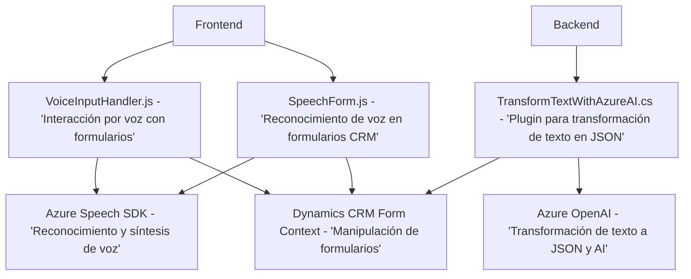

### Breve resumen técnico

El repositorio contiene tres archivos pertenecientes a un sistema distribuido con funcionalidades que integran la **interacción por voz usando Azure Speech SDK**, el **procesamiento dinámico de formularios en CRM** y **transformación avanzada de texto mediante Azure OpenAI**. Este sistema apunta a mejorar la productividad y dinámica de trabajo en entornos CRM mediante patrones de reconocimiento de voz y manipulación de datos estructurados.

---

### Descripción de arquitectura

La arquitectura del sistema sigue un enfoque **modular de capas**, en el que cada componente cumple con responsabilidades específicas:
1. **Frontend/JS**:
   - Implementa lógica para capturar datos de formularios y manejar interacción basada en reconocimiento de voz, integrada con Azure Speech SDK.
   - Manipula la API del navegador (DOM) y APIs internas de Microsoft Dynamics CRM (`Xrm.WebApi`).
   - Modulariza cada tarea clave en funciones independientes (reconocimiento, manipulación de datos, integración con APIs).

2. **Backend/Plugin**: 
   - Plugin en C# desarrollado con la estructura estándar de **Dynamics CRM**, usando `IPlugin`. Su propósito principal es transformar texto en JSON estructurado siguiendo reglas específicas con ayuda de Azure OpenAI.
   - API REST y patrones de integración con servicios externos en el backend.

Se trata de una **arquitectura híbrida** entre n-capas y microservicios, ya que los módulos están relativamente acoplados mediante la integración con Dynamics CRM, pero también hacen uso de servicios externos como Azure Speech SDK y Azure OpenAI.

---

### Tecnologías usadas

1. **Frontend**:
   - **JavaScript**: Lenguaje base para la manipulación dinámica de formularios y carga de Azure Speech SDK.
   - **Azure Speech SDK**: Para reconocimiento de voz y síntesis.
   - **Microsoft Dynamics CRM Web APIs**: Integración con formularios y datos internos del CRM.
   - **DOM APIs**: Manipulación de campos dinámicos y carga de dependencias.

2. **Backend**:
   - **C#**: Lenguaje base para el desarrollo del plugin.
   - **Microsoft.Xrm.Sdk**: API estándar para extensiones en Dynamics CRM.
   - **Azure OpenAI API**: Servicio de transformación de texto en JSON.
   - **System.Net.Http**: Realiza solicitudes HTTP a servicios externos.
   - **Newtonsoft.Json** y **System.Text.Json**: Serialización y manipulación de JSON.

3. **Servicios Externos**:
   - Azure Speech SDK (`https://aka.ms/csspeech/jsbrowserpackageraw`).
   - Azure OpenAI para generación procesada de texto.

---

### Diagrama Mermaid válido para GitHub

---

### Conclusión final

La solución implementada en este repositorio parece ser parte de un sistema orientado a mejorar la interacción con formularios de **Microsoft Dynamics CRM** mediante reconocimientos de voz (frontend) y transformaciones de texto (backend). Utiliza tecnologías clave como **Azure Speech SDK** y **Azure OpenAI**, mientras que sigue la buena práctica de modularizar funciones y aplicar patrones claros como desacoplamiento en el plugin y separación de responsabilidades en el código JavaScript.

En términos de arquitectura, es un sistema **híbrido modular**, utilizando capas y servicios externos como Azure APIs para comunicarse eficientemente entre frontend y backend, con integración directa en sistemas CRM existentes.