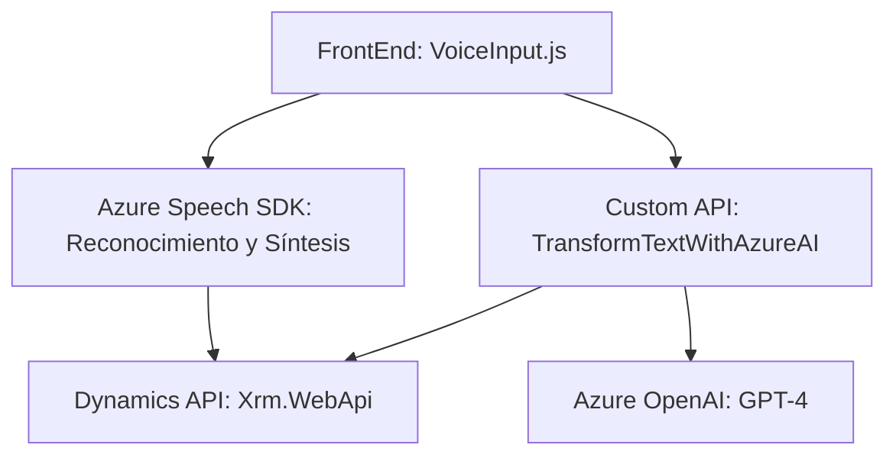

# Breve resumen técnico
Este repositorio contiene una solución híbrida que combina integración con APIs externas (Azure Speech SDK y OpenAI) dentro de una plataforma CRM, probablemente Microsoft Dynamics 365. Contiene código para la interacción y procesamiento de formularios en una interfaz frontend basada en JavaScript, junto con lógica backend mediante plugins en C#. El sistema permite el reconocimiento y síntesis de voz, mientras utiliza modelos de Inteligencia Artificial (IA) para transformar entradas de texto.

---

# Descripción de arquitectura
La arquitectura del sistema es **n-capas**, con una lógica distribuida entre el frontend (presentación y lógica de negocio basada en JavaScript dentro de un navegador) y el backend mediante plugins de Dynamics CRM para flujos empresariales y procesos de IA. Tiene una fuerte orientación hacia una arquitectura **event-driven** ya que el procesamiento se dispara en respuesta a acciones como voz ingresada, eventos de formularios o llamadas a funciones de API externas.

1. **Capa de presentación**: Implementada en JavaScript y funcional en el navegador.
2. **Capa de negocio**: Incluye lógica para la manipulación de formularios y flujo de datos hacia servicios externos (Azure Speech SDK y Azure OpenAI).
3. **Capa de datos**: Basada en el contexto de la plataforma Dynamics CRM para manejar los datos.

La integración con Azure Speech SDK y OpenAI sugiere un **patrón de integración de servicios externos**.

---

# Tecnologías utilizadas
1. **Frontend:**
   - JavaScript (lógica de manejo de formularios y voz).
   - Azure Speech SDK: Reconocimiento de voz y síntesis de texto a voz.
   - Modificación del DOM y contexto de formularios (Dynamics 365 WebApi).

2. **Backend (Plugins/Dynamics CRM):**
   - Microsoft Xrm.Sdk para CRM.
   - Azure OpenAI (GPT-4) para procesamiento de texto.
   - HTTP requests usando `System.Net.Http`.
   - Manejo de JSON con `System.Text.Json` y `Newtonsoft.Json.Linq`.

3. **Infraestructura externa**:
   - Custom API `trial_TransformTextWithAzureAI` para lógica avanzada de IA.
   - Llamadas REST para interactuar con Azure OpenAI y Speech SDK.

4. **Patrones:**
   - Modularidad: Cada archivo o clase contiene funciones específicas con nombres claros.
   - Plugin Pattern (Dynamics CRM): Centralizado en la ejecución mediante contexto CRM.
   - Asincronía en frontend con callbacks y promesas.
   - API Gateway con integración de servicios de cloud (Azure).

---

# Diagrama Mermaid válido para GitHub Markdown

---

# Conclusión final
Esta solución integra múltiples tecnologías para habilitar un flujo de trabajo basado en voz e inteligencia artificial en aplicaciones empresariales. El frontend actúa como capa de presentación y procesamiento inicial, mientras el backend asume la lógica más avanzada, procesando datos mediante modelos IA (GPT-4). Su arquitectura n-capas y orientación a eventos es ideal para sistemas modernos basados en plataformas de CRM.

