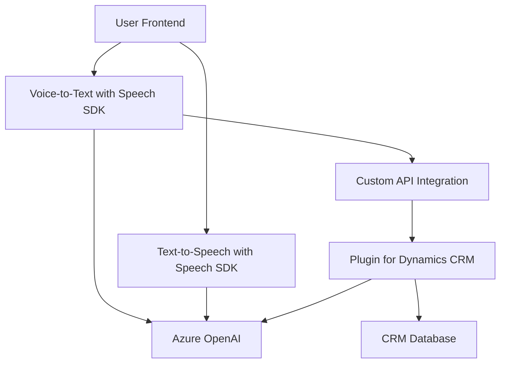

### Breve Resumen Técnico

Este repositorio contiene una solución destinada a integrar reconocimiento y síntesis de voz utilizando **Azure Speech SDK** y procesamiento avanzado de texto mediante **Azure OpenAI**. Los archivos implementan funcionalidades en dos áreas principales:
1. **Frontend**: Para interacción directa con el usuario, incorporando síntesis de voz y transcripción mediante **Azure Speech SDK**.
2. **Plugins**: Extensiones para Dynamics CRM que aprovechan **Azure OpenAI** para transformar y estructurar texto dinámicamente.

### Descripción de Arquitectura

- **Tipo de solución**: La solución está compuesta por dos componentes principales:
  - **Frontend**: Una aplicación cliente que trabaja con formularios dinámicos, utilizando reconocimiento de voz y síntesis de texto en tiempo real.
  - **Plugins (Backend)**: Extendiendo la lógica de negocio de Dynamics CRM (monolito extensible) mediante plugins sincronizados con APIs externas.
- **Arquitectura**:
  - **Frontend**:
    - Estructura modular basada en funciones que realiza integración directa con servicios de Azure y manipulación de formularios dinámicos.
    - Uso de patrones de eventos (event-driven) y SDK-as-a-service para manejar la interacción.
  - **Backend**:
    - Monolito extensible basado en plugins, conforme a estándares de Dynamics CRM.
    - Delegación a servicios externos (Azure OpenAI) bajo un enfoque de arquitectura por microservicios.
  - En conjunto: La solución se alinea hacia un enfoque híbrido, posiblemente orientado a una arquitectura de microservicios en el futuro.

### Tecnologías Usadas

1. **Azure Speech SDK**:
   - Manejo de síntesis y reconocimiento de voz dentro del módulo de Frontend.
   - Clases como `SpeechConfig` y `SpeechSynthesizer` utilizadas para configurar y procesar textos en voz.
2. **Azure OpenAI**:
   - Procesamiento avanzado de texto en el plugin backend.
   - Servicios como GPT-4 utilizados para transformer texto según modelos predefinidos.
3. **Dynamics CRM SDK**:
   - Extensión mediante API de Dynamics CRM: `Xrm.WebApi` y `IPlugin`.
4. **JavaScript** y **.NET Framework**:
   - **Frontend**: JS con estructura modular y enfoque en manipulación de formularios dinámicos.
   - **Backend**: Extensiones en C# para plugins de Dynamics CRM.
5. **HTTP Communication**:
   - Envío de peticiones para interactuar con APIs externas como Speech SDK y OpenAI.

### Dependencias Externas Presentes

1. **Azure Speech SDK**: Para las funcionalidades de síntesis y reconocimiento de voz.
2. **Azure OpenAI**: Para procesar inteligencia artificial aplicada a texto.
3. **Dynamics 365 CRM API**: Manipulación de datos y atributos dinámicos.
4. **Newtonsoft.Json y System.Text.Json**: Bibliotecas utilizadas para manejo de datos JSON en el backend.

### Diagrama Mermaid

### Conclusión Final

La solución presenta un **enfoque híbrido**, combinando:
- Una interfaz cliente modular que interactúa con APIs avanzadas para manejo de voz y manipulación de datos dinámicos.
- Extensiones backend basadas en plugins de Dynamics CRM, con soporte para **inteligencia artificial** mediante **Azure OpenAI**.

Si bien actualmente utiliza una arquitectura monolítica extensible, la integración de servicios externos orienta el diseño hacia un potencial de optimización basado en **microservicios**, lo que permitiría escalar de forma más eficiente.