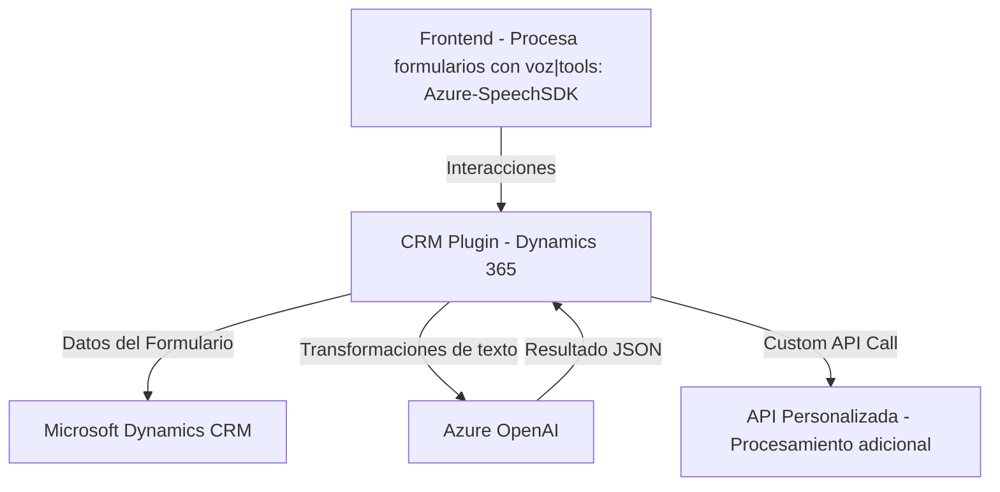

## Breve resumen técnico

La solución presentada es un conjunto de interconectados módulos que combina un **frontend basado en JavaScript** con **funcionalidades de síntesis y entrada de voz**, y un **backend en C#** que implementa un **plugin para Dynamics CRM** con conectividad hacia Azure OpenAI. Es un ecosistema diseñado para facilitar la interacción entre usuarios y formularios, añadiendo capacidades de accesibilidad y procesamiento avanzado de datos utilizando IA.

---

## Descripción de Arquitectura

1. **Tipo de solución**:
   - **Frontend**: Módulos que permiten la integración de entrada/salida por voz con funcionalidades del Azure Speech SDK.
   - **Backend/Plugin**: Una extensión para Microsoft Dynamics CRM que utiliza el servicio Azure OpenAI para transformar datos textuales.

2. **Arquitectura**:
   - **Monolítica extendida**: Sigue un esquema de arquitectura de **n capas**: presentación (frontend), lógica de negocio (backend/plugin), y capa de integración (Azure APIs). Integra servicios externos para cubrir las capacidades de síntesis de voz y procesamiento AI.
   - **Orientación a microservicios**: Algunas partes muestran patrones desacoplados al integrar APIs personalizadas y módulos reutilizables.

---

## Tecnologías usadas

1. **Frameworks y SDKs**:
   - **Frontend**: Utiliza JavaScript en conjunto con **Azure Speech SDK** para síntesis y transcripción de voz.
   - **Backend**: Uso de .NET Framework y `Microsoft.Xrm.Sdk` para implementación nativa de plugins en Dynamics 365 CRM.
   - **API Externa**: Azure OpenAI Service integrado mediante llamadas HTTP REST.

2. **Patrones**:
   - **Modularización**: División de responsabilidades con funciones y clases bien segmentadas.
   - **Integración de APIs Cloud**: Uso de servicios como Azure Speech SDK y OpenAI para extender capacidades.
   - **Dynamic Field Mapping**: Métodos orientados a adaptar valores dinámicos del formulario o API al contexto del CRM.

3. **Dependencias y componentes externos**:
   - **Azure Speech SDK**: Para transcripción y síntesis de voz en el frontend.
   - **Azure OpenAI Service**: Para ejecución de procesamiento avanzado de texto.
   - **Microsoft Dynamics CRM**: Backend integrado como un plugin nativo a un ecosistema CRM.
   - **Custom APIs**: Dinámicas dentro del CRM para realizar transformaciones de texto adicionales.

---

## Diagrama Mermaid

Represéntese la relación lógica de los componentes. Este diagrama muestra el flujo de datos entre frontend, middleware y servicios externos.

---

## Conclusión final

La solución presentada es una integración bien segmentada con una arquitectura de **n capas** ampliando capacidades nativas de **Microsoft Dynamics CRM**. Combina:
- **Frontend accesible** con soporte de entrada/salida de voz.
- **Backend extensible** que utiliza plugins de Dynamics y servicios de IA como Azure OpenAI.
- **Patrones de modularidad y conectividad cloud** para mantener la flexibilidad y escalabilidad.

Sin embargo, es recomendable evaluar aspectos de seguridad relacionados con la gestión de claves de Azure y robustecer la abstracción y validación de datos, especialmente en el lado del plugin y las APIs externas. La solución es útil para escenarios con altos niveles de interactividad accesible y procesamiento textual inteligente.