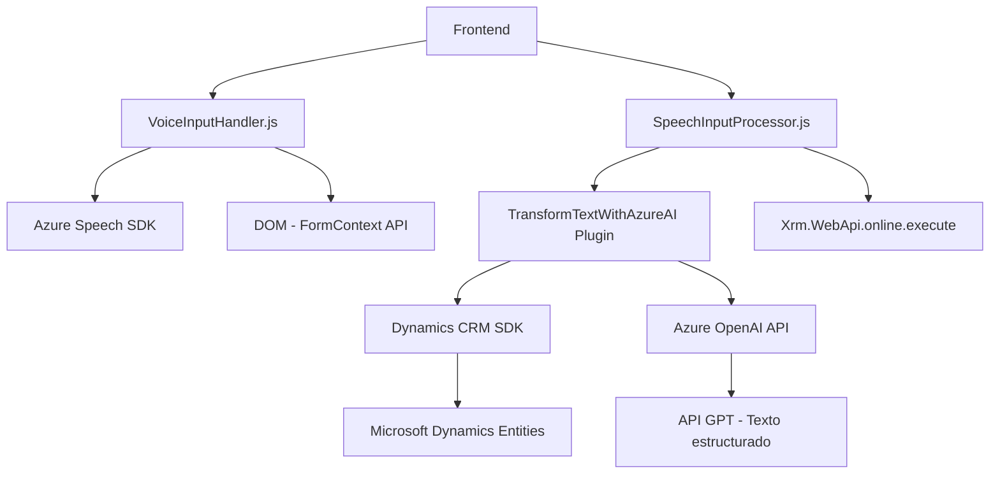

### Breve resumen técnico
El repositorio contiene componentes que integran funcionalidad relacionada con el reconocimiento y síntesis de voz mediante el **Azure Speech SDK**, manipulación de formularios en el frontend y procesamiento avanzado de texto utilizando **Azure OpenAI GPT** en un entorno de **Dynamics CRM**. Las principales áreas funcionales son la interacción usuario-frontend (mediante inputs de voz y datos visibles en formularios) y la transformación de texto con IA, estructurada en plugins para el backend.

---

### Descripción de la arquitectura
1. **Arquitectura general**: El sistema utiliza una arquitectura **n-capas**, definida principalmente por una capa de presentación (frontend), capa de procesamiento/acción (integración con Speech SDK y APIs), y una capa de servicios/backend (integración con Dynamics CRM y Azure OpenAI). Aunque no está completamente desacoplada, se aprecia un diseño modular y extensible.
   
2. **Frontend**:
   - Contiene scripts que interactúan directamente con el navegador.
   - Actúa como la capa de presentación, manipulando datos del DOM de formularios mediante APIs exclusivas de Dynamics.
   - Procesamiento condicional para reconocimiento de voz (manual o asistido con IA).
   
3. **Backend**:
   - Implementa un patrón basado en **Plugins** dentro de Dynamics CRM para procesar texto con reglas definidas.
   - Utiliza el SDK de Dynamics para interactuar con entidades del CRM.
   - Se conecta con servicios externos como OpenAI GPT en Azure mediante API REST.

---

### Tecnologías usadas
1. **Frontend**:
   - **Azure Speech SDK**: Reconocimiento de voz y síntesis mediante API JS.
   - **JavaScript Vanilla**: Para manipulación DOM, entradas de usuario y lógica de negocio.
   
2. **Backend**:
   - **Microsoft Dynamics SDK**: Para la creación de plugins y manipulación del contexto CRM.
   - **Azure OpenAI API**: Consumo de servicios de IA para transformación avanzada de texto.
   - **Newtonsoft.Json y System.Net.Http**: Para manipulación de JSON y solicitudes HTTP.

3. **Frameworks o servicios comunes**:
   - Carga dinámica de servicios externos (Speech SDK desde URL pública).
   - Xrm.WebApi para solicitudes asincrónicas en el CRM.

---

### Diagrama Mermaid válido para GitHub

---

### Conclusión final
Este sistema combina un enfoque basado en **n-capas** para lograr interacción entre un frontend capaz de reconocer y sintetizar voz, y un backend que transforma datos mediante IA. La arquitectura es modular y extensible, con integración de servicios externos (Azure Speech, OpenAI) y tecnologías de Microsoft Dynamics CRM. Además, se implementan buenas prácticas como la encapsulación de la lógica y un diseño desacoplado entre frontend/backend. Sin embargo, podría ser mejorado adoptando un enfoque más orientado a la **arquitectura hexagonal**, con mayor desacoplamiento entre lógica de negocio y dependencias externas.