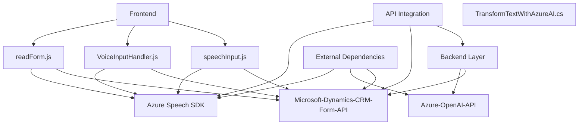

### Breve resumen técnico
El repositorio incluye cinco archivos que implementan una solución basada en **Azure Speech SDK** y **Azure Cognitive Services API (Speech y OpenAI)** para procesamiento de voz y texto en sistemas integrados con **Microsoft Dynamics CRM**. La solución utiliza una combinación de funcionalidades frontend (JavaScript) y backend (C# plugins) para interactuar con user inputs y APIs externas, lo que la categoriza como un **API y plugin** integrados en una plataforma CRM.

---

### Descripción de la Arquitectura
La arquitectura de esta solución puede clasificarse como **modular** con acercamientos hacia un diseño **n-capas**. Aunque el sistema está segmentado en distintos módulos, estos operan como funciones manejando entrada y salida entre capas diferenciadas:
1. **Frontend Layer**: Se compone de archivos JavaScript (`readForm.js` y `speechForm.js`) responsables de la captura, procesamiento y envío de datos ingresados por los usuarios a través de formularios visibles y mediante reconocimiento de voz usando el Azure Speech SDK.
2. **API Integration Layer**: Implementa la comunicación entre Dynamics CRM y Azure APIs (Speech SDK, OpenAI). Aquí también se manejan reglas de negocio específicas, como el procesado de datos de voz y texto.
3. **Backend Layer**: Compuesta por el plugin C# (`TransformTextWithAzureAI.cs`), encargado de procesar datos semiestructurados enviados desde las capas superiores y devolver transformaciones específicas en formato JSON mediante el servicio Azure OpenAI.

---

### Tecnologías usadas
**Principal**
1. **Frontend (JavaScript)**:
   - Azure Speech SDK: Procesamiento de voz a texto/voz sintetizada.
   - Microsoft Dynamics CRM Form API (`Xrm.WebApi.online`): Integración con la capa CRM para manipulación de sus formularios y entidades de datos.
   - Modular JavaScript (APIs y clases reutilizables).

2. **Backend (.NET C#)**:
   - **Microsoft Dynamics CRM Plugin Framework**: Implementación de lógica empresarial para interactuar con formularios y servicios CRM.
   - Azure OpenAI: Modelo GPT consumido mediante REST API para procesamiento de texto.
   - `System.Net.Http`, `Newtonsoft.Json.Linq`, `System.Text.Json`: Utilizadas para la comunicación HTTP y manipulación de JSON.

**Patrones**
1. **Modularidad**: Cada funcionalidad está descomponida en funciones o métodos separados (Single Responsibility Principle).
2. **Integración con servicios externos**: Maneja API externas como dependencias tercerizadas para aumentar el alcance del sistema (Azure Cognitive Services).
3. **Arquitectura n-capas**:
   - **Frontend**: Encargado de procesar datos iniciales.
   - **API Integration Layer**: Orquestación entre front y backend mediante servicios REST.
   - **Backend**: Procesa e interactúa con APIs como OpenAI.

---

### Dependencias y componentes externos
1. **Azure Speech SDK**, cargado dinámicamente mediante: `https://aka.ms/csspeech/jsbrowserpackageraw`.
2. **Azure OpenAI API** (`gpt-4o`), para que el backend procese y transforme texto en JSON estructurado.
3. **Microsoft Dynamics CRM Form API** (`XRM.WebApi.online`) para manipulación de datos en el frontend de Dynamics CRM.
4. **HTTP client libraries** (`System.Net.Http`) y JSON parsers (`System.Text.Json`, `Newtonsoft.Json.Linq`) para la integración backend.

---

### Diagrama Mermaid válido para GitHub

---

### Conclusión final
La solución está diseñada con una arquitectura modular y separada en capas que incluye lógica tanto del frontend (JavaScript para manejo de voz y formularios) y del backend (con integración de Azure OpenAI en un plugin de Dynamics CRM en C#). Los patrones observados como modularidad, servicios externos, y n-capas reflejan un diseño flexible y escalable, aunque podría beneficiarse de un mayor desacoplamiento entre frontend y backend para proteger la cohesión entre capas. La integración con servicios de Azure y Dynamics CRM permite crear aplicaciones avanzadas de reconocimiento de voz con funcionalidad de procesamiento por inteligencia artificial, todo alojado dentro de un ecosistema CRM.