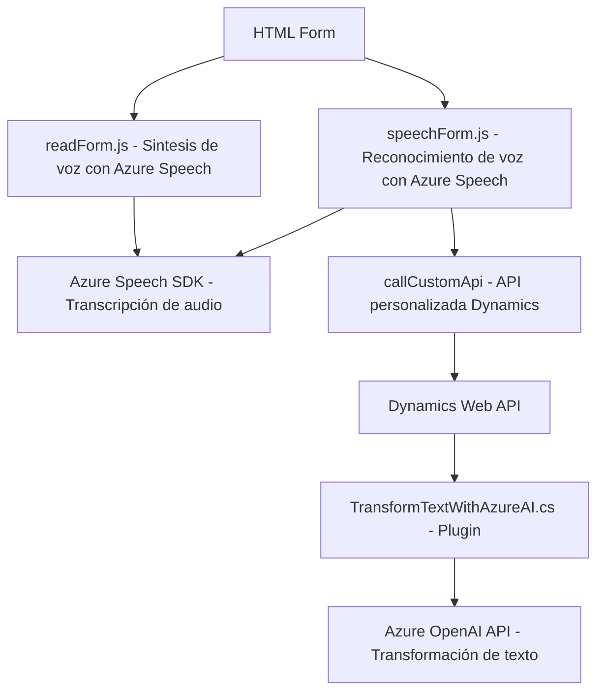

### Breve resumen técnico
El análisis del repositorio revela una solución orientada a la integración de reconocimiento y síntesis de voz mediante **Azure Speech SDK** y generación de contenido estructurado con **Azure OpenAI**, adaptada para integrarse con **Microsoft Dynamics CRM**. Su arquitectura es modular, basada en funciones y plugins que implementan operaciones específicas sobre un contexto de formulario CRM.

---

### Descripción de arquitectura
La arquitectura puede clasificarse como **composición de servicios con arquitectura de capa**. Las siguientes capas principales son observables:

1. **Capa de presentación (Frontend)**:
   - Scripts en **JavaScript** (`readForm.js` y `speechForm.js`) para brindar funcionalidades de voz (entrada y salida) al usuario en la interfaz del formulario.
   - Carga dinámica de recursos externos como **Azure Speech SDK**.

2. **Capa de lógica de negocio (backend de Dynamics)**:
   - Implementación de un plugin en **C#** (`TransformTextWithAzureAI.cs`) que usa el **Microsoft.Xrm.Sdk** para integrarse directamente al modelo de extensibilidad de Microsoft Dynamics CRM.
   - Integración con API externa proporcionada por **Azure OpenAI** para transformar texto en objetos estructurados JSON.

3. **Capa de integración**:
   - Interacciones RESTful entre el backend (plugin) y servicios Azure (Speech SDK y OpenAI).

---

### Tecnologías usadas
1. **Frontend**:
   - **HTML/JavaScript** para lógica en la interfaz de usuario.
   - **Azure Speech SDK** para reconocimiento y síntesis de voz.

2. **Backend**:
   - **C# .NET Framework**: utilizado para el plugin de Dynamics CRM.
   - **Microsoft Dynamics CRM SDK**: Extensibilidad del CRM basada en la interfaz `IPlugin`.
   - **Azure OpenAI API**: Servicios RESTful para procesamiento de lenguaje y transformación de texto.
   - **System.Net.Http**: Manejador de solicitudes HTTP.
   - **System.Text.Json** y **Newtonsoft.Json.Linq**: Procesamiento de datos JSON.

---

### Diagrama Mermaid

---

### Conclusión final
La solución es una integración avanzada de múltiples servicios, que utiliza un enfoque funcional modular en el frontend (JavaScript) y patrones orientados a servicios en el backend (plugin de Dynamics y APIs externas). Esto permite características como la entrada de voz dinámica, síntesis de audio, reconocimiento avanzado mediante inteligencia artificial (IA), y procesamiento textual mediante Azure OpenAI.

**Puntos fuertes**:
1. Modularidad en la implementación, con separación clara de responsabilidades.
2. Interoperabilidad con plataformas externas (Azure Speech y OpenAI), ampliando las capacidades de Microsoft Dynamics CRM.
3. Uso efectivo de tecnologías modernas como SDKs de Azure, API RESTful, y manipulación avanzada de JSON.

**Áreas de mejora**:
- Centralización de configuración: Configurar valores como claves API, región de Azure y reglas de transformación mediante un archivo externo o entorno de variables.
- Ampliar el manejo de errores en el plugin para evitar fallos críticos dentro del contexto CRM.