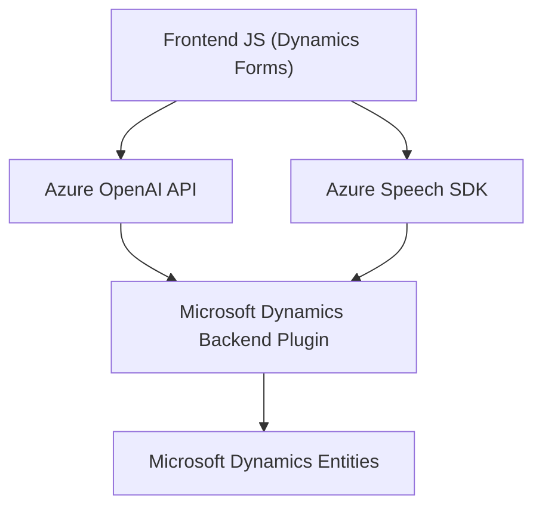
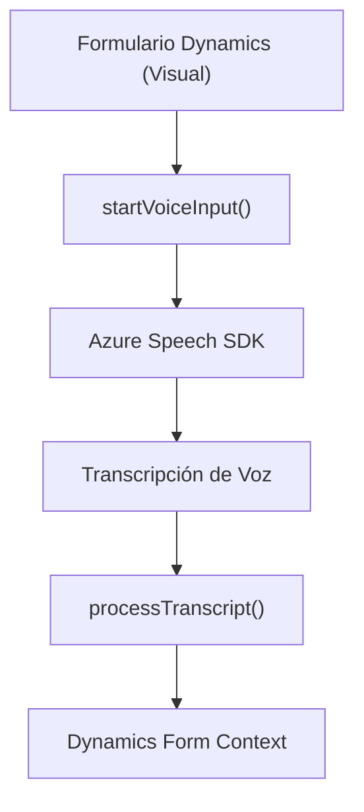
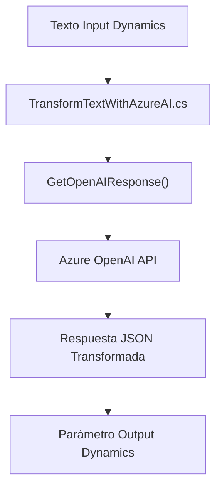

### Resumen Técnico
El repositorio es una solución integrada que utiliza **Microsoft Dynamics 365**, **Azure Speech SDK** y **Azure OpenAI** para ofrecer funcionalidades avanzadas como síntesis de texto a voz, reconocimiento de voz y procesamiento de texto con inteligencia artificial.

### Arquitectura
La solución parece operar bajo una **arquitectura multicapa** (estilo n-capas) con componentes frontend (JavaScript), backend (plugins de Dynamics 365 en C#) y APIs externas (Azure AI). Los componentes están organizados de forma modular, aunque mantienen una fuerte integración subyacente.

#### Capas identificadas:
1. **Frontend**: JavaScript implementado directamente en los formularios y controladores de Dynamics 365.
2. **Backend**: Plugins alojados en Dynamics CRM escritos en C# para manipulación personalizada y extensibilidad del sistema.
3. **Servicios Externos**:
   - Azure Speech SDK (integrado dinámicamente para voz).
   - Azure OpenAI (procesamiento avanzado de texto).

### Tecnologías Usadas
1. **Frontend**:
   - **JavaScript**: Principal lenguaje para manipular formularios y configurar el reconocimiento y síntesis de voz.
   - **Azure Speech SDK**: SDK dinámicamente cargado para reconocimiento y síntesis de voz.
2. **Backend**:
   - **C#**: Lenguaje de implementación de plugins para Dynamics.
   - **Microsoft Dynamics 365 SDK**: Para definir y gestionar eventos dentro del CRM.
   - **Azure OpenAI API**: Para transformar texto en JSON estructurado.
3. **Servicios Externos**:
   - **Azure Speech SDK Endpoint**: Para funciones relacionadas con voz.
   - **HTTP Calls (REST)**: Comunicación con servicios de Azure OpenAI.
4. **Bases de datos relacionadas**: Utilización de entidades de Dynamics CRM como almacenamiento y mapeo.

### Patrones Usados
1. **Modularidad**: Cada archivo o clase está segmentado para cumplir una tarea específica (por ejemplo, reconocimiento de voz, manejo de texto, interacción con API).
2. **Orientación a Eventos**: Integración con los eventos del CRM para ejecutar lógica en tiempo real.
3. **Cargador Dinámico**: SDK de Azure Speech cargado mediante JavaScript cuando se requiere.
4. **Integración de API**: Servicios como Azure OpenAI y Speech SDK integrados directamente mediante REST API.

### Diagramas Mermaid

#### Diagrama General de Arquitectura

#### Flujo de Reconocimiento de Voz

#### Flujo de Transformación de Texto con OpenAI

### Conclusión Final
La solución está diseñada como una integración profunda entre Dynamics 365, Azure AI y servicios orientados a voz, lo que le permite extender las funcionalidades nativas del CRM. Utiliza una arquitectura **multicapa** con Javascript para manipulación directa del frontend, y C# para lógica extendida en plugins de Dynamics. La dependencia de servicios externos, como **Azure Speech SDK** y **Azure OpenAI**, representa una implementación moderna para tareas avanzadas como reconocimiento de voz y procesamiento semántico.