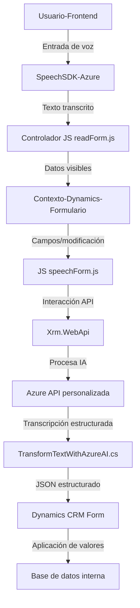

# Resumen técnico

El repositorio analiza la integración y desarrollo heterogéneo de interfaces frontend y backend, vinculadas a Microsoft Dynamics 365 y servicios de Azure (Azure Speech SDK y Azure OpenAI). El enfoque está en la interacción con formularios de Dynamics 365 para entrada y salida de voz, transformación de texto mediante IA, y sincronización con APIs y servicios externos.

---

### Descripción de arquitectura

La solución se basa en tres pilares principales:
1. **Front-end basado en JavaScript**: Se utiliza para interacción del usuario, carga dinámica del SDK de Azure Speech y comunicación con formularios en Dynamics 365.
2. **Backend basado en C# Plugins (Dynamics CRM)**: Maneja la lógica avanzada con integración de Azure OpenAI para transformar datos.
3. **Interacción API**: El sistema extiende Microsoft Dynamics CRM mediante módulos (plugins) integrados y acceso a APIs externas, representando aspectos de arquitectura modular.

Se observa un diseño híbrido entre componentes modulares y microservicios, donde la arquitectura está integrada en un sistema de Dynamics CRM con ampliación por plugins y servicios externos (Azure). La interacción asincrónica indica separación de capas entre frontend, servicios remotos y lógica empresarial backend.

---

### Tecnologías utilizadas

- **Frontend (JavaScript)**:
  - Uso del SDK de Azure Speech para síntesis y reconocimiento de voz.
  - Framework de formularios Dynamics 365 (Xrm.WebApi).
  - Comunicación asincrónica (`async/await`) y carga dinámica de scripts.

- **Backend (C#)**:
  - Plugins basados en API de Dynamics CRM.
  - Dependencias para manejo de JSON (`System.Text.Json`, `Newtonsoft.Json`) y llamadas HTTP (`HttpClient`).
  - Uso directo del servicio Azure OpenAI.

- **Servicios externos**:
  - Azure Speech SDK: Señalización y audio para entrada/salida de voz.
  - Azure OpenAI: IA para transformación de texto estructurado.
  - Microsoft Dynamics CRM y sus APIs integradas.

---

### Diagrama **Mermaid** (GitHub-compatible)

---

### Conclusión final

La solución combina elementos de arquitectura **modular** con fundamentos de **microservicios** a través de la integración de APIs externas (Speech SDK, OpenAI) y plugins específicos en Dynamics CRM. Su diseño está optimizado para **gestión asincrónica** y dependencia dinámica de servicios globales.

Aunque su separación entre frontend, servicios, y backend asegura flexibilidad, su dependencia de plataformas (Dynamics 365, Azure) lo orienta hacia un ecosistema **Extendido del CRM** y una arquitectura híbrida basada en la **integración de servicios en Cloud**. Esto lo convierte en una solución ideal para sistemas empresariales con foco en IA y automatización.