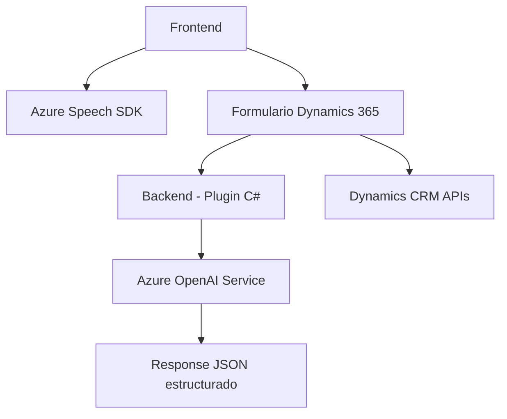

### **Breve resumen técnico**
El repositorio describe una solución enfocada en la integración de datos de formularios CRM (Dynamics 365) con capacidades de voz y IA mediante servicios de Azure. Consiste principalmente en un **frontend escrito en JavaScript** que utiliza el **Azure Speech SDK** para síntesis y reconocimiento de voz, así como un **plugin en C#** que emplea **Azure OpenAI** para procesamiento y análisis de texto en el entorno CRM.

### **Descripción de arquitectura**
La solución sigue una arquitectura **híbrida de n capas con componentes desacoplados**. Cada módulo cumple su rol específico:
1. **Frontend**: Actúa como la capa de presentación, proporcionando la interacción con el usuario mediante un formulario y funciones de síntesis/reconocimiento de voz en el navegador.
2. **Backend/Plugin**: Implementa lógica empresarial en Dynamics CRM mediante plugins distribuidos. Estos plugins permiten la interacción con el servicio de Azure OpenAI para procesamiento de texto y la actualización de registros en el sistema CRM.
3. **Servicios externos**: Los servicios de Azure (Speech SDK y OpenAI) se integran como componentes externos para extender capacidades de análisis y voz.

El diseño es modular, con funciones bien aisladas y enfocadas en tareas específicas (speech synthesis, field mapping, serialization, API integration). Aunque existen dependencias externas, las capas del sistema están parcialmente desacopladas, alineándose con prácticas modernas de desarrollo.

### **Tecnologías usadas**
- **Frontend**:
  - **JavaScript** (ES6): Utilizado para la lógica del frontend.
  - **Azure Speech SDK**: Proporciona funcionalidad de síntesis y reconocimiento de voz.
- **Backend**:
  - **C#**: Lenguaje principal para la implementación del plugin en Dynamics CRM.
- **Dependencias de backend**:
  - **Microsoft Dynamics CRM Plugin Framework**: Uso de clases como `IPlugin`, `IOrganizationService`, `IPluginExecutionContext`.
  - **Azure OpenAI Service**: Utilización de GPT-4 para el procesamiento de texto y generación de JSON mediante especificaciones.
  - **Newtonsoft.Json**: Librería para serialización y deserialización JSON.

### **Dependencias o componentes externos**
1. **Azure Speech SDK** (`https://aka.ms/csspeech/jsbrowserpackageraw`): Necesario para síntesis y reconocimiento de voz en el frontend.
2. **Azure OpenAI Service**: Utilizado en el plugin para texto estructurado mediante GPT-4, con endpoint externo configurado.
3. **Dynamics CRM APIs**: Dependencia directa del sistema CRM para acceder a formularios y campos.
4. **Newtonsoft.Json**: Para la manipulación profunda de datos entre el plugin y servicios externos.

### **Diagrama Mermaid**

### **Conclusión final**
La arquitectura implementada combina características de **n capas** con componentes desacoplados y servicios externos. Este diseño facilita la ampliación de capacidades del sistema CRM a través de AI y capacidades de voz. Aunque el frontend actúa como intermediario para la captura y síntesis, el backend se especializa en analizar y normalizar datos mediante IA. Esta solución está orientada a ambientes empresariales que usan Dynamics 365.