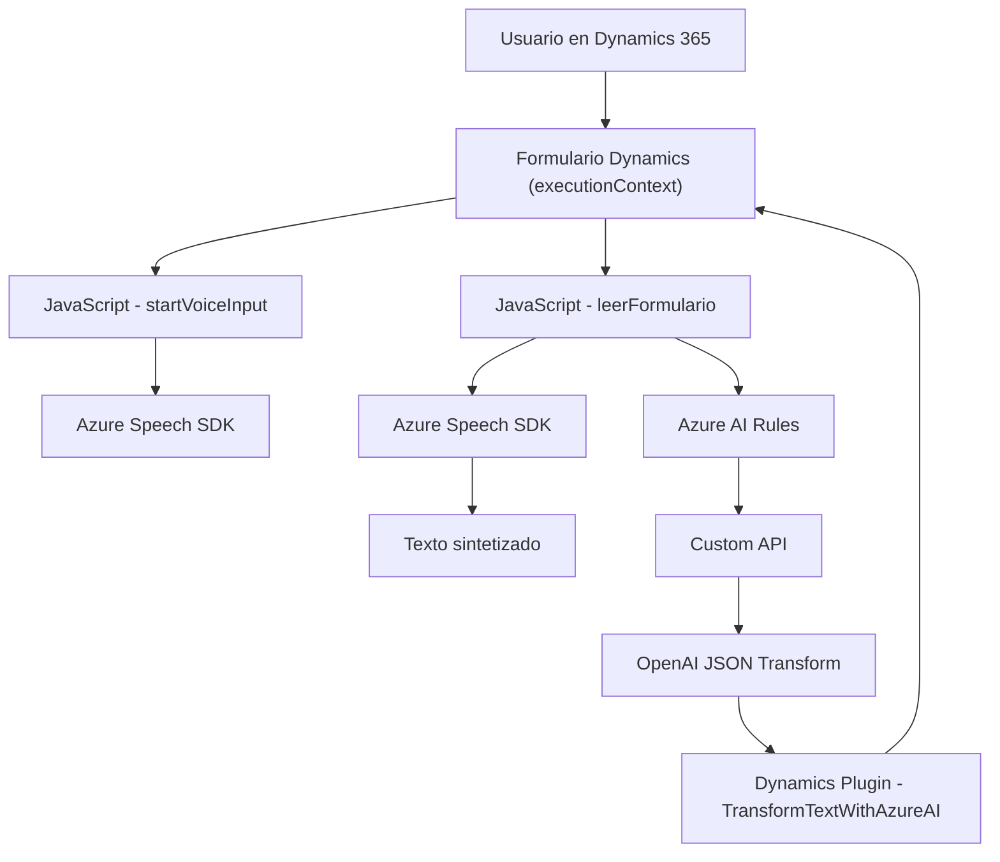

### Breve resumen técnico:

La solución presentada integra múltiples componentes para habilitar funcionalidades avanzadas en la gestión y procesamiento de formularios dentro de un entorno Dynamics 365. Se apoya en servicios de Azure Speech SDK para reconocimiento y síntesis de voz, y en Azure OpenAI para estructuración de datos. Los archivos incluyen lógica cliente para interactuar con formularios y servicios externos (a través de APIs), así como lógica del servidor para procesamiento con IA.

---

### Descripción de arquitectura:

La arquitectura parece distribuirse como una solución híbrida **n-capas**, donde:
1. **Presentación:** Los archivos de frontend interactúan directamente con los formularios y usuarios (JavaScript en Dynamics 365).
2. **Lógica de negocio:** Plugins en Dynamics CRM (C#) procesan datos utilizando APIs externas como Azure OpenAI para automatizar tareas complejas como la estructuración JSON.
3. **Servicios externos:** Servicios de Azure integrados en todos los niveles aportan capacidades como IA (OpenAI) y reconocimiento/síntesis de voz (Speech SDK).

Los componentes están diseñados para desacoplar funcionalidades específicas, aunque la dependencia fuerte del contexto de Dynamics 365 introduce cierta cohesión. Esto sugiere una solución orientada al cliente dinámico más que una arquitectura completamente desacoplada como la hexagonal.

---

### Tecnologías usadas:

1. **Azure Speech SDK:** Procesamiento de voz.
2. **Azure OpenAI Service:** Generación de respuestas y estructuración de texto en JSON.
3. **Microsoft Dynamics 365 API:** Integración y manipulación de datos en la plataforma CRM.
4. **Librerías de C#:** Manejo HTTP, JSON, y manipulación específica del SDK de Dynamics CRM.
5. **JavaScript:** Interacción con formularios en frontend mediante lógica de eventos y APIs.
6. **Newtonsoft.Json.LINQ:** Manejo de JSON en C#.

---

### Diagrama Mermaid válido para GitHub:

---

### Conclusión final:

La solución presentada constituye un sistema híbrido diseñado para maximizar la capacidad de integración entre usuarios y formularios dentro de la plataforma Dynamics 365, usando **Azure Speech SDK** y **Azure OpenAI** como servicios externos principales. Su arquitectura es principalmente orientada a **n-capas**, con una fuerte dependencia del contexto específico de Dynamics CRM. Aunque está bien estructurada para robustez y funcionalidad, podría beneficiarse de mayores esfuerzos en desacoplamiento para facilitar el uso en entornos no vinculados al ecosistema de Dynamics.