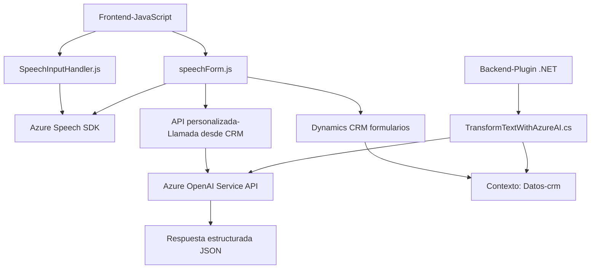

### Breve resumen técnico
La solución corresponde a un sistema basado en aplicaciones integradas que conecta funcionalidades de reconocimiento y síntesis de voz, manipulación de formularios en un entorno CRM (Dynamics 365), y procesamiento avanzado de datos a través de inteligencia artificial utilizando Azure OpenAI. Los archivos analizados indican que el sistema incluye componentes frontend en JavaScript y un backend desarrollado en .NET como un plugin para Dynamics CRM.

### Descripción de arquitectura
La solución utiliza una arquitectura basada en **n capas**, donde:
- **Frontend** proporciona una interfaz modular para interactuar con formularios y gestionar funciones de reconocimiento/síntesis de voz.
- **Backend** incorpora lógica de negocio como un plugin personalizado en CRM, interactuando con servicios externos.

La arquitectura también exhibe características de integración de **microservicios** en la forma de llamadas a APIs externas, como Azure Speech SDK y Azure OpenAI.

### Tecnologías usadas
- **Frontend:**
  - **JavaScript:**
    - Funciones para reconocer y sintetizar voz utilizando Azure Speech SDK.
    - Interacción con formularios a través de `formContext` en Dynamics CRM.
  - Servicios externos como Azure Speech SDK mediante carga dinámica de scripts.
- **Backend:**
  - **Microsoft Dynamics CRM SDK:** Extensión de funcionalidades mediante el patrón de plugins (`IPlugin`).
  - **Azure OpenAI Service:** Para transformación de texto.
  - **.NET Framework** (presumiblemente versiones como .NET Standard o Framework 4.6+):
    - Uso de bibliotecas como `System.Net.Http` y `System.Text.Json`.

### Dependencias o componentes externos presentes
1. **Azure Speech SDK:** Para reconocimiento y síntesis de voz.
2. **Azure OpenAI Service:** Para transformar texto utilizando capacidades de GPT.
3. **Dynamics CRM SDK:** Manejo de formularios y gestión de datos.
4. **Bibliotecas .NET:** Para construir la lógica del plugin.
5. API personalizada de Dynamics CRM expuesta mediante `Xrm.WebApi`.

---

### Diagrama Mermaid

---

### Conclusión final
La solución está diseñada para expandir la funcionalidad de Dynamics CRM mediante conexión con servicios avanzados que incluyen reconocimiento/síntesis de voz y procesamientos de texto por inteligencia artificial. Su arquitectura sólida y modular combina características de **n capas** con la integración de microservicios para llamadas a APIs externas. La adopción de principios del patrón **Plugin** en el backend asegura una integración controlada con el entorno CRM y separa las preocupaciones de la gestión de voz y datos.