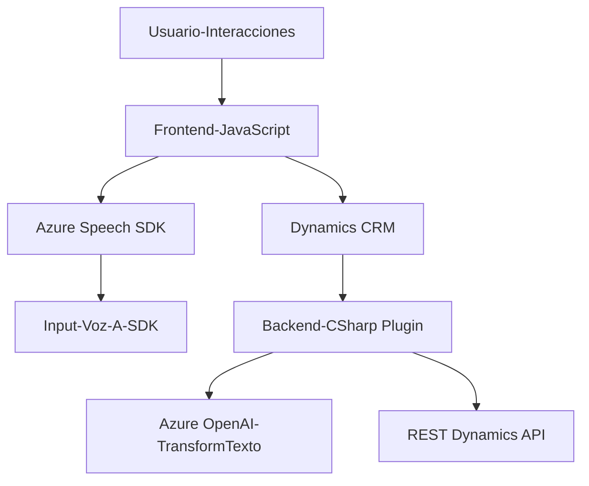

### Breve resumen técnico:
Este repositorio contiene tres archivos focalizados en la interacción con Azure Speech SDK y Azure OpenAI para convertir texto a voz, procesar entrada de voz en formularios de Dynamics CRM, y transformar texto utilizando reglas específicas definidas desde un plugin. La solución se integra con Dynamics CRM y servicios externos de Microsoft Azure.

---

### Descripción de arquitectura:
Este sistema se puede describir como una solución híbrida que combina:
1. **Frontend modular:** Maneja interacciones directas con usuarios (formulario y entrada/salida de voz). Es de tipo **multicapa** debido a la separación por funciones como extracción de datos, procesamiento y síntesis.
2. **Backend basado en plugins:** Utiliza el patrón **arquitectura de extensibilidad** típica de Microsoft Dynamics CRM, donde los plugins amplían la funcionalidad del sistema conectándola con Azure OpenAI.
3. **Servicios externos:** Integra el SDK de Speech y Azure OpenAI siguiendo el patrón **Adaptador de servicios externos** en una arquitectura **n capas**.

---

### Tecnologías usadas:
- **Frontend (JavaScript):**
  - **SDKs y APIs:**
    - **Azure Speech SDK:** Para síntesis de voz y reconocimiento de entrada.
    - **Xrm.WebApi**: Para interacción con Dynamics CRM.
  - **Patrones implementados:**
    - Modularidad (separación de responsabilidades y funciones).
    - Adaptadores de servicios (uso del SDK de Azure Speech y Xrm.WebApi).
    - Procesadores de entrada y salida.
  
- **Backend (C#):**
  - **Frameworks:**
    - **.NET Framework** para plugins de Dynamics CRM.
    - **Azure OpenAI REST API** para procesamiento avanzado de texto.
    - **Newtonsoft.Json** para manejo eficiente de JSON estructurado.
  - **Patrones implementados:**
    - Factory (con `IOrganizationServiceFactory`).
    - Servicios externos vía adaptadores.
    - Integración con sistemas clientes (Dynamics CRM).
  
- **Servicios en la nube:**
  - **Azure Speech Service**: Para síntesis y reconocimiento de voz.
  - **Azure OpenAI**: Para transformación avanzada de texto.

---

### Diagrama Mermaid:

---

### Conclusión final:
Este repositorio muestra una integración avanzada entre frontend y backend, apoyada en sistemas externos como Azure Speech y Azure OpenAI. La arquitectura es híbrida, entre **n capas** para el frontend y **extensibilidad plugin** en backend para Dynamics CRM.

La solución destaca por:
1. Su modularidad en frontend para manejar entrada/salida de voz.
2. Uso extensivo de servicios externos mediante adaptadores bien definidos.
3. Interoperabilidad con Dynamics CRM, actuando como un puente entre la interacción directa del usuario y procesamiento avanzado en la nube.

Es robusta, escalable y adecuada para entornos Microsoft-centric avanzados.