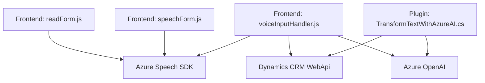

### Breve Resumen Técnico
La solución analizada en estos archivos representa una aplicación híbrida que conecta servicios web (Azure) con Dynamics 365 para habilitar procesamiento de voz y texto mediante reconocimiento inteligente, manipulación de datos en formularios, y generación de respuestas estructuradas a partir de servicios SaaS externos como Azure OpenAI.

---

### Descripción de Arquitectura
La arquitectura combina:
1. **Patrón n-capas**:
   - Capa de presentación: Scripts **Frontend** que manipulan los datos del formulario en Dynamics 365 y habilitan funciones de reconocimiento de voz.
   - Capa lógica: Plugins como `TransformTextWithAzureAI.cs`, donde se encapsula la lógica principal de procesamiento del texto usando Azure OpenAI.
   - Capa de servicios: Integración con servicios externos (SaaS), como Azure Speech SDK y Azure OpenAI, para funciones avanzadas.
   
2. **Arquitectura Orientada a Servicios (SOA)**: La solución depende fuertemente de integraciones con servicios externos (SDK de voz y OpenAI API), para modularizar funcionalidades altamente especializadas (síntesis de voz, reconocimiento de texto, interoperabilidad con AI).

3. **Patrones Asíncronos**: 
   - Scripts JavaScript implementan carga dinámica de SDKs.
   - Interacciones con Azure Speech y Dynamics API se diseñan para manejos basados en promesas/async-await.

---

### Tecnologías Usadas
1. **Frontend**: JavaScript 
   - Funciones avanzadas para extracción dinámica de datos en formularios de Dynamics 365.
   - Uso de Azure Speech SDK para síntesis y reconocimiento de voz, cargado dinámicamente desde un CDN.
   
2. **Backend**: C# 
   - Plugins personalizados (`TransformTextWithAzureAI.cs`) diseñados para integrarse con Dynamics CRM.
   - Manipulación de JSON mediante `Newtonsoft.Json` y `System.Text.Json`.
   - Integración directa con la API de Azure OpenAI para lógica avanzada basada en inteligencia artificial.

3. **Integraciones**: 
   - **Azure Speech SDK**: Reconocimiento de voz, síntesis de texto en speech.
   - **Azure OpenAI API**: Tratamiento avanzado de texto según reglas configurables.
   - **Dynamics CRM API**: Extensiones del modelo y manipulación de datos internos.

---

### Diagrama Mermaid Válido para GitHub Markdown

---

### Conclusión Final
La solución analizada es una amalgama de tecnologías modernas diseñadas para maximizar las capacidades de Dynamics CRM mediante la integración inteligente con servicios Azure. Utiliza su arquitectura modular para desarrollar una funcionalidad escalable y extensible con un foco sobre SaaS, asegurando flexibilidad en el manejo de datos de voz y texto. Aunque el diseño es robusto, ciertas áreas como gestión segura de credenciales y manejo de configuración externa podrían optimizarse para mejorar la seguridad y escalabilidad.