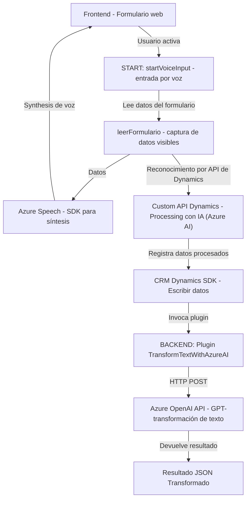

### Breve resumen técnico

El repositorio combina tres tipos de componentes:
1. **Frontend scripts (JavaScript)**: Manejan la interacción del usuario. En este caso, interactúan con formularios en el navegador y realizan operaciones como reconocimiento y síntesis de voz utilizando el Microsoft Azure Speech SDK.  
2. **Backend plugin (C#)**: Implementa lógica personalizada para un CRM basado en Dynamics 365 y extiende capacidades mediante integración con la API de Azure OpenAI para transformar texto.
3. **Custom API (Dynamics 365)**: Se utiliza para el procesamiento de datos con Azure AI en un entorno de CRM, facilitando la inserción y transformación de datos en base a un modelo específico.

---

### Descripción de arquitectura

La solución tiene una **arquitectura híbrida** con las siguientes características:
1. **Frontend modular**: Scripts JavaScript se ejecutan en el cliente (navegador), interactúan con formularios de Dynamics 365 y realizan llamadas a servicios externos como el Azure Speech SDK.
2. **Backend basado en plugins**: El plugin de C# ejecuta lógica personalizada como un proceso ligado al ciclo de vida de Dynamics CRM. Este se integra con Azure OpenAI para el procesamiento avanzado del texto.
3. **Integración con Dynamics 365 y APIs**: Los datos generados en el cliente se envían a una Custom API en Dynamics 365, la cual complementa las operaciones del plugin y de los formularios web.
4. **N capas**: La lógica está estructurada en capas bien separadas. El frontend maneja la interacción; el backend gestiona reglas empresariales y procesos; y los servicios externos (SDKs y APIs) añaden inteligencia y reconocimiento.

---

### Tecnologías, frameworks y patrones

1. **Frontend (JavaScript)**:
   - Lenguaje: **JavaScript**
   - SDK: **Microsoft Azure Speech SDK**
   - Navegador: APIs como `SpeechSDK` y `document.createElement`.

2. **Backend (C#)**:
   - Lenguaje: **C#**
   - Framework: **.NET (Dynamics 365 CRM SDK)**.
   - HTTP requests: **HttpClient**.
   - JSON handling: **System.Text.Json** y **Newtonsoft.Json**.

3. **External services**:
   - **Azure Speech SDK**: Para reconocimiento y síntesis de voz.
   - **Azure OpenAI API**: Para transformar texto mediante el modelo GPT.

### Patrones utilizados:
- **Event-Driven Architecture**: Usado en los scripts frontend para manejar eventos y callbacks de habla y reconocimiento.
- **Repository Pattern**: El plugin centraliza toda la lógica relacionada con la lectura/escritura en el CRM.
- **Decoupling through APIs**: Las diferentes partes del sistema interactúan a través de API donde están desagregadas por servicios específicos (OpenAI para texto y Speech SDK para voz).
- **Input Validation**: Cada componente valida datos en sus capas respectivas, asegurando robustez y control de errores.

---

### Dependencias o componentes externos

#### Frontend:
- **Microsoft Azure Speech SDK**: Reconocimiento y síntesis de voz.
- **Browser APIs**: Para manejo de DOM e interacción con el SDK.

#### Backend:
- **Dynamics 365 SDK**: Extensiones a CRM mediante plugins.
- **Azure OpenAI API**: Modelo GPT para procesar y transformar texto.
- **CRM Custom API**: Dinámica programada por equipo técnico, conecta CRM con Azure AI.

#### Almacenamiento:
No hay referencias directas a bases de datos en este análisis, pero dados los componentes referenciados (Dynamics 365 y plugins), los datos finales se almacenan en la base de datos interna del CRM.

---

### Diagrama Mermaid

---

### Conclusión final

La solución es un **sistema híbrido orientado a eventos y servicios** que combina interacción cliente-servidor con inteligencia artificial. Los componentes están bien distribuidos entre un frontend modular (manejo de voz para formularios), librerías externas (SDK de Azure Speech), APIs (Dynamics y Azure OpenAI), y plugins para procesos complejos en el backend del CRM.

1. **Ventajas**:
   - Modulación clara.
   - Uso de tecnologías modernas como Azure Speech y OpenAI.
   - Extensión predecible del CRM con lógica a medida.
   - Arquitectura flexible (integra servicios externos de IA y SDK).

2. **Riesgos**:
   - Dependencia alta de servicios externos (Azure), lo que podría limitar su operación si hay cambios en plataformas externas.
   - Seguridad: Claves estáticas en el código requieren mejora de gestión (migración a almacenamiento seguro).
   - Complejidad: La integración multiplataforma podría generar mayores problemas de mantenimiento si no se centralizan configuraciones.

A longitud de vista, la evolución natural sería migrar hacia una arquitectura **serverless** para simplificar gestión de backend y aprovechar la escalabilidad inherente de Azure, manteniendo el modelo de modularidad y su integración profunda con Dynamics 365.