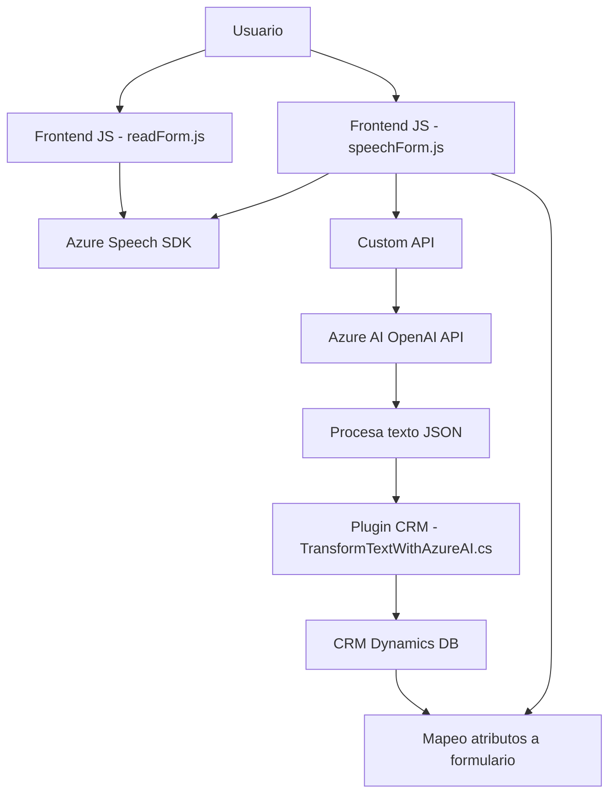

### **Breve resumen técnico**
Este repositorio es parte de una solución que implementa capacidades de entrada y salida de voz en formularios (frontend) y además incluye un plugin desarrollado en C# para integrarse con Dynamics CRM y Azure OpenAI. La solución se basa en la interacción con formularios dinámicos, utilizando servicios externos como Azure Speech SDK y Azure OpenAI para reconocimiento de voz, síntesis de voz, y procesamiento de texto con inteligencia artificial. 

---

### **Descripción de arquitectura**

1. **Tipo de solución:**  
   - Es una solución híbrida, compuesta por dos partes principales:  
     - **Frontend (JavaScript):** Para lectura de formularios dinámicos y síntesis de voz, así como inserción de datos procesados mediante comandos de voz.  
     - **Plugin (C#):** Backend basado en Dynamics CRM, conectado con **Azure OpenAI API** para transformar texto usando reglas predefinidas.  

2. **Arquitectura:**  
   - La solución utiliza una arquitectura **n-capas**, debido a su separación en:  
     - Presentación (JavaScript para interacción de formularios).
     - Integración con APIs internas y externas (Azure Speech SDK, Azure OpenAI).
     - Backend/plugin basado en Dynamics para procesar datos transformados.
   - También presenta características que podrían asociarse a la **arquitectura hexagonal**, gracias a la integración con servicios externos (Azure Speech y OpenAI) a través de adaptadores claros (API y SDK).

---

### **Tecnologías usadas**
1. **Frontend:**  
   - **Azure Speech SDK:** Procesamiento y síntesis de voz.  
   - **JavaScript:** Entrada y manipulación de datos en formularios.  
   - **Dynamics 365 XRM.WebApi:** Actualización y lectura de datos en formularios dinámicos dentro de un CRM.

2. **Backend:**  
   - **C#:** Implementación del plugin para Dynamics CRM.  
   - **Azure OpenAI API:** Procesamiento de texto enriquecido.  
   - **Microsoft.Xrm.Sdk:** Manejo del modelo de datos dentro del plugin.  
   - **Newtonsoft.Json:** Manipulación de objetos JSON.

3. **Servicios externos:**  
   - Integración directa con **Azure Speech SDK** para habla y síntesis.  
   - Consumo de **Azure OpenAI API** para transformación avanzada de texto.

---

### **Dependencias o componentes externos**
- **Azure Speech SDK:** Para entrada y salida de voz.  
- **Azure OpenAI API:** Para procesamiento de texto avanzado con inteligencia artificial.  
- **XRM Dynamics CRM API:** Para manipular datos del sistema CRM.  
- **CDN del SDK:** `https://aka.ms/csspeech/jsbrowserpackageraw` para cargar el Speech SDK dinámicamente en el frontend.  
- **Servicios internos del CRM:** Como `Xrm.WebApi` para CRUD de datos en formularios.  

---

### **Diagrama Mermaid**

---

### **Conclusión final**
Este repositorio implementa una solución de innovación tecnológica en formulación dinámica, utilizando un enfoque basado en la integración con servicios externos (Azure Speech y OpenAI). La arquitectura presenta características de **n-capas**, con capas bien definidas de presentación (JavaScript), negocio (API personalizada y Dynamics plugin), y servicios externos (Azure). Su diseño modular facilita la extensibilidad y la actualización futura de funcionalidades. El sistema se adapta particularmente bien a aplicaciones CRM avanzadas, mejorando la interacción humana mediante automatización y capacidades de IA para entrada de voz y enriquecimiento de texto.