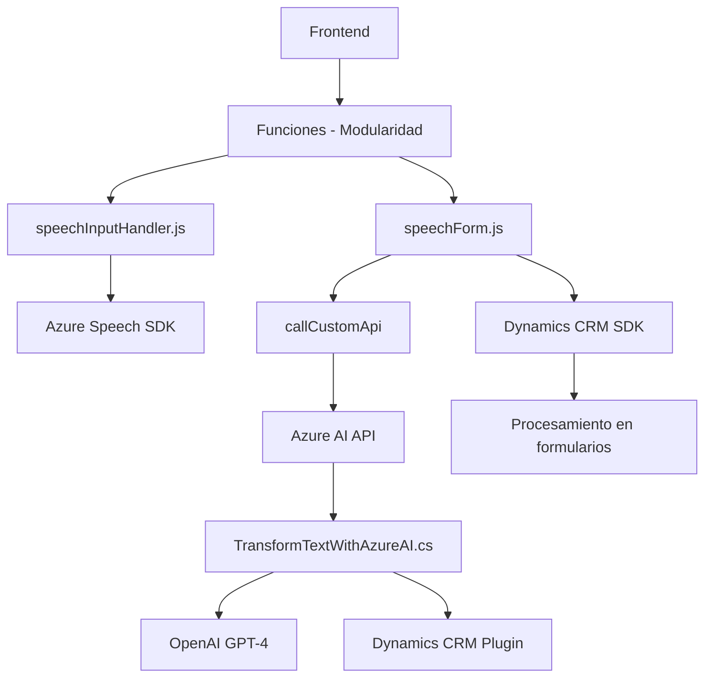

### Breve resumen técnico

Este repositorio integra dos principales módulos de código en JavaScript para interacción de usuarios mediante voz y un plugin en C# diseñado para transformar texto utilizando Azure OpenAI. Los módulos procesan datos de formularios de Dynamics CRM, permiten entrada de voz, sintetizan texto y aplican normativas específicas para la manipulación del texto con inteligencia artificial.

---

### Descripción de arquitectura

**Tipo de solución**: 
La solución es un **backend/plug-in con integración IoT y frontend** que soporta interacción mediante voz y procesamiento de texto en tiempo real. Está orientada a integrarse con Microsoft Dynamics CRM y utiliza funcionalidades externas de Microsoft Azure, como Speech SDK y OpenAI.

**Arquitectura**:
El sistema se organiza como una arquitectura **n capas**:
1. **Capa de Presentación**: Dispositivos frontend (datos sobre formularios visibles y APIs del navegador).
2. **Capa de Negocio**:
   - Procesamiento de voz y texto mediante SDK de Azure Speech integrado con un mapa de campos de Dynamics CRM.
   - Trasformación textual con normas personalizadas mediante un plugin conectado con Azure OpenAI.
3. **Capa de Persistencia**: Relacionada con las operaciones en campos y entidades del CRM empleando los SDK correspondientes.

Además, se detecta el uso del patrón **hexagonal** en el diseño del plugin, separando la lógica específica de negocio y núcleo de las interacciones externas como llamadas a servicios API y dependencias del flujo de Dynamics CRM.

---

### Tecnologías usadas

1. **Microsoft Azure Speech SDK**:
   - Entrada de voz, reconocimiento y síntesis de texto a voz.
   - Enlaces dinámicos con el navegador para optimizar el uso de recursos.

2. **Azure OpenAI Service**:
   - Generación de respuestas personalizadas con el modelo GPT-4.

3. **ECMAScript**:
   - Modularidad mediante funciones organizadas.

4. **Dynamics 365 CRM**:
   - APIs y SDK para interacción directa con formas dinámicas de CRM.

5. **C# y Microsoft.Xrm.Sdk** (archivo `TransformTextWithAzureAI.cs`):
   - Implementa lógica de transformación textual para Dynamics 365 mediante un plugin.

6. **Patrones**:
   - Fábrica: Para configuraciones de síntesis de voz y asignación de datos.
   - Façade: Abstracción de procesos a través de funciones como `startVoiceInput`.
   - Inversión de control (por dependencias externas dinámicas).

---

### Dependencias o componentes externos

1. **Microsoft Azure Speech SDK y OpenAI**:
   - Speech SDK es completamente dinámico y se carga desde un CDN.
   - OpenAI depende de solicitudes HTTP con formatos de JSON preprocesados.

2. **Dynamics CRM SDK**:
   - Manejo de formularios dinámicos agregando valores mediante `formContext` y mapeo de atributos.

3. **APIs del navegador**:
   - Incluyen manipulación DOM para extraer información visible de formularios.

---

### Diagrama Mermaid

---

### Conclusión final

Este repositorio combina interacción humana avanzada mediante reconocimiento de voz, síntesis de texto y procesamiento transformador basado en IA dentro de aplicaciones empresariales. La arquitectura refleja una forma híbrida de **n capas con integración externa**, optimizada para trabajar en un entorno corporativo con **Dynamics 365 CRM**. La modularidad de su diseño se asegura manteniendo ligereza y escalabilidad al no incluir todas las dependencias de manera estática. Esta solución es ideal para automatización de procesos comerciales y mejora en la experiencia de usuarios/clientes en contextos profesionales y empresariales.