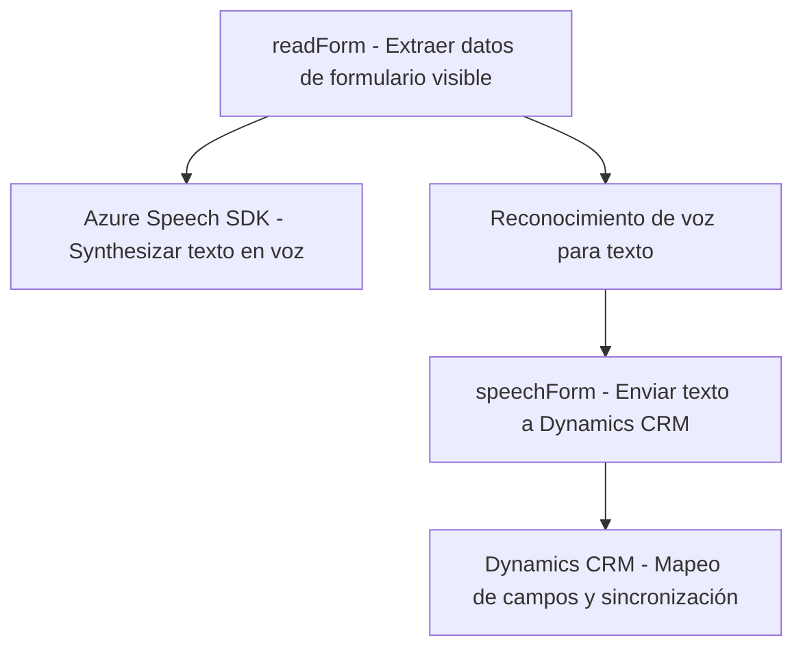
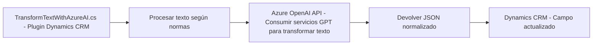

# Resumen técnico

El repositorio corresponde a una solución que integra un **sistema de síntesis y reconocimiento de voz** con formularios dinámicos de **Dynamics 365**. Utiliza APIs externas y SDKs, incluyendo **Azure Speech SDK** y **Azure OpenAI API**, para transformar datos de entrada y salida en una experiencia interactiva centrada en la voz. Además, hay un plugin de Dynamics CRM que actúa como un adaptador para realizar el procesamiento de texto basado en la integración con OpenAI.

---

# Descripción de arquitectura

1. **Tipo de arquitectura**:  
   La arquitectura corresponde a una solución de **integración modular** con patrones mixtos:
   - La parte de frontend implementa funcionalidades mediante módulos desacoplados y maneja datos desde un **repositorio de datos externo** (Dynamics 365).
   - El backend usa un plugin basado en Dynamics CRM para extender las capacidades del sistema mediante **API externas**. Esto sugiere un diseño orientado con principios de lógica distribuida.
   - **Microservicios indirectos**: API personalizada de Azure OpenAI utilizada como un servicio externo, por lo que no es estrictamente monolítica ni de capas puras.

2. **Patrones identificados**:  
   - **Synthesis and Recognition Pipeline**: Procesa datos visibles desde Dynamics 365 y sintetiza voz en tiempo real (frontend). Simultáneamente, el reconocimiento de voz devuelve datos para integrarlos al CRM.
   - **External Service Integration**: SDK dinámico para la integración con servicios de Azure Speech y Azure OpenAI.
   - **Adapter Pattern**: En el plugin, el método actúa como adaptador HTTP para traducir solicitudes al API OpenAI.
   - **SRP (Principio de Responsabilidad Única)**: Los módulos tienen funciones únicas específicas (sintetizar voz, reconocer texto, interactuar con formularios, transformar datos en JSON).

---

# Tecnologías usadas

1. **Frontend**:
   - JavaScript para lógica del cliente.
   - **Azure Speech SDK**: Síntesis y reconocimiento de voz.
   - Dinámica de formularios basada en **Dynamics CRM SDK**.

2. **Backend**:
   - **C# y Dynamics 365 Plugin Architecture**: Extiende operaciones en el sistema CRM.
   - Integración con **Azure OpenAI API** para la generación de texto dinámico.

3. **Frameworks, librerías y capacidades externas**:
   - **Newtonsoft.Json** y **System.Text.Json**: Manipulación del JSON en el plugin.
   - **HttpClient**: Cliente HTTP para consumir APIs.
   - **Azure Services**: Speech-to-text, síntesis de voz y procesamiento de texto basado en IA.

---

# Diagramas Mermaid válidos para GitHub

Se generarán dos diagramas: uno para el **Frontend** y otro para el **Plugin Backend**, representando las interacciones principales de ambos componentes.

## (1) Frontend: Integración de voz con formularios CRM

## (2) Plugin Backend: Transformación de texto con OpenAI

---

# Conclusión final

La solución integra tecnología de reconocimiento y síntesis de voz con procesamiento avanzado de texto para entornos de **Dynamics 365 CRM**. Su diseño modular combina frontend desacoplado (en JavaScript) y un backend basado en **plugins de Dynamics 365** para procesar texto estructurado mediante **Azure AI**. Aunque el proyecto muestra un enfoque moderno e integrador, destaca la necesidad de mejorar la seguridad (clave API) y manejo de errores para garantizar robustez en ambientes productivos.