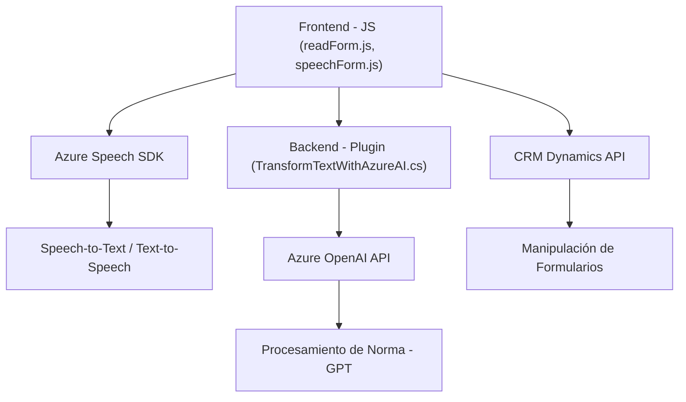

## Breve resumen técnico

Este repositorio contiene tres tipos de implementaciones principales que interactúan entre sí en torno a un modelo basado en procesamiento de datos CRM, reconocimiento de voz (Speech-to-Text) y síntesis de voz (Text-to-Speech). Combina frontend con JavaScript, integraciones complejas con servicios de Azure (Speech SDK y OpenAI API), y extensiones en el backend mediante plugins para Dynamics CRM.

---

## Descripción de arquitectura

La solución está organizada en varias capas y componentes que colaboran con una arquitectura orientada a servicios:

1. **Frontend:** Implementado en JavaScript, enfocado en recogida de datos en formularios, procesamiento de voz, integración dinámica con SDKs externos (Azure Speech), y llamadas a APIs para transformar textos.
2. **Backend:** Implementación de un plugin basado en Dynamics CRM, cuya función principal es conectar con Azure OpenAI para realizar transformaciones avanzadas de texto en respuesta JSON.
3. **Servicios externos:** Uso intensivo de Azure Speech SDK para reconocimiento y síntesis de voz, así como Azure OpenAI API para aplicar reglas de negocio al procesamiento de texto.

### Principales patrones arquitectónicos:
- **Plugin-Based Architecture (Backend):** El plugin de Dynamics CRM se basa en el modelo de extensión oficial de Microsoft, integrando lógica personalizada mediante la interfaz `IPlugin`.
- **Facade Pattern:** Simplifica interacciones con servicios complejos como Azure OpenAI y Speech SDK, exponiendo funciones más accesibles desde el frontend.
- **Microservicios:** Aunque no es una arquitectura estrictamente dividida en microservicios, hay una clara modularización e integración con APIs externas (ej.: Azure Speech y OpenAI).
- **N-capas:** Cada módulo tiene funciones bien separadas: frontend interactúa con datos del usuario, el backend realiza transformaciones complejas, y los servicios externos conectan con APIs.

---

## Tecnologías usadas

1. **Frontend:**
   - JavaScript para lógica de negocio en el navegador.
   - Azure Speech SDK para procesamiento por voz (extracción de texto y síntesis TTS).
   - Manipulación de formularios dinámicos de un CRM.

2. **Backend:**
   - Dynamics CRM SDK (Microsoft.Xrm.Sdk).
   - C# (.NET) como lenguaje de implementación para plugins.
   - Azure OpenAI API para procesamiento de texto.

3. **Servicios externos:**
   - **Azure Speech SDK** (biblioteca cargada dinámicamente para Speech-to-Text y Text-to-Speech).
   - **Azure OpenAI API:** Transformación avanzada de textos basados en GPT.

---

## Diagrama **Mermaid** válido para GitHub

---

## Conclusión final

Este repositorio implementa una solución orientada al sector CRM que combina frontend y backend mediante integraciones con servicios potentes como Azure Speech y OpenAI. Principalmente es una arquitectura en capas complementada por interacciones automáticas con APIs externas. Se observan buenas prácticas de modularidad y patrones de diseño como fachada, plugin-based y carga dinámica de SDKs externos.

Sin embargo, es importante mejorar la documentación para detallar configuraciones específicas (como regiones y claves de Azure) y explorar cómo escalaría este sistema en un modelo de microservicios completo si el volumen de datos y procesamiento aumenta significativamente.