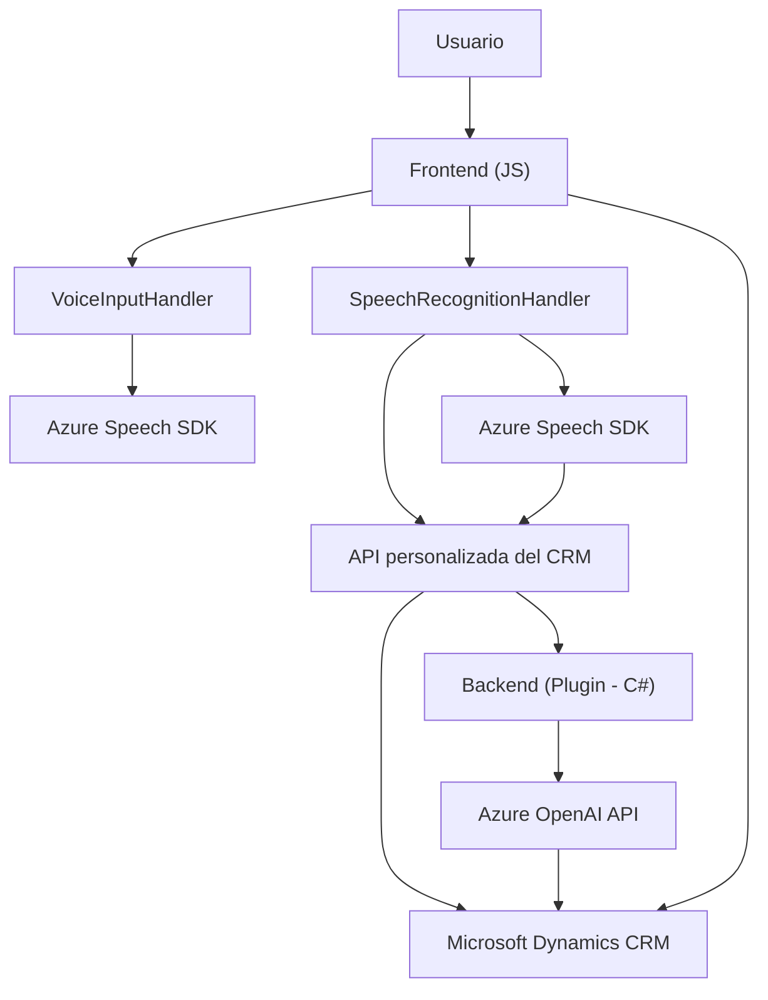

### Breve resumen técnico
Este repositorio contiene archivos que forman parte de una solución integrada de CRM (Microsoft Dynamics CRM), con funcionalidades orientadas hacia la interacción entre el frontend (formularios) y servicios externos como el **Azure Speech SDK** y **Azure OpenAI**. La solución incluye procesamiento de datos del formulario, entrada/salida por voz y transformación de texto con IA.

### Descripción de arquitectura
La arquitectura es **n-capas**, con un enfoque en separar responsabilidades:
1. **Frontend/JS**:
   - Gestión de formularios y la interacción usuario-SDK.
   - Carga y uso de SDK externos (Azure Speech SDK).
   - Procesamiento de datos para síntesis de voz y reconocimiento de voz.
2. **Backend/plugins**:
   - Transformación de datos en el contexto del CRM usando Azure OpenAI para procesamiento avanzado de texto.
   - Ejecución lógica de negocio dentro del contexto del CRM mediante plugins configurables.

### Tecnologías usadas
1. **Frontend**:
   - **JavaScript**: Lenguaje principal para la interacción con formularios y SDKs.
   - **Azure Speech SDK**: Reconocimiento de voz y síntesis.
2. **Backend**:
   - **C# (.NET)**: Desarrollo de plugins en Dynamics CRM.
   - **Microsoft Dynamics CRM SDK**: Extensión del CRM mediante plugins.
   - **Azure OpenAI API**: Procesamiento de texto avanzado.
   - **JSON Serialization (Newtonsoft.Json / System.Text.Json)**: Manejo de estructuras JSON.
   - **HttpClient** (C#): Para integración con Azure API.

### Dependencias y componentes externos
1. **Azure Speech SDK**: Acceso dinámico mediante script (`https://aka.ms/csspeech/jsbrowserpackageraw`).
2. **Azure OpenAI**: Procesamiento de texto mediante IA.
3. **Microsoft Dynamics CRM SDK**: Contexto de ejecución de plugins y manipulación de datos del CRM.
4. **JSON Libraries**: Para serialización/deserialización de datos entre el CRM y servicios en Azure.

### Diagrama Mermaid (válido para GitHub Markdown)

### Conclusión final
La solución presentada en este repositorio tiene un enfoque claramente diseñado para integrarse con sistemas CRM (Microsoft Dynamics) y servicios IA en la nube (Azure Speech SDK y OpenAI). Destaca el uso de una **arquitectura n-capas** con separación clara de responsabilidades:
- **Frontend**: Procesa entrada y salida de datos por voz y gestionan SDK especializadas como Azure Speech.
- **Backend/Plugins**: Ejecuta lógica compleja, transforma datos con IA y manipula entidades del CRM.

Esta solución permite una interacción avanzada entre usuarios y el sistema CRM, utilizando tecnologías modernas de IA y reconocimiento de voz, y estableciendo un flujo de integración robusto mediante APIs y SDKs externos.