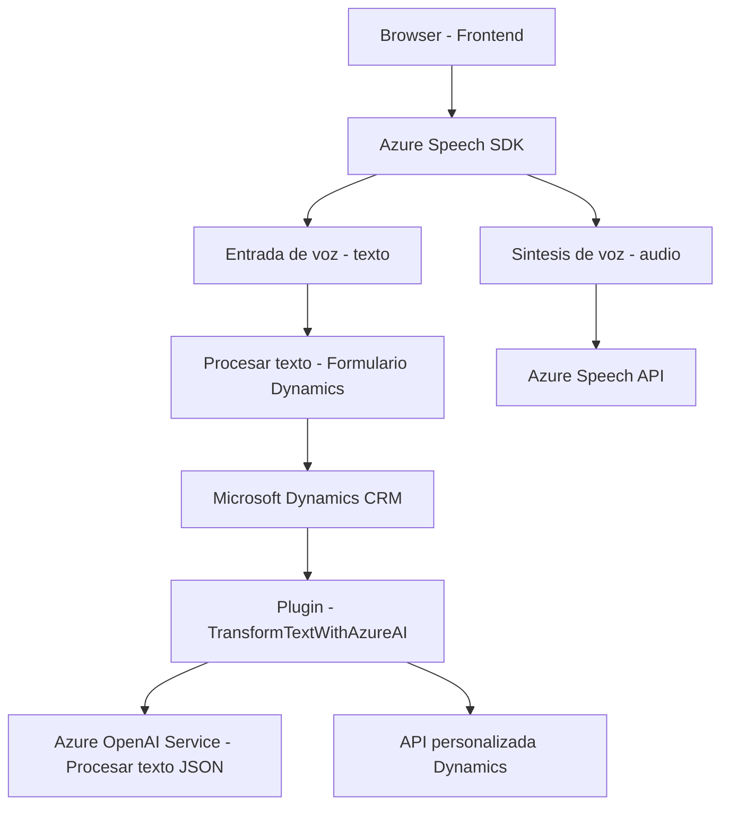

### Breve resumen técnico 
La solución es un sistema híbrido compuesto por un **frontend basado en JavaScript** y un **plugin de Dynamics CRM** escrito en C#. El objetivo es implementar interacción con usuarios mediante voz (entrada y síntesis), manipulación de datos en formularios de Dynamics 365 y transformación de texto con inteligencia artificial utilizando servicios de Azure. 

---

### Descripción de arquitectura
La arquitectura corresponde a un **modelo multicapa** que interactúa con servicios externos. El sistema puede dividirse en:
1. **Frontend (JavaScript)**: que ejecuta la funcionalidad para usuarios y se integra mediante APIs o SDKs externos como Azure Speech SDK para entrada y síntesis de voz.
2. **Backend (C# Plugin)**: Actúa como lógica de negocio de Dynamics CRM. Implementa un patrón de carga de plugins (Dynamics 365 Plugin-based Architecture) que permite extensibilidad directa de los eventos en la plataforma.
   
### Características específicas:
- La parte frontend opera basada en eventos, controlando entrada de datos mediante voz y asociando dichos datos a formularios.
- El backend procesa la lógica avanzada de transformación de texto usando un servicio externo de Azure OpenAI.
- La arquitectura se complementa con un diseño modular, desacoplando cada pieza funcional y promoviendo el uso de SDKs o APIs externas.

---

### Tecnologías usadas
1. **Azure Speech SDK**:
   - Para entrada y síntesis de voz, cargado dinámicamente en el frontend a través de JavaScript.
   
2. **Dynamics 365 CRM SDK**:
   - Facilitador del plugin de backend (código en C#) para automatizar y extender funcionalidades del sistema.

3. **Azure OpenAI Service**:
   - Usado en backend C# para transformación de texto y generación de JSON estructurado basado en el contenido proporcionado por el usuario.

4. **Newtonsoft.Json.Linq**:
   - Manipulación avanzada de objetos JSON en la lógica del plugin.

5. **HTTP Client**:
   - Comunicación directa con Azure OpenAI Service desde el backend.

### Patrones y prácticas identificadas
- **Multicapa y modularidad**: Se separan distintas responsabilidades (frontend, backend, plugins, y servicios externos).
- **Estrategia de "facade" para integración de SDKs**: Encapsula las operaciones externas mediante funciones específicas como la carga condicional del SDK.
- **Asynchrony**: Uso de promesas y operaciones asincrónicas para manejar interacciones de red y externos.

---

### Diagrama Mermaid

---

### Conclusión final
La solución analiza datos ingresados mediante voz, interactúa con formularios de Dynamics CRM para extraer visibles atributos o llenarlos automáticamente, y transforma textos con reglas precisas aplicando tecnologías de inteligencia artificial (Azure OpenAI). 

La arquitectura sigue el enfoque de **multicapa** con integración de servicios externos (Azure Speech y OpenAI), asegurando modularidad y facilitando la integración de SDKs con una mínima fricción. 

Es adecuada para entornos corporativos, como aplicaciones empresariales personalizadas con Dynamics CRM, y hace uso eficiente de recursos para extender las capacidades nativas de la plataforma.