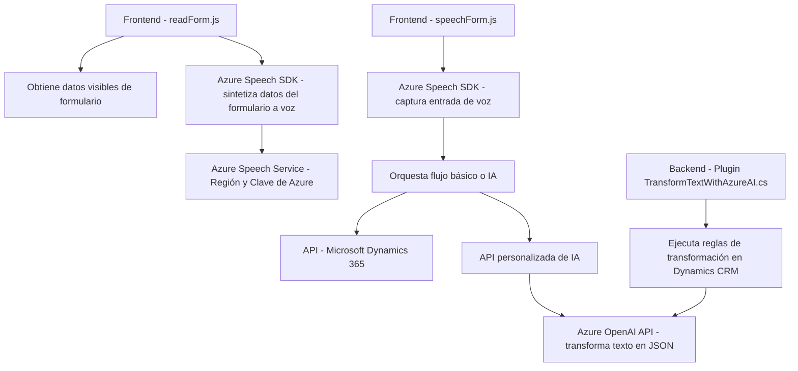

### Breve resumen técnico

Este repositorio implementa una solución centrada en la integración entre servicios de voz e inteligencia artificial, utilizando **Azure Speech SDK**, **Azure OpenAI** y **Microsoft Dynamics 365**. Consta de archivos orientados al frontend para procesamiento de voz (con **JavaScript**) y un backend en forma de **plugin** (C#) para la transformación avanzada de texto. Está diseñado para operar en entornos de Dynamics 365 y utiliza servicios externos de Azure.

---

### Descripción de la arquitectura

La arquitectura está diseñada en **n capas** con integración de servicios externos. El frontend actúa como capa de presentación, donde se realizan tareas de interacción con el usuario que incluyen la captura y síntesis de voz mediante **Azure Speech SDK**. Los datos obtenidos del usuario se analizan y se procesan dinámicamente en los formularios de Dynamics 365, con dos flujos diferenciados: uno básico y otro avanzado basado en inteligencia artificial. La capa de backend consiste en un **plugin de Dynamics CRM** que se comunica tanto con los servicios internos de Dynamics (via Web API) como con **Azure OpenAI** para la transformación avanzada de texto.

Gran parte de la responsabilidad se distribuye entre módulos independientes, siguiendo principios de **modularidad** y **responsabilidad única**, con una ligera integración de patrones como **orquestación** y **callback**.

---

### Tecnologías usadas
- **Frontend**
   - **JavaScript**: Implementación principal para captura y síntesis de voz.
   - **Azure Speech SDK**: Integración dinámica para procesamiento de voz.
   - **Microsoft Dynamics 365 Web API**: Para manipular datos de formularios y realizar llamadas personalizadas.

- **Backend**
   - **C# Plugin**: Ejecución de reglas en Dynamics CRM y comunicación externa.
   - **Azure OpenAI API**: Para transformaciones avanzadas de texto.
   - **Newtonsoft.Json**: Procesamiento de respuestas REST en formato JSON.
   - **Dynamics CRM SDK**: Provisión de plugins para interacción directa con CRM.

- **Servicios externos**
   - **Azure Speech SDK**: Procesamiento de voz (reconocimiento y síntesis).
   - **Azure OpenAI**: Transformación avanzada de texto en el backend.

---

### Diagrama Mermaid 100 % compatible con GitHub Markdown

---

### Conclusión final

Este repositorio implementa una solución **orientada a capas** con funcionalidad de reconocimiento y síntesis de voz junto con transformación de datos mediante inteligencia artificial, utilizando la plataforma **Azure**. Utiliza principios de modularidad y separación de responsabilidades, permitiendo una fácil extensión y mantenimiento. Es óptimo para soluciones empresariales que necesitan enriquecer la interacción de usuarios con entornos Dynamics 365 mediante voz e inteligencia artificial.