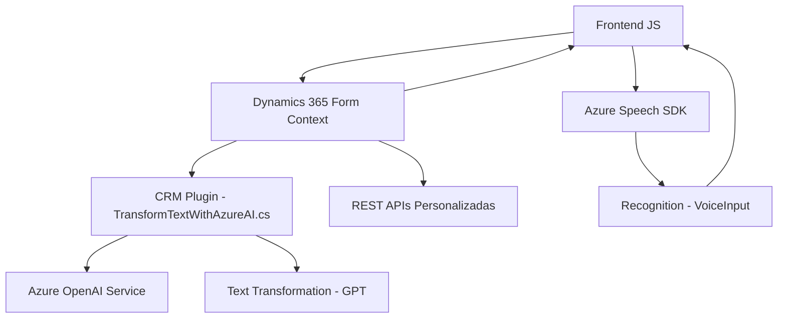

### Breve Resumen Técnico

El repositorio contiene tres archivos principales que forman parte de una solución orientada a la integración de formularios CRM y servicios de Azure para reconocimiento de voz y procesamiento de texto mediante inteligencia artificial. Estos archivos implementan procesamiento dinámico de datos en plataformas como Dynamics 365, además de interacción con Microsoft Azure Speech SDK y OpenAI Service.

---

### Descripción de Arquitectura

1. **Tipo de Solución**:  
   - Combina elementos de **API**, **frontend** (cliente web) y **plugins** (backend dinámico de CRM).
   - Principalmente orientada a extender las capacidades de Dynamics 365 usando herramientas modernas en el cliente y backend.

2. **Tecnologías, Frameworks y Patrones**:  
   - **Frontend**:
     - Azure Speech SDK para reconocimiento y síntesis de voz.
     - Funciones basadas en JavaScript, con modularidad y callbacks asíncronos.
     - `Dynamics 365` (contexto `formContext`) para manipulación de formularios CRM.
   - **Backend**:
     - Dynamics CRM plugin framework (`IPlugin`) para extender funcionalidades mediante lógica personalizada.
     - Azure OpenAI Service para procesamiento avanzado de texto con modelos GPT.
   - **Patrones**:
     - **Event-Driven Architecture**: Uso de eventos y callbacks.
     - **SOA (Service-Oriented Architecture)**: Interacción con servicios externos (Azure Speech y OpenAI).
     - **Microkernel (CRM Plugins)**: Extensibilidad mediante el estándar de plugins en Dynamics CRM.
     - Modularización y separación de responsabilidades.

3. **Dependencias Externas**:  
   - **Azure Speech SDK** (`https://aka.ms/csspeech/jsbrowserpackageraw`) para reconocimiento de voz y síntesis.
   - **Azure OpenAI Service**: Endpoint directo para consumir modelos GPT.
   - Frameworks como `Newtonsoft.Json` y `System.Net.Http` para procesamiento JSON y comunicación HTTP.

4. **Tipo de Arquitectura**:  
   - **N capas**: Componentes frontend que interactúan con un backend centralizado basado en Dynamics CRM (plugin).
   - Combina aspectos de **hexagonal architecture**: Integraciones externas mediante puertos y adaptadores (SDKs y servicios REST).
   - Uso de servicios externos garantiza capacidad de escalar y separar lógicas externas.

---

### Diagrama Mermaid válido para GitHub Markdown

---

### Conclusión Final

Esta solución representa una integración bien estructurada entre la interfaz en Dynamics CRM, frontend basado en JavaScript y APIs externas de Azure. Su arquitectura permite manejar de manera eficaz el reconocimiento de voz, el procesamiento avanzado de texto y la manipulación de datos en aplicaciones CRM. La arquitectura de **n capas** y el uso de patrones como SOA y eventos asíncronos asegura flexibilidad, escalabilidad y buena integración con los servicios modernos de Azure.