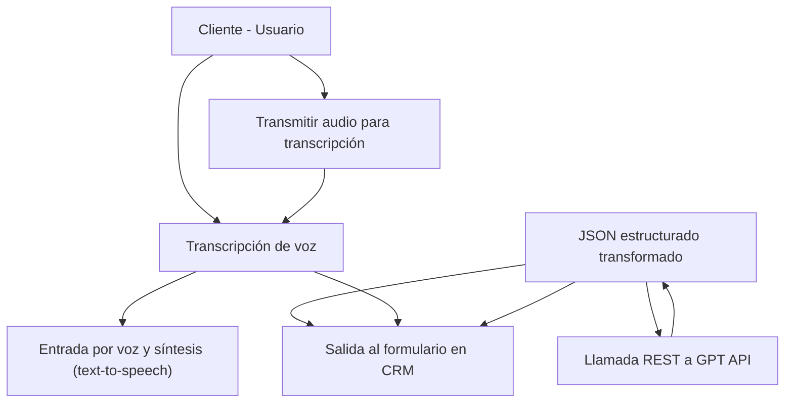

### Breve resumen técnico
El proyecto descrito es una solución orientada a la interacción y automatización de procesos mediante reconocimiento de voz (speech-to-text) y generación de voz (text-to-speech), integrada con formularios en un sistema CRM (Dynamics 365). Adicionalmente, incluye un plugin que interactúa con Azure OpenAI GPT para transformar textos según reglas predefinidas.

### Descripción de arquitectura
La arquitectura del sistema puede caracterizarse como una **híbrida entre aplicaciones cliente-servidor** y **integración con servidores externos**. Principalmente:
1. **Frontend:** Implementa funcionalidades de voz con un enfoque en modularidad a través de funciones que interactúan con formularios CRM.
2. **Backend:** Utiliza un plugin implementado en C# (.NET) con integración de Microsoft Dynamics CRM y el servicio de Azure OpenAI GPT mediante APIs REST.
3. **Dependencias externas:** Utiliza dos APIs: Azure Speech SDK y Azure OpenAI GPT, lo que sugiere orientación hacia una arquitectura de microservicios o servicios desacoplados.

### Tecnologías usadas
1. **Frontend:** Implementado en JavaScript para la interacción del usuario con los formularios y el manejo de API.
   - **Azure Speech SDK (JavaScript SDK):** Usado para text-to-speech y speech-to-text.
2. **Backend:**
   - **Plugin de Microsoft Dynamics CRM**: Para extender la funcionalidad y realizar operaciones desde el lado del servidor. 
   - **C# y .NET Plugin SDK:** Base de la implementación del backend.
   - **Azure OpenAI (GPT API):** Para procesamiento de textos con IA.
   - **Newtonsoft.Json:** Bibliotecas para trabajar con JSON en el backend.
   - **HTTP client services**: Para realizar solicitudes HTTP al servicio Azure OpenAI.

### Diagrama Mermaid
Representación básica de la solución y las principales interacciones entre componentes:

### Conclusión Final
Este es un **sistema orientado a servicios** con funcionalidades específicas en los extremos (UI en el cliente y un backend como plugin en Dynamics CRM), complementado por servicios de terceros como el Speech SDK y OpenAI GPT. La solución se desarrolla bajo principios de **modularidad**, usando APIs para interactuar entre componentes y microservicios, con un enfoque especial en aplicar patrones como desacoplamiento y DTO para gestionar datos estructurados.