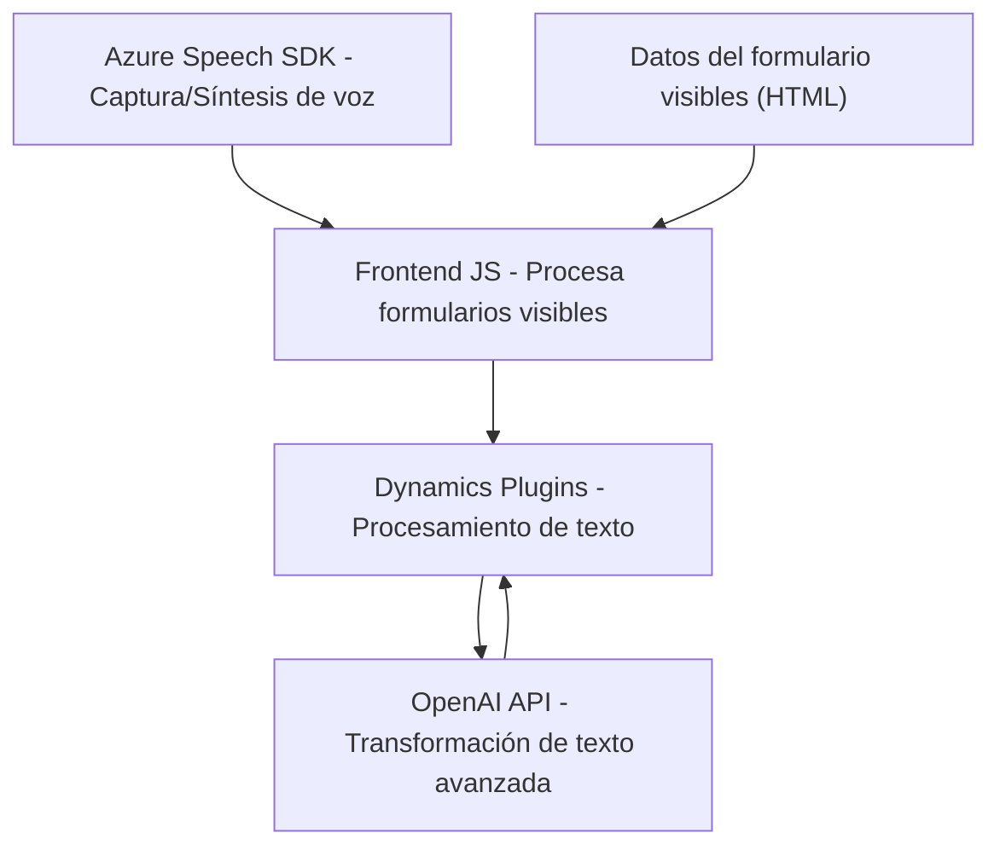

# Análisis del repositorio

## Breve resumen técnico
El repositorio contiene la implementación de soluciones para la **gestión dinámica de formularios y captura/síntesis de voz** dentro del ecosistema de Microsoft Dynamics 365. Incluye tanto **código frontend en JavaScript** para interactuar con el SDK Azure Speech y los formularios de Dynamics, como un **plugin backend en C#** que se comunica con Azure OpenAI para la transformación avanzada de texto.

---

## Descripción de arquitectura
La arquitectura general está basada en un modelo **híbrido cliente-servidor**, donde se integran servicios externos como **Azure Speech SDK** y **Azure OpenAI API** para funciones específicas, mientras que la lógica de negocio se distribuye entre:
- **Frontend (JS)**: Interacción del usuario, lectura de campos visibles y síntesis/captura de entrada por voz.
- **Backend (Plugin C#)**: Procesamiento de texto mediante inteligencia artificial y devolución de resultados al sistema Dynamics.

Este diseño combina:
- Frontend modular: Con responsabilidades bien delimitadas (lectura, síntesis, captura y API).
- Complemento backend: Utilización de eventos en Dynamics para ejecutar tareas y conectarse con un microservicio de transformación de texto (Azure OpenAI API).

### Arquitectura dominante
La solución utiliza un modelo **n-capas híbrido**, donde hay:
1. **Capa cliente (Frontend)** basada en JavaScript para manejo de datos y SDK.
2. **Capa lógica de negocio (Dynamics Plugin)** en C# para ejecutar eventos y transformación avanzada.
3. **Dependencias externas** que contribuyen al modelo **API-driven**:
   - Azure Speech SDK para interacción con voz.
   - Azure OpenAI API para transformación de texto.
4. **Integración de servicios cloud** (Azure) como principal patrón.

---

## Tecnologías, frameworks y patrones usados
### **Frontend (JavaScript)**
- **Azure Speech SDK**: Sirve para captura y síntesis de voz.
- **JavaScript modular**: Código organizado en funciones reutilizables.
- **Patrones de diseño**:
  - **Carga dinámica de SDK** mediante URL pública.
  - **Event-Driven Architecture**: Uso de eventos de interacción del usuario (formularios visibles, callbacks).

### **Backend (C# Plugin)**
- **Dynamics CRM SDK**: (nuget `Microsoft.Xrm.Sdk`) para interactuar con eventos y datos en Dynamics.
- **Azure OpenAI API**: Cliente HTTP para procesamiento avanzado de texto mediante modelos GPT.
- **Newtonsoft.Json**: Manejo estructurado de datos JSON.
- **HttpClient**: Integración con servicios externos.
- **Patrones de diseño**:
  - **Plugin Design Pattern** para ejecutar procesos en Dynamics.
  - **Integración API externa vía REST** (Azure).

---

## Dependencias o componentes externos presentes
1. **Azure Speech SDK**: Servicio SaaS para captura y salida de voz.
2. **Azure OpenAI API**: Inteligencia artificial basada en GPT para transformación avanzada de texto.
3. **Dynamics 365 SDK y WebApi**: Interacción y gestión de datos en formularios de CRM.
4. **Diseño modular**: Separación de código entre frontend y backend para diferentes propósitos.
5. **Microsoft/Xrm.SDK DLL**: Manejo de datos y configuración en Dynamics CRM.

---

## Diagrama Mermaid (válido para GitHub)

---

## Conclusión final
La solución está orientada a complementar la funcionalidad estándar de Microsoft Dynamics 365, utilizando integraciones externas como **Azure Speech SDK** para síntesis de voz y captura de datos, mientras que el backend, mediante un plugin Dynamics en C#, transforma datos en tiempo real usando **Azure OpenAI API**. 

El diseño arquitectónico sigue un modelo híbrido basado en **n-capas** con una fuerte integración SaaS mediante APIs externas, respondiendo bien a necesidades como automatización, captura eficiente de datos y personalización del flujo de trabajo. Sin embargo, sería importante evaluar el manejo de credenciales de servicios externos para garantizar privacidad y seguridad en la implementación final.