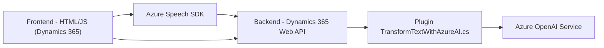

### Breve resumen técnico
El repositorio presenta una solución digital orientada a la integración con Microsoft Dynamics 365. Está diseñada para ampliar las capacidades de reconocimiento y síntesis de voz mediante el SDK de Azure Speech, así como procesar y transformar datos utilizando Azure OpenAI. Está compuesto por dos archivos principales para frontend en JavaScript y un plugin en C# para Dynamics CRM.

---

### Descripción de arquitectura
La arquitectura utiliza **n-capas**, dividiendo las responsabilidades:
1. **Frontend**:
   - Implementación en JavaScript basada en el navegador.
   - Manejo de eventos del formulario y procesamiento vía SDK Azure Speech.
2. **Backend (Dynamics CRM):**
   - Extensibilidad mediante plugins (C#) que integran funciones avanzadas como procesamiento de lenguaje natural usando Azure OpenAI.
3. **Exposición a APIs externas**:
   - Azure Speech SDK para la síntesis y reconocimiento de voz.
   - Azure OpenAI para procesamiento avanzado de texto.
4. **Integración dinámica**:
   - Relación estrecha con Dynamics 365 Web API para la comunicación, buscar entidades de datos y estructurarlas.

Esta arquitectura despliega una solución que combina arquitectura cliente-servidor y modularidad para separar lógicas de frontend y backend. 

---

### Tecnologías usadas y dependencias
#### Tecnologías principales:
1. **Frontend:**
   - **JavaScript** (vanilla) para manipulación de formularios y manejo de SDK dinámico.
   - **Azure Speech SDK**: Reconocimiento y síntesis de texto-a-voz.
2. **Backend:**
   - **Microsoft.CRM SDK**: Extensibilidad de Dynamics CRM.
   - **C#**: Scripts orientados al plugin.
   - **Azure OpenAI Service**: Procesamiento avanzado en la nube.

#### Componentes externos considerados:
- Azure Speech SDK: Para síntesis y reconocimiento de voz.
- Azure OpenAI: Transformación de texto según reglas personalizadas.
- Dynamics 365 Web API: Integración directa para obtener y escribir en formularios dinámicos.
- Bibliotecas JSON (`Newtonsoft` y `System.Text.Json`) para el procesamiento de datos JSON.

---

### Diagrama Mermaid

---

### Conclusión final
La solución combina tecnologías modernas de Microsoft Azure y Dynamics 365 para brindar una experiencia avanzada de interacción entre usuario y datos del formulario. Usa reconocimiento de voz y síntesis con Azure Speech junto con procesamiento avanzado de texto en Azure OpenAI. Con una arquitectura n-capas modular, garantiza mantenibilidad y escalabilidad, cumpliendo estándares corporativos y aprovechando lo último en inteligencia artificial. El uso de SDK externos y una integración directa con Dynamics permite automatizar y enriquecer la capacidad de los formularios empresariales.