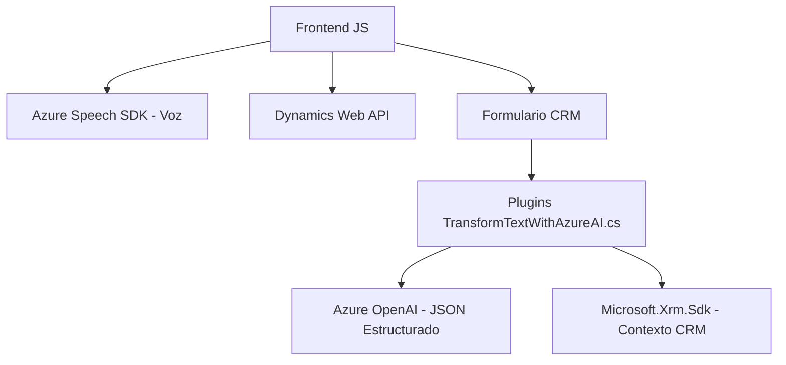

### Breve resumen técnico

Este repositorio implementa soluciones para una integración que combina funcionalidades frontend y backend en un ambiente Dynamics CRM. Utiliza el Azure Speech SDK y servicios asociados como Azure OpenAI para tareas relacionadas con asistencia por voz y procesamiento de textos. Por la naturaleza de los archivos analizados, la solución se configura como una mezcla de **frontend avanzado** y **plugins personalizados** para extender capacidades de CRM.

---

### **Descripción de arquitectura**
#### **Tipo de arquitectura:**  
- **N-capas:** Los componentes se dividen en una capa de presentación (frontend) que interactúa con los usuarios dentro del CRM, y una capa lógica (plugins en C# y llamadas a servicios externos) que realiza operaciones avanzadas.  
- **Integración por servicios externos:** Los sistemas delegan procesamiento intensivo en APIs externas como Azure Speech SDK y Azure OpenAI, simplificando la lógica del repositorio y aprovechando servicios específicos de inteligencia artificial.
- **Extensible:** Usa plugins para personalizar y extender la funcionalidad del CRM, lo que lo convierte en una arquitectura modular.

#### Características principales:  
- **Frontend:** Implementación en JavaScript para interacciones de usuario (capturar voz, procesar información del formulario visual). Usa el Azure Speech SDK para entrada y síntesis de voz.  
- **Backend:** Plugins basados en C# que conectan Dynamics CRM con Azure OpenAI, proporcionando procesamiento avanzado de texto (estructura JSON).  
- **Patrones aplicados:** Modularización, Service Layer, MVC-like para organización de lógica en JavaScript y arquitectura plugin en Dynamics.

---

### **Tecnologías usadas**
1. **Frontend:**  
   - **JavaScript**: Implementación clara de funciones para la gestión de formularios y manipulación de datos del CRM.  
   - **Azure Speech SDK**: Para reconocimiento y síntesis de voz.  
   - **Dynamics CRM Web API**: Interacción directa con contextos del formulario CRM.   

2. **Backend:**  
   - **Microsoft.Xrm.Sdk**: Librería estándar para desarrollo de plugins en Dynamics CRM.  
   - **Azure OpenAI Service:** Procesamiento de lenguaje natural para transformación de textos.  
   - **Newtonsoft.Json.LINQ:** Manipulación de JSON en C#.  
   - **System.Net.Http:** Comunicación HTTP RESTful con servicios externos.  

3. **Patrones:**  
   - Modularización: Separación de responsabilidades entre funciones y clases.  
   - Carga dinámica: Azure Speech SDK se incluye al vuelo.  
   - Encapsulación: Métodos individuales para cada funcionalidad específica.

---

### Diagrama Mermaid

---

### Conclusión final

Este repositorio combina herramientas frontend y backend para extender las capacidades de CRM utilizando inteligencia artificial y procesamiento de lenguaje natural. La arquitectura de **N-capas** segmenta claramente las responsabilidades entre presentación y lógica de negocios, aprovechando servicios externos como Azure para tareas avanzadas. Como resultado, la solución es potente y extensible, aunque podría beneficiarse de mejores prácticas de seguridad en integración de credenciales sensibles.