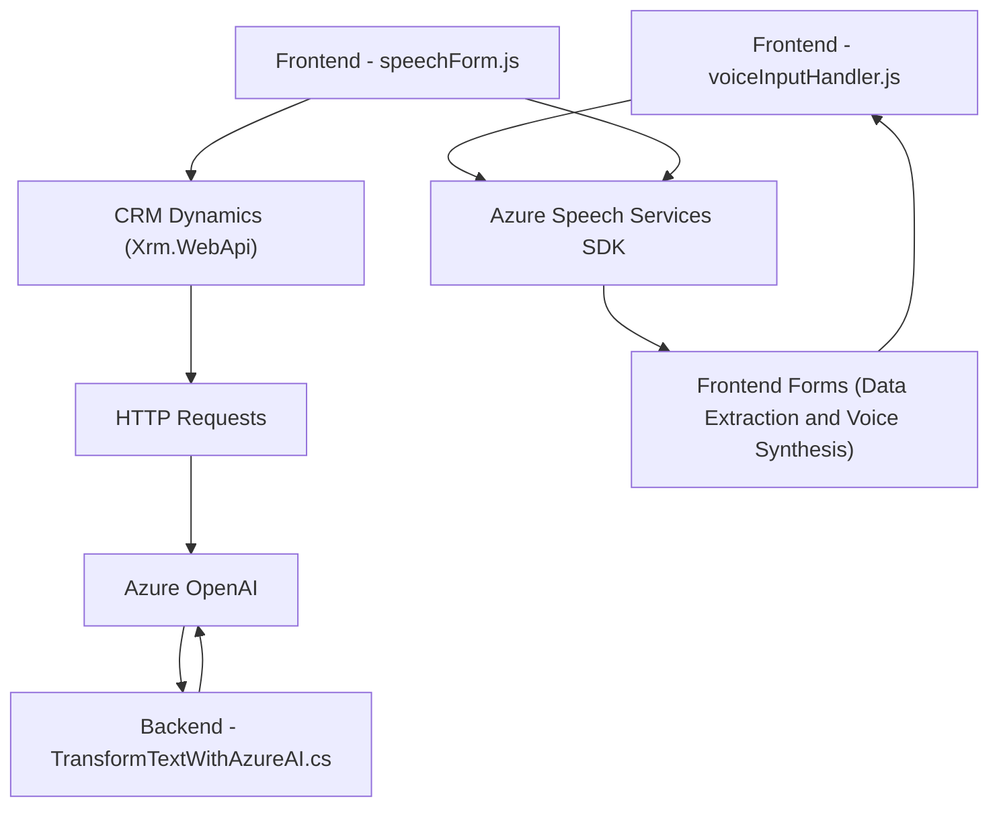

### Breve resumen técnico:
El repositorio parece estar diseñado para integrar servicios de Inteligencia Artificial (IA) con formularios dinámicos basados en plataformas como Dynamics CRM. Utiliza Azure Speech SDK y Azure OpenAI para proporcionar funcionalidad avanzada de entrada/salida y procesamiento de voz, así como transformación de texto. Las clases y métodos están organizados con principios modulares y un enfoque de integración entre frontend y plugins backend.

---

### Descripción de arquitectura:
1. **Tipo de solución**:
   - La solución parece ser una arquitectura híbrida que combina frontend (JavaScript) con plugins backend (.NET) para una plataforma Dynamics CRM.

2. **Arquitectura general**:
   - **Frontend**: Se basa en un enfoque desacoplado y modular para interactuar con SDKs externos (Azure Speech).
   - **Backend**: Implementa una arquitectura basada en plugins adherida al estándar Dynamics CRM y patrones REST para interacción con servicios externos (Azure OpenAI).
   - **Patrón predominante**: Lógicamente, sigue un estilo **n capas**, dividiendo responsabilidades claramente entre la capa de presentación (Frontend), la capa de negocio (Plugins y lógica del código) y la capa de servicios externos (Azure Speech y OpenAI).

---

### Tecnologías usadas:
1. **Frontend**:
   - Azure Speech SDK: Procesamiento y síntesis de voz.
   - JavaScript moderno: Uso de asincronía (`Promises`).
   - Xrm.WebApi: Interacción con Dynamics CRM desde el lado cliente.
   
2. **Backend**:
   - .NET Framework: Plugins desarrollados en C# para Dynamics CRM.
   - Microsoft.Xrm.Sdk: Para el desarrollo de lógica de negocio dentro del entorno CRM.
   - Azure OpenAI: API REST para generación de texto basado en IA.
   - JSON libraries (`System.Text.Json`, `Newtonsoft.Json.Linq`): Para manejar datos estructurados.

3. **Servicios externos**:
   - Azure Speech Services (procesamiento de audio y TTS).
   - Azure OpenAI API (transformación de texto conforme a reglas específicas de negocios).

4. **Patrones usados**:
   - Encapsulación de lógica: Cada función/plugin tiene una única responsabilidad.
   - Adaptador: Integración con SDK externo (Azure Speech y OpenAI).
   - Service Provider Pattern: En backend, el uso intensivo de `IServiceProvider` facilita la integración y desacoplamiento.

---

### Diagrama Mermaid para GitHub Markdown:

---

### Conclusión final:
La solución combina un diseño modular con integración avanzada de servicios externos como Azure Speech y Azure OpenAI para habilitar funcionalidades de procesamiento de voz y transformación de texto. La arquitectura aprovecha n capas, desacoplada por la interacción frontend-backend vía APIs. Esto proporciona escalabilidad y flexibilidad para entornos dinámicos como CRM. El diagrama ilustra claramente la relación entre módulos y servicios involucrados, con el Backend actuando como una extensión que utiliza lógica de negocio personalizada.