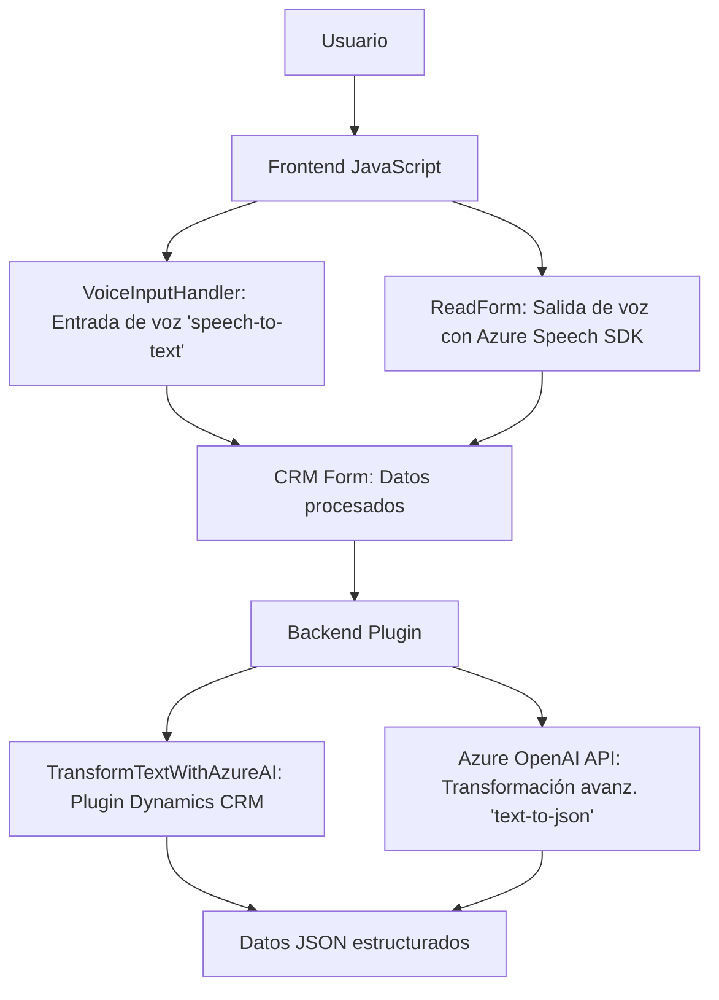

### Breve resumen técnico

Este repositorio contiene tres archivos principales con soluciones diferentes pero interconectadas. El conjunto provee funcionalidades para interacción con formularios CRM, integración de IA mediante APIs de Azure (Speech SDK y OpenAI), gestión de voz para entrada y salida, y transformación de datos. Parece estar diseñado para un entorno Microsoft Dynamics CRM, extendiendo su funcionalidad mediante componentes personalizados en backend (.NET Plugin) y frontend (JavaScript).

---

### Descripción de arquitectura

La solución combina una arquitectura basada en **n capas**:
1. **Capa de Presentación (Frontend)**: Maneja la interacción de usuario, lectura de formularios visuales y manipulación de voz (sintetización y procesamiento).
2. **Capa de Lógica de Negocio (Plugin)**: Procesamiento backend mediante un plugin de Dynamics CRM para transformar datos con Azure OpenAI.
3. **Integración API**: Servicios externos (Azure Speech SDK y OpenAI) para procesos avanzados de sintetización y procesamiento.

En conjunto, esta arquitectura sigue el patrón de **cliente-servidor** al usar Dynamics CRM, integrando servicios externos para extender la funcionalidad del sistema.

---

### Tecnologías usadas

1. **Frontend (JavaScript)**:
   - **Azure Speech SDK**: Sintetización y reconocimiento de voz.
   - Programación asíncrona con `async/await`.
   - Contexto CRM (`Xrm.WebApi`, `formContext`) para interacción con formularios desde Dynamics.
   
2. **Backend (.NET Plugin)**:
   - **Azure OpenAI API**: Procesamiento avanzado de texto.
   - **Microsoft Dynamics SDK**: Implementación basada en `IPlugin` para eventos CRM.
   - **Newtonsoft.Json y System.Text.Json**: Manejo de JSON.

3. **Infraestructura nube**:
   - **Azure Cognitive Services**: Usadas para voz y lenguaje natural.

4. **Patrones de diseño**:
   - **Modular**: Isolación de funciones y responsabilidades específicas.
   - **Factory/Builder Pattern**: Configuración de objetos (ej. `SpeechConfig`).
   - **Plugin Architecture**: Dinámica de integración con Dynamics CRM.
   - **Adapter**: Transformación de datos con integraciones API.

---

### Diagrama Mermaid válido para GitHub

---

### Conclusión final

El repositorio aborda una solución diseñada para extender las capacidades de Dynamics CRM mediante tecnología de nube (Azure). La arquitectura modular y basada en API permite gestionar entrada de voz, salida de texto mediante sintetización, y procesamiento avanzado con IA. Aunque se centra en una arquitectura de **n capas**, algunas funcionalidades muestran acoplamiento fuerte con Dynamics CRM, haciéndola ideal para entornos específicos con necesidades de personalización avanzada.

La implementación refleja un enfoque moderno y eficiente para integrar tecnologías de voz e inteligencia artificial en ecosistemas empresariales. Sin embargo, posibles limitaciones incluyen la dependencia de servicios de Azure, lo que podría afectar la portabilidad hacia otros sistemas.