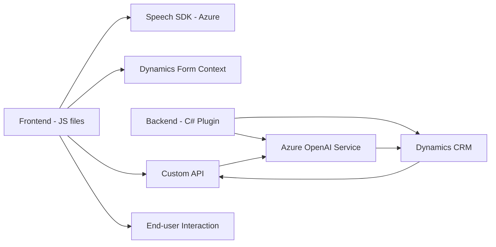

### Análisis y descripción del repositorio:

#### 1. Breve resumen técnico
El repositorio contiene archivos diseñados en diferentes lenguajes orientados a integraciones con complejidad técnica basada en **Azure Speech SDK**, **Azure OpenAI service**, y **Microsoft Dynamics CRM API**. La solución parece estar distribuida y estructurada para proporcionar operaciones de reconocimiento de voz, síntesis de texto a voz, y transformación de texto mediante IA. Según los archivos destacados:

- Los archivos JavaScript apuntan al manejo de formularios en el frontend con capacidades de reconocimiento y síntesis de voz.  
- El archivo C# `TransformTextWithAzureAI.cs` pertenece a un backend orientado a plugins en **Dynamics CRM**, diseñado para interactuar con Azure OpenAI y transformar datos.

---

#### 2. Descripción de arquitectura
La arquitectura es **n-capas distribuida** donde:
- **Frontend Layer** (implementada en JavaScript) gestiona la interacción directa con el usuario, entrada de datos, y despliega servicios de reconocimiento/síntesis de voz mediante el Azure Speech SDK.
- **Backend Layer**:
  - Plugins basados en C# interactúan con Microsoft Dynamics CRM a través de `IPlugin` para operaciones basadas en el servicio Azure OpenAI.  
  - Backend servicios externos para tareas de transformación avanzada mediante modelos IA.
- **API Layer**: Comunicación directa con servicios y SDKs externos:  
  - Azure Speech SDK para reconocer y sintetizar voz.  
  - Azure OpenAI para transformación avanzada.  
  - Dynamics CRM WebAPI para gestionar datos y atributos del sistema.

Se implementa una **arquitectura con integración de servicios externos** (Azure y Dynamics), reflejando características de **componentes desacoplados**, aunque partes del frontend tienen dependencias estrechas con SDKs específicos.

---

#### 3. Tecnologías y patrones usados
- **Frontend:**  
  - **Lenguaje:** JavaScript.  
  - **Frameworks/SDKs:** Azure Speech SDK, Microsoft Dynamics para formularios y APIs.  
  - **Patrones:** Patrón modular funcional, manejo de eventos con callbacks, programación asíncrona (`Promises/Async-Await`).  
  - **Usos:** Integración multimodal (texto, voz), mapeo dinámico de formularios.  

- **Backend:**  
  - **Lenguaje:** C#.  
  - **Frameworks/SDKs:** Azure OpenAI, Dynamics SDK (interfaz `IPlugin` y `IOrganizationService`).  
  - **Librerías:** Newtonsoft.Json para manipulación de datos JSON estructurados.  
  - **Patrones:** Arquitectura Plugin; comunicación vía API REST para integración con Azure OpenAI; inyección de dependencias.

- **Archivos comunes:**  
  Uso directo de servicios externos (Azure Speech y OpenAI) para interacción con APIs REST y SDKs.

---

#### 4. Dependencias o componentes externos
1. **Microsoft Dynamics CRM:** Contexto del repositorio marca fuerte integración con esta plataforma. Uso intensivo de sus APIs y modelos de plugins.
2. **Azure Speech SDK:** Servicios de reconocimiento y síntesis de voz con carga dinámica del SDK.
3. **Azure OpenAI:** Procesamiento avanzado mediante GPT-4 desde endpoints específicos.
4. **Custom API de Dynamics:** Llamada API personalizada para procesamiento adicional del texto reconocido.

---

#### 5. Diagrama Mermaid válido para GitHub

---

### Conclusión final
El repositorio implementa una solución distribuida y orientada a servicios con foco en **integración avanzada entre Microsoft Dynamics CRM y Azure Services**. La arquitectura utilizada puede clasificarse como una solución de **n capas con apalancamiento de servicios externos**, donde cada capa tiene responsabilidades claramente definidas:

1. **Frontend Layer:** Captura información, la procesa y sintetiza mediante voz usando **Azure Speech SDK**.
2. **Backend Layer:** Realiza transformaciones avanzadas de datos mediante plugins **Dynamics CRM** y consultas a **Azure OpenAI**.

Esto permite una funcionalidad robusta, enfocada al soporte de interacción multimodal y la aplicación de inteligencia artificial a través de reconocimiento de voz y transformación de texto. Esta arquitectura facilita la escalabilidad pero puede ser altamente dependiente del ecosistema de Azure y Dynamics.