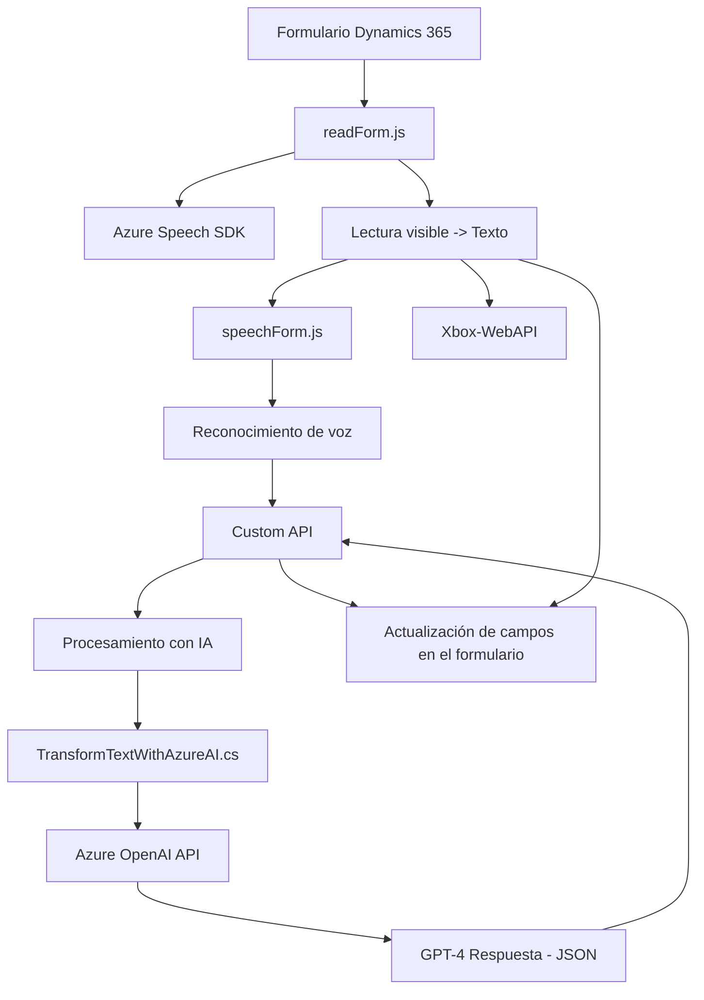

### Breve resumen técnico
El repositorio presenta funcionalidades destinadas a mejorar la interacción entre formularios de Dynamics 365 y servicios externos (Azure Speech SDK y Azure OpenAI). Está organizado como una aplicación orientada a formularios dinámicos, con capacidades de reconocimiento de voz y síntesis de texto, así como un plugin de extensibilidad en Dynamics CRM para transformar texto mediante el servicio GPT-4.

---

### Descripción de arquitectura
La solución describe tres componentes principales:
1. **Frontend JavaScript Modules**:
   - Aquellos enfocados en el reconocimiento de voz y la lectura de formularios con Azure Speech SDK.
   - Operación basada en asincronía, ejecutando comandos de habla y lectura para convertir en texto los datos de formularios dinámicos.
2. **Backend Plugin (`TransformTextWithAzureAI.cs`)**:
   - Actúa como una lógica del lado servidor para transformar el texto mediante interacción directa con Azure OpenAI.
   - Implementa el patrón de extensibilidad específico de Dynamics CRM (`plugin`).
3. **Integración API personalizada**:
   - Mediante el uso de funciones específicas para interactuar con Dynamics 365 mediante API, asegurando cambios en formularios basados en la parametrización (mapeos de campos, transcripciones transformadas).

---

### Tecnologías usadas
1. **Frontend con JavaScript**:
   - **Azure Speech SDK**: Reconocimiento y síntesis de voz.
   - **Promesas y asincronía**: Modularización y carga dinámica.
   - **Dynamics 365 Form APIs**: Manipulación y mapeo de formularios dinámicos.
2. **Backend con C#**:
   - **Microsoft Dynamics CRM SDK**: `IPlugin` implementación para extensibilidad.
   - **Azure OpenAI API**: Uso de GPT-4 para enriquecimiento y transformación de datos.
   - **HTTP client (`System.Net.Http`)**: Comunicación externa.
   - **JSON libraries**: `Newtonsoft.Json.Linq`, `System.Text.Json`.
3. **Integration Services**:
   - Custom API basada en Dynamics 365 para actualizar atributos y gestionar llamados HTTP externos.

---

### Diagrama **Mermaid**

---

### Conclusión final
La solución presentada combina la interacción entre rendimiento en el frontend (procesamiento en vivo mediante Azure Speech SDK) y procesamiento enriquecido en el backend (implementación de plugin y Azure OpenAI). La arquitectura puede considerarse **modular y orientada a servicios**, en tanto existe un alto nivel de desacoplamiento entre los componentes y se delegan tareas complejas como el reconocimiento de voz o la transformación a APIs y servicios externos.

Su potencial reside en su integración con Microsoft Dynamics 365 y el apalancamiento de tecnologías de reconocimiento y procesamiento de lenguaje natural enlazadas con servicios de la nube. Sin embargo, el archivo C# podría beneficiarse de la utilización de configuraciones más seguras y flexibles para sus claves de acceso y endpoints.