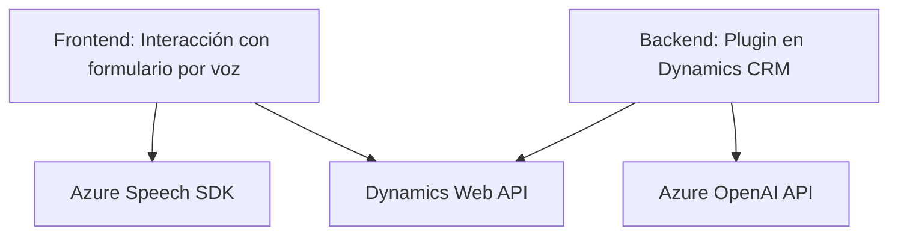

### Resumen Técnico:
El repositorio parece formar parte de una solución orientada a integrar reconocimiento de voz, síntesis de texto a voz y procesamiento de texto mediante servicios de Azure (Speech SDK y OpenAI). Está dividido en varios componentes clave:
1. **Frontend:** Scripts de JavaScript (`readForm.js`, `speechForm.js`) que proporcionan interacción por voz y manipulación de formularios en Dynamics utilizando Azure Speech SDK.
2. **Backend:** Plugin en C# (`TransformTextWithAzureAI.cs`) para la integración de Dynamics CRM con Azure OpenAI.

---

### Descripción de la Arquitectura:
La solución implementa una arquitectura de **n capas**:
- **Frontend:** Scripts en JavaScript actúan como capa de presentación/interacción con el usuario.
- **Backend:** Un plugin ejecutado en Dynamics CRM sirve como capa de negocio para transformar y procesar datos mediante Azure OpenAI.
- **Servicios externos:** Integración directa con Azure Speech SDK para reconocimiento de voz y síntesis de texto a voz, y Azure OpenAI para transformación avanzada de texto.

La integración sigue patrones como **API Gateway** para interactuar con APIs externas y **Modularización** en el diseño del software. 

---

### Tecnologías Usadas:
1. **Azure Speech SDK (JavaScript):** Reconocimiento de voz y síntesis de voz.
2. **Azure OpenAI API (C#):** Procesamiento avanzado de texto mediante IA.
3. **Dynamics CRM SDK (`Microsoft.Xrm.Sdk`):** Manipulación y acceso a datos de los formularios en Dynamics.
4. **Backend en .NET/C#:** Ejecución de lógica empresarial en plugins de Dynamics CRM.
5. **JavaScript:** Gestión dinámica de formularios, carga de SDK, e integración con servicios.
6. **JSON:** Serialización/deserialización de datos para comunicación entre componentes y servicios externos.

---

### Diagrama Mermaid:

---

### Conclusión Final:
Esta solución implementa una integración robusta entre Dynamics CRM y servicios en la nube como Azure Speech y Azure OpenAI. La arquitectura escalable de n capas permite separar responsabilidades: el frontend interactúa mediante JavaScript con SDKs de reconocimiento de voz y el backend C# ejecuta lógica empresarial mediante plugins. Sin embargo, hay algunos riesgos identificados como la falta de cifrado de claves API incrustadas, que deberían ser mitigados mediante mecanismos de configuración segura.