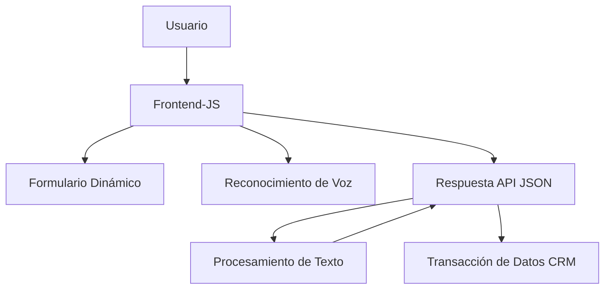

### Breve resumen técnico
El repositorio parece ser parte de un sistema híbrido que integra servicios de Microsoft Dynamics CRM, Azure Speech SDK y Azure OpenAI. Su objetivo principal es ofrecer una solución basada en reconocimiento y procesamiento de voz para entrada y manipulación de datos en formularios, además de un plugin que transforma texto en JSON según reglas específicas.

---

### Descripción de arquitectura
La arquitectura parece ser **modular orientada a servicios**, con las siguientes características principales:
1. **Cliente Frontend:**
   - Es un módulo basado en JavaScript/HTML que interactúa con usuarios generando datos de entrada y lectura de formularios mediante Azure Speech SDK.
   - Las arquitecturas subyacentes siguen elementos del patrón **Event-Driven Architecture**, ya que las funciones se disparan en secuencia basada en eventos como la captura de voz o interacción con el formulario.
   - Hay una clara modularización de las responsabilidades por función (lectura de formularios, reconocimiento de voz, síntesis de texto). Esto refiere a un patrón de diseño **single responsibility principle (SRP)**.

2. **Backend para Microsoft Dynamics CRM:**
   - Proporciona funcionalidades avanzadas a través de un plugin de Dynamics CRM que integra una **microarquitectura de servicios REST** basada en Azure OpenAI, para el procesamiento de texto.
   - Es una arquitectura **n capas**, ya que aprovecha la estructura de Plugins ofrecida por Dynamics CRM, con separación entre capa de presentación, capa lógica de negocios en el plugin y servicios externos.

---

### Tecnologías usadas
1. **Frontend**:
   - Lenguaje: **JavaScript**.
   - SDK: **Azure Speech SDK** para reconocimiento de voz y síntesis de texto.
   - Framework: Posible integración con un frontend dinámico (React, Angular, etc.) debido al uso claro de funciones basadas en contextos de formulario.

2. **Backend/Plugin**:
   - Lenguaje: **C# (.NET)** en forma de plugin para Dynamics CRM.
   - SDK: **Microsoft Dynamics CRM SDK**.
   - API de Azure OpenAI para procesamiento de texto (interacción con modelos GPT a través de endpoints HTTP).
   - Dependencias adicionales: **Newtonsoft.Json**, `HttpClient` (para realizar llamadas HTTP), APIs de manejo de JSON nativas de .NET, expresiones regulares (`System.Text.RegularExpressions`), etc.

---

### Diagrama Mermaid válido para GitHub Markdown

---

### Conclusión final
El repositorio implementa una solución integral basada en voz, lectura de formularios y procesamiento de texto, que parece integrarse con Microsoft Dynamics CRM. El diseño modular basado en servicios externos garantiza que cada funcionalidad esté acoplada de manera independiente, lo que apoya la escalabilidad y mantenibilidad en un modelo **n-capas** híbrido con integración a servicios en la nube. 

Aunque se presenta una arquitectura eficiente, hay oportunidades de mejora, como una mayor documentación y manejo detallado de excepciones. La solución apunta hacia un enfoque moderno y avanzado en integración de servicios inteligentes y voz mediante Azure.