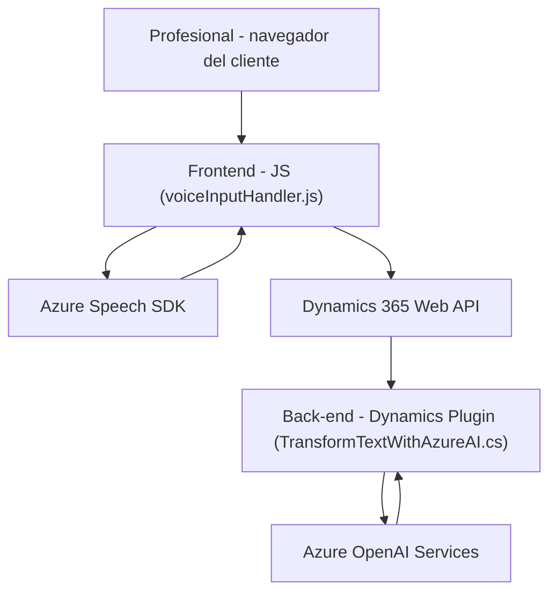

### Breve resumen técnico

El repositorio describe una solución que combina la integración entre front-end (con JavaScript) y back-end (plugin en C#) para interactuar con formularios de Dynamics 365. El sistema utiliza servicios externos, específicamente **Azure Speech SDK** y **Azure OpenAI**, para asumir responsabilidades de reconocimiento de voz, síntesis de texto en voz, y transformación de texto en estructuras JSON mediante inteligencia artificial.

---

### Descripción de arquitectura

La solución tiene componentes que siguen una arquitectura de **n-capas**:
1. **Capa de presentación (front-end)**: Archivos JavaScript (`voiceInputHandler.js` y otros en la carpeta FRONTEND/JS) que gestionan la interacción con el formulario del usuario por medio de Azure Speech SDK.
2. **Capa de lógica de negocio**: El archivo `TransformTextWithAzureAI.cs` implementa un plugin en Dynamics 365 para ejecutar lógica de transformación de texto usando Azure OpenAI.
3. **Capa de integración/externalización**: Uso de dependencias externas como Azure Speech SDK y Azure OpenAI Services para realizar tareas específicas.

El sistema muestra rasgos de **modularidad** y orientación hacia microservicios, incluso considerando que el plugin se integra directamente como parte de Dynamics CRM.

---

### Tecnologías usadas

1. **Frontend:**
   - **Lenguaje**: JavaScript.
   - **Frameworks/librerías**:
     - **Azure Speech SDK**: Reconocimiento y síntesis de voz para extraer datos de formularios y convertirlos en audio.
     - **Dynamics 365 Web API**: Manipulación del contexto del formulario y comunicación con APIs personalizadas.
   - **Patrones**:
     - Modularización: Separación por función específica.
     - Asincronía: Uso de callbacks para asegurar la carga de SDKs.
     - MVC: Gestión de modelos relacionados con los formularios y lógica de control.

2. **Backend:**
   - **Lenguaje**: C#.
   - **Frameworks/librerías**:
     - **Microsoft.Xrm.Sdk**: Desarrollo de plugins en Dynamics CRM.
     - **Azure OpenAI Service**: Procesamiento avanzado de texto con inteligencia artificial.
     - **Newtonsoft.Json** y **System.Text.Json**: Procesado de JSON.
   - **Patrones**:
     - Plug-in architecture: Se adapta al modelo extensible de Dynamics CRM.
     - API Integration: Comunicación con servicios externos mediante llamadas HTTP.
     - Lógica modular: Validación y transformación de texto en pasos bien definidos.

---

### Diagrama Mermaid compatible con GitHub Markdown

---

### Conclusión final

Este repositorio implementa una solución que interactúa con **Dynamics 365 CRM** para facilitar el procesamiento de datos a través de formularios mediante **reconocimiento de voz y transformación de texto asistido por IA**. El enfoque combina un front-end en **JavaScript** con servicios modernos como **Azure Speech SDK** y **Azure OpenAI**, cuyo uso habilita funcionalidad avanzada basada en inteligencia artificial y síntesis de voz. La arquitectura, aunque dependiente de un monolito al estar vinculada directamente a Dynamics CRM, refleja un diseño modular y orientado a servicios externos.