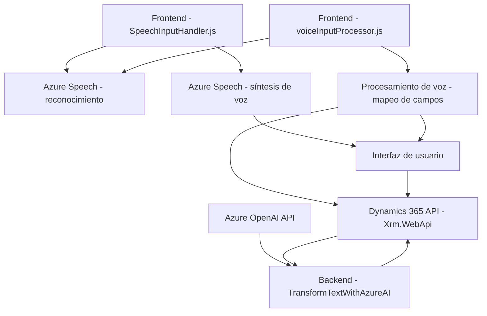

### Breve resumen técnico
El repositorio está diseñado para procesar datos de un formulario y realizar síntesis y entrada de voz a través del **Azure Speech SDK**, incorporando capacidades adicionales con IA mediante **Azure OpenAI**. También integra un plugin para Dynamics CRM que transforma texto en un formato estructurado utilizando **Azure OpenAI APIs**.

---

### Descripción de arquitectura
La solución se integra en el marco de una arquitectura basada en **n-capas**:
1. **Capa de presentación (Frontend):** Contiene scripts JavaScript (`SpeechInputHandler.js`, `voiceInputProcessor.js`) para interactuar con formularios de Dynamics 365. Implementa interfaces para entrada de voz y mapeo de campos.
2. **Capa de lógica de negocio (Backend):** Representada por el plugin **TransformTextWithAzureAI.cs**, que transforma texto proporcionado por el usuario, basado en reglas predefinidas por Microsoft Dynamics CRM.
3. **Capa de integración con servicios externos:** Se utiliza **Azure Speech SDK** para síntesis y reconocimiento de voz, y **Azure OpenAI** para transformación avanzada de textos.

Esta arquitectura se distribuye parcialmente, integrando funcionalidades locales (scripts del frontend) con servicios en la nube (Azure Speech SDK y Azure OpenAI).

---

### Tecnologías usadas
1. **Frontend:**
   - **JavaScript:** Para procesar formularios y realizar síntesis de voz.
   - **Azure Speech SDK:** Para las funciones de reconocimiento y síntesis de voz.
   - **Dynamics 365 APIs (`Xrm.WebApi`)**: Para realizar operaciones CRUD y buscar entidades dentro de formularios.

2. **Backend:**
   - **C# (ASP.NET):** Usado para el plugin del CRM.
   - **Azure OpenAI:** Para transformar texto usando IA avanzada (modelo GPT).
   - **Dynamics CRM Plugin Architecture:** Interfaz `IPlugin` para extender funcionalidades del CRM.

3. **Diseño y patrones:**
   - **Microservicios:** Integración con servicios en la nube (Azure Speech y OpenAI) como parte de la solución.
   - **n-capas:** Separación de responsabilidades entre el frontend, lógica de negocio y comunicación con servicios externos.
   - **Principios SOLID:** Principalmente el SRP en las funciones JavaScript y clases C#.
   - **Dependency Injection:** En el plugin, el contexto `IServiceProvider` permite una gestión más eficiente de dependencias.
   - **Callback-driven programming y Promesas:** Usadas en JavaScript para trabajos asincrónicos con SDKs y APIs externas.

---

### Dependencias o componentes externos
1. **Azure Speech SDK:** Dependencia principal en los scripts del frontend.
   - Generación de voz sintetizada.
   - Reconocimiento de voz.
   - Dinámica de carga mediante script.

2. **Azure OpenAI API (`https://openai-netcore.openai.azure.com/`)**:
   - Procesamiento avanzado de texto bajo normas específicas.
   - Modelos generativos (como **GPT-4o**).

3. **Dynamics 365 APIs (`Xrm.WebApi`):**
   - Manipulación y consulta de formularios y entidades en Dynamics CRM.
   - Implementación específica para captar datos y enviar transformaciones.

4. **Microsoft Dynamics Plugin Framework (`IPlugin`):** Para extender funciones al CRM mediante eventos programados en el backend.

5. **Librerías .NET:** Para integrar funcionalidades con APIs externas, serialización JSON (via `Newtonsoft.Json.Linq` y `System.Text.Json`), y manejo de peticiones HTTP.

---

### Diagrama Mermaid válido para GitHub

---

### Conclusión final
La solución incluye interacción avanzada entre scripts de frontend, un plugin en backend y servicios externos. Combina tecnologías como **JavaScript**, **C#**, **Azure Speech SDK**, y **Azure OpenAI** en una arquitectura **n-capas** con separación de responsabilidades. Aunque podría considerarse un sistema monolítico, la integración con servicios en la nube y el CRM la distingue como una **arquitectura orientada a API/microservicios**. Es un diseño modular, escalable y bien organizado, que permite extender las funcionalidades sin afectar el sistema general.