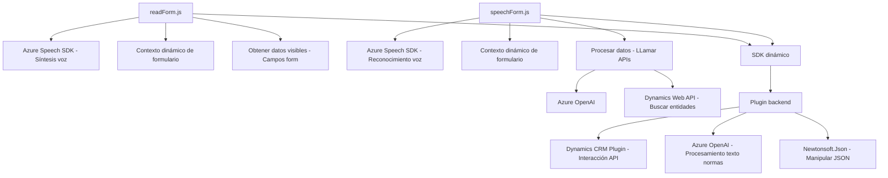

### Breve resumen técnico:
Los archivos analizados implementan un conjunto de soluciones orientadas a la interacción entre usuarios, formularios dinámicos de **Dynamics 365**, y servicios externos como **Azure Speech SDK** y **Azure OpenAI**. La funcionalidad principal incluye la síntesis y reconocimiento de voz, la manipulación de datos en formularios, y el procesamiento basado en IA.

---

### Descripción de arquitectura:
La arquitectura presentada combina distintas capas y servicios:
1. **Plugins en Dynamics CRM:** Utilizan el patrón Plugin Pattern para extender la funcionalidad del CRM mediante servicios .NET y Azure OpenAI.
2. **Frontend funcional:** Los archivos `readForm.js` y `speechForm.js` representan lógica funcional en un enfoque modular, usando JavaScript para interactuar con formularios y servicios externos. Estos scripts soportan la interacción Cliente-Servidor.
3. **Integración con SaaS:** Todo el sistema depende de servicios como **Azure Speech SDK** y **Azure OpenAI** para sus operaciones principales, lo que muestra una arquitectura **Service-Oriented**.
4. **Modelo de arquitectura n-Capas:** Diferentes archivos tienen roles delimitados (UI frontend, lógica plugin backend), que interactúan con servicios externos.

---

### Tecnologías usadas:
- **Frontend:** JavaScript ES6+, integrado con Dynamics 365 (formContext y executionContext).
- **Backend:** .NET Framework con Dynamics 365 SDK (`Microsoft.Xrm.Sdk`) para la extensión mediante plugins.
- **Servicios:** 
  - Azure Speech SDK: Synthesis y reconocimiento de voz.
  - Azure OpenAI: IA para procesamiento del texto.
  - Dynamics 365 Web API: Para operaciones de búsqueda y llamadas a entidades.
- **Librerías adicionales:** `Newtonsoft.Json` en el backend para JSON avanzado.

---

### Diagrama Mermaid válido para GitHub:

---

### Conclusión final:
Esta solución presenta un sistema **multicapa** orientado a servicios que se apoya en **Azure** para la síntesis/reconocimiento de voz y procesamiento de texto con inteligencia artificial, en combinación con **Dynamics CRM plugins**. Las entidades interactúan mediante contextos claramente delimitados, haciendo uso de arquitecturas como **event-driven programming** y **service layer pattern**. La elección de servicios externos aporta escalabilidad y una base para extender funcionalidades futuras sin alteraciones significativas en la arquitectura actual.