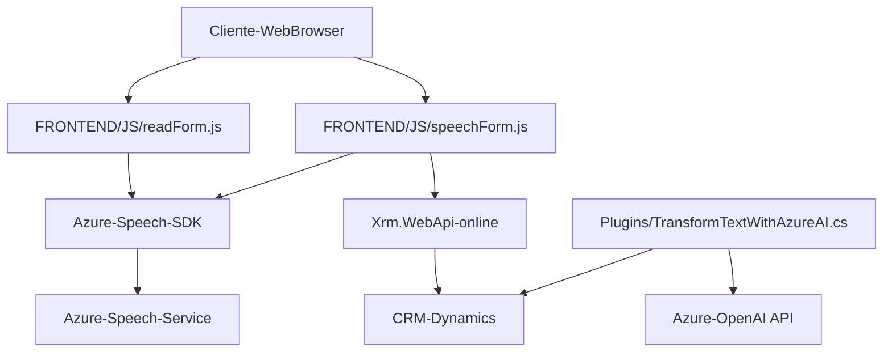

### Breve resumen técnico:
El proyecto es un conjunto de componentes integrados que utiliza Azure Speech SDK y Azure OpenAI para interactuar con formularios en un sistema CRM, posiblemente Microsoft Dynamics. Implementa funcionalidades como reconocimiento y síntesis de voz, procesamiento dinámico de campos de formulario por voz, y transformación de datos mediante un plugin de Dynamics CRM.

---

### **Descripción de arquitectura:**
El software utiliza una arquitectura híbrida que combina:

1. **Frontend (Client-side)**: Módulos JavaScript diseñados para interactuar con Azure Speech SDK y CRM APIs como `<Xrm.WebApi.online>`. Estos facilitan la entrada de datos por voz, la síntesis de formularios, y su manipulación en el frontend de la aplicación.
2. **Backend Plugin**: Implementado en C# mediante un enfoque basado en **plugin architecture**, diseñado para ejecutarse en el marco de Dynamics CRM. Este plugin vincula la entrada de texto del usuario con transformaciones específicas utilizando la API de Azure OpenAI para tratar el contenido con GPT.

El diseño general sigue un patrón **modular** con funciones específicas para cada responsabilidad. Además, utiliza **middleware** para conectar servicios externos (Azure Speech SDK, Azure OpenAI, Dynamics CRM). La naturaleza integrada con CRM y Azure apunta hacia una arquitectura **n capas**, donde los módulos frontend, backend y servicios actúan como capas separadas dentro del sistema.

---

### **Tecnologías usadas:**
1. **Frontend**:
   - JavaScript (vanilla JavaScript)
   - Azure Speech SDK (API de síntesis y reconocimiento)
   - Xrm.WebApi.online (API de Dynamics CRM)

2. **Backend**:
   - Lenguaje: C# (.NET Framework para plugins de Dynamics CRM)
   - Dependencias:
     - Azure OpenAI API (GPT-4 endpoint)
     - System.Net.Http para solicitudes HTTP
     - Microsoft Dynamics CRM SDK para la integración del plugin
   - Patrones: Plugin architecture, singleton-like HttpClient

3. **Servicios Externos**:
   - Azure Speech: Con sintetización de voz y capacidades de reconocimiento de sonido a texto.
   - Azure OpenAI: GPT-4 para transformar textos a JSON estructurado.

4. **Adicionales**:
   - Manejo de formularios dinámicos en CRM por medio de API y mapeo lógico.

---

### **Diagrama Mermaid para GitHub:**
El siguiente diagrama representa las interacciones entre los componentes del sistema: frontend (JavaScript), backend (plugin), y servicios externos (Azure Speech y OpenAI).

---

### **Conclusión Final**:
El repositorio parece ser una solución híbrida que incluye un **frontend implementado en JavaScript** con integración de SDKs externos (Azure Speech), además de un **backend basado en C# plugins** en Dynamics CRM que extiende la funcionalidad del sistema para manejar transformaciones de texto con Azure OpenAI.

La arquitectura modular y basada en eventos mejora la separación de responsabilidades y la mantenibilidad. No obstante, se identificaron algunas áreas de mejora, como el manejo seguro de claves de API y la optimización de código redundante o no utilizado (por ejemplo, ciertas dependencias en el archivo `.cs`). A pesar de ello, las tecnologías están bien integradas y alineadas con las características de un sistema orientado a servicios y n capas.