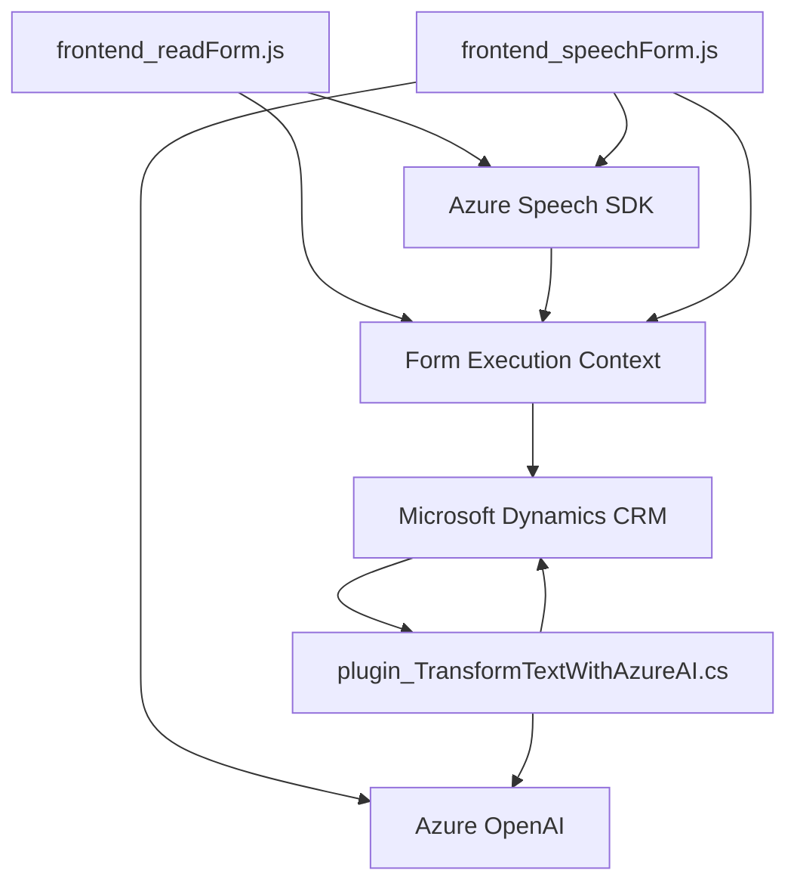

### Breve resumen técnico:
El repositorio explora la integración entre servicios de conversación por voz, reconocimiento de voz, generación de texto hablado y soporte de inteligencia artificial mediante el **Azure Speech SDK** y **Azure OpenAI**. Los archivos representan componentes de una solución que interactúa con un contexto, presumiblemente de formularios o CRM como Microsoft Dynamics 365.

---

### Descripción de la arquitectura:
La solución tiene una arquitectura **modular de capas**, con separación funcional en distintos niveles:
1. **Frontend (FRONTEND folder)**: JavaScript archivos (`readForm.js` y `speechForm.js`) que implementan la lógica de síntesis y reconocimiento de voz a través del **Azure Speech SDK**. Ambos archivos manejan diferentes aspectos del flujo de datos entre usuario, APIs externas y un sistema de representación visual (formularios).
2. **Plugins (TransformTextWithAzureAI.cs)**: Definición de un plugin basado en **Microsoft Dynamics CRM** que sirve como interfaz servidor para transformar comandos hablados en texto estructurado mediante **Azure OpenAI**.

Este diseño puede considerarse una aproximación a una **arquitectura de microservicios**, donde cada componente (frontend y plugin) funciona como un servicio independiente que colabora en el flujo de datos y funcionalidades.

---

### Tecnologías utilizadas:
1. **Azure Speech SDK**: Para reconocimiento y síntesis de voz, gestionando entradas habladas y generando salidas en audio.
2. **Azure OpenAI**: Para transformar texto en formato JSON estructurado, utilizando modelos GPT-4.
3. **Dynamics CRM SDK**: Framework estándar para integración y extensión del entorno de Dynamics 365.
4. **JavaScript**: En el frontend para manipulación DOM, lógica de flujos y comunicación con servicios externos.
5. **C#** (Plugins): Para lógica de negocio orientada a eventos como parte del servidor CRM.
6. **Other libraries**:
   - `Newtonsoft.Json.Linq` para manipulación JSON.
   - `System.Net.Http` para comunicación API REST.

---

### Diagrama Mermaid:

---

### Conclusión final:
La solución integra componentes frontend y backend para crear una experiencia avanzada de interacción basada en voz en formularios de CRM. Los patrones observados sugieren un diseño modular y una aproximación a microservicios con fuerte uso de servicios externos como Azure Speech SDK y Azure OpenAI. Las partes del repositorio están bien estructuradas y separadas según su funcionalidad: la capa frontend gestiona la comunicación con el usuario, mientras que el plugin define patrones de transformación de datos en el contexto del servidor CRM.