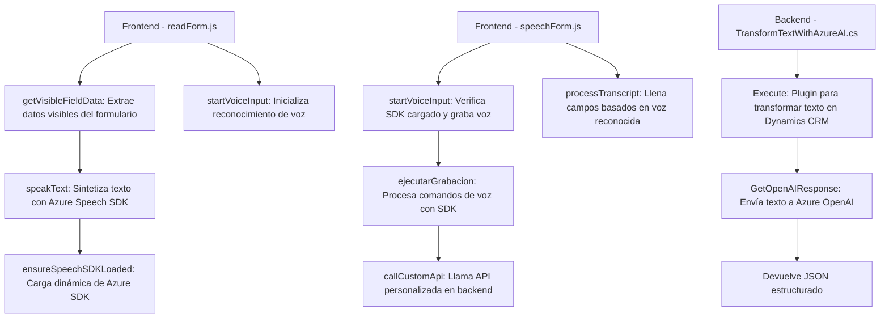

### Breve Resumen Técnico
El repositorio parece ser una solución híbrida que integra el procesamiento de voz con datos dinámicos en una interfaz frontend y backend conectada a un sistema de CRM como Microsoft Dynamics, utilizando servicios de inteligencia artificial de Azure. Incluye un frontend basado en JavaScript para UI/UX y un backend en C# para la integración entre Azure OpenAI y la lógica del negocio.

---

### Descripción de Arquitectura
La arquitectura general incluye:
- **Frontend en JavaScript**: Componentes que interactúan con formularios y utilizan Azure Speech SDK para síntesis y reconocimiento de voz.
- **Backend en C#**: Plugin para Dynamics CRM que transforma texto en JSON estructurado mediante Azure OpenAI Service.
- **Estructura Modular**: Los métodos están claramente organizados con responsabilidades únicas, tanto en el lado de frontend como backend.
- **Patrones utilizados**:
  - **SDK Adapter**: Abstracción de Azure Speech SDK para interactuar con formularios en frontend.
  - **Plugin Observable**: Implementación compatible con Dynamics CRM en el backend.
  - **Dependency Injection**: Uso de `formContext` en JavaScript y `IServiceProvider` en C# para acceder y modificar el estado del sistema.
  - **Client-Server Architecture**: Interacción entre el frontend y Dynamics CRM mediante HTTP y APIs personalizados.

---

### Tecnologías Usadas
1. **Frontend**:
   - JavaScript (DOM API, ES6+).
   - Azure Speech SDK: Sintetización y reconocimiento de voz.
   - Dynamics CRM API: Para recuperar atributos y modificar formularios dinámicos.

2. **Backend**:
   - C#: Desarrollo de plugins.
   - Azure OpenAI Service: Modelo GPT-4 para procesamiento de lenguaje natural.
   - Microsoft Dynamics CRM SDK: Para integrar eventos del modelo de negocio.

3. **Exteriores**:
   - Azure AI Services (Speech SDK y OpenAI).
   - Custom API en Dynamics CRM.

---

### Diagrama Mermaid

---

### Conclusión Final
La solución está diseñada para entornos de Microsoft Dynamics CRM donde la interacción por voz y la IA juegan un papel fundamental en la experiencia del usuario. La arquitectura utiliza un enfoque modular y desacoplado para integrar servicios externos (Azure AI y Speech SDK) con Dynamics CRM. El uso de JavaScript en el frontend asegura una integración dinámica que se complementa con el plugin en C#. Sin embargo, se podrían mejorar las prácticas de gestión de errores, especialmente en las solicitudes HTTP hacia Azure OpenAI y el Speech SDK, para aumentar la robustez del sistema.