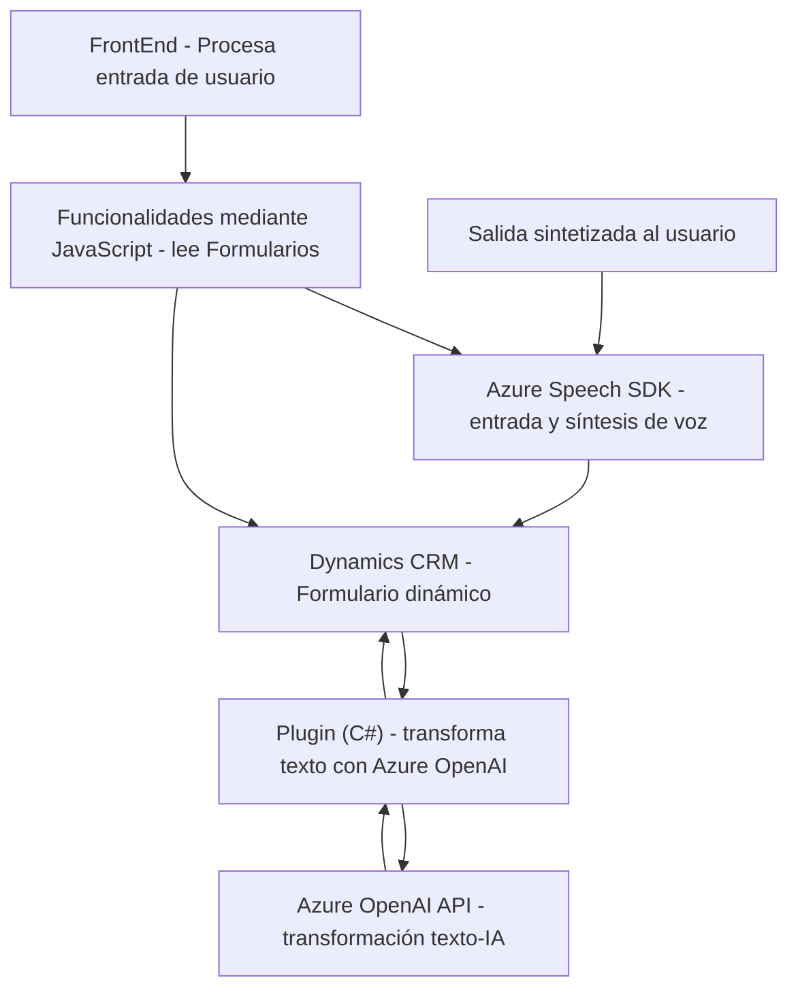

### Breve resumen técnico
El repositorio facilitado establece una solución para integrar funcionalidades avanzadas de entrada y procesamiento de voz, junto con inteligencia artificial basada en Azure OpenAI. Utiliza un enfoque modular complementado por un plugin desarrollado para Dynamics 365 CRM, logrando enriquecer la interacción con un front-end y procesar datos utilizando APIs de Azure y servicios CRM.

### Descripción de arquitectura
La arquitectura de esta solución se puede clasificar como **orientada a servicios con integración de SDK externo**, combinando elementos de **arquitectura n-capas** y características de **arquitectura hexagonal**:
1. **Capa de presentación:** Implementada como un front-end basado en JavaScript que interactúa con el usuario a través de entrada de voz y lectura de formularios CRM.
2. **Capa de lógica empresarial:** Representada por las funciones contenidas en el plugin y JavaScript, encargadas de procesar datos (entrada/salida), tomar decisiones y enviar solicitudes o actualizaciones al CRM y Azure.
3. **Capa de servicios externos:** Incluye las dependencias hacia Azure Speech SDK para entrada y síntesis de voz, así como Azure OpenAI para transformación de texto mediante modelos IA.

La integración SDK y el acceso a APIs externas refuerzan una separación de responsabilidades, mientras que el uso de sistemas como Dynamics 365 CRM implica una alta modularidad y centralización del sistema.

### Tecnologías usadas
1. **Frontend (JavaScript):**
   - Manejo de elementos formales en Dynamics CRM.
   - Uso del SDK de Azure Speech para reconocimiento y síntesis de voz.
2. **Backend (C#, Plugin):**
   - Azure OpenAI API para procesamiento de texto dinámico.
   - Microsoft.Xrm.Sdk para interacción con Dynamics 365.
   - `HttpClient` y JSON parsers (`System.Text.Json`, `Newtonsoft.Json`) para trabajar con APIs externas.
3. **Dependencias externas:**
   - Azure Speech SDK (URL: `https://aka.ms/csspeech/jsbrowserpackageraw`).
   - Azure OpenAI API para inteligencia artificial.

### Diagrama Mermaid

### Conclusión final
Este repositorio configura una solución robusta y modular integrada con Dynamics CRM, compatible con servicios de Azure Speech y Azure OpenAI. Mediante el uso de JavaScript en el front-end y un plugin desarrollado en C#, proporciona funciones avanzadas de entrada de voz, síntesis y procesamiento IA. A nivel arquitectónico, combina características de diseño n-capas y patrones de integración con SDK externos, adaptándose bien a entornos empresariales que buscan enriquecer la experiencia del usuario mediante tecnologías cognitivas.