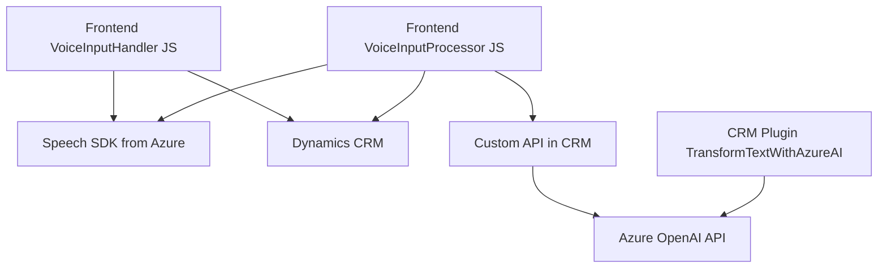

### Breve Resumen Técnico

El repositorio contiene un proyecto orientado principalmente a **integrar capacidades de voz y procesamiento de lenguaje natural (NLP)** en una solución basada en **Microsoft Dynamics 365** y servicios de **Microsoft Azure**. Hay tres módulos principales:  
- **frontend (JavaScript)**: Responsable de la gestión del reconocimiento de voz y síntesis utilizando Azure Speech SDK.  
- **backend (plugin en C#)**: Implementa lógica complementaria de procesamiento de lenguaje usando Azure OpenAI en el contexto del sistema CRM.  

El propósito principal del proyecto es aumentar la accesibilidad y agregar capacidades de entrada y salida de voz para usuarios que interactúan con formularios dinámicos en un sistema CRM.

---

### Descripción de la Arquitectura

- **Tipo de solución:** La solución funciona como una **sistema híbrido** entre un frontend y un plugin especializado en el CRM. El proyecto varía entre un módulo de **frontend JavaScript** para la interacción usuario-aplicación y un **plugin para Dynamics 365**, lo que permite integrar procesamiento avanzado con APIs externas de Microsoft Azure, especialmente servicios de voz y arquitectura basada en IA.  
- **Arquitectura:** Dado que la solución integra un sistema de procesamiento modular (con frontend y backend) basado en componentes, podemos clasificarlo como **Arquitectura de Microservicios en cooperación con una aplicación CRM**. Utiliza una mezcla de patrones, como **Programación Funcional** (en el frontend) y **Plugin-Based Architecture** (en el backend). 

---

### Tecnologías, Frameworks y Patrones Utilizados

#### **Frontend**
- **JavaScript**: Lenguaje base para el frontend.
- **Azure Speech SDK**: Para reconocimiento y sintetización de voz, cargado dinámicamente (lazy-loading pattern).
- **Microsoft Dynamics CRM Context APIs**: Gestión de datos de formulario en un sistema CRM.

#### **Backend**
- **C#**: Lenguaje empleado en el plugin del CRM.
- **Microsoft Dynamics 365 SDK**: Interfaz para la ejecución de plugins en el entorno del CRM.
- **Azure OpenAI API**: Motor de procesamiento de lenguaje natural que transforma datos en JSON estructurado.
- **HttpClient/REST**: Herramientas para consumir servicios externos (Azure OpenAI).

#### **Patrones**
- **Integración con servicios externos**: Uso extensivo de APIs de Azure para síntesis de voz y procesamiento del lenguaje.  
- **Plugin-Based Architecture**: Extiende funcionalidades del CRM con plugins dinámicos.  
- **Service-Oriented Architecture (SOA)**: Backend comunica tareas específicas como transformación NLP mediante servicios externos.  
- **Lazy Loading**: El SDK de Azure Speech se carga dinámicamente solo cuando es necesario.  
- **Programación Funcional**: Separación de responsabilidades por funciones puras con parámetros descriptivos.  
- **Desacoplamiento**: Reutilización y organización de código por funcionalidades.  

---

### Dependencias y Componentes Externos

- **Azure Speech SDK** ([Speech service](https://aka.ms/csspeech/jsbrowserpackageraw)): Para reconocimiento de voz y síntesis en el frontend.  
- **Dynamics CRM Custom APIs** (utilizando `Xrm.WebApi.online.execute`): Para ejecutar comandos y manipular formularios dinámicos.  
- **Azure OpenAI API** ([Documentation](https://learn.microsoft.com/en-us/azure/cognitive-services/openai)): Para procesamiento de texto y transformación en JSON con reglas definidas.  
- **System.Net.Http (HttpClient)**: Realiza peticiones REST al servicio Azure OpenAI.  
- **JSON Handling** (System.Text.Json / Newtonsoft.Json): Para la manipulación y transformación de datos JSON en el backend.  

---

### Diagrama **Mermaid** Compatibles con **GitHub Markdown**

---

### Conclusión Final

La solución es un **híbrido web-CRM** especializado en accesibilidad y procesamiento de formularios mediante síntesis de voz y comandos de voz, integrando servicios avanzados de **AI y NLP** de Azure.  
En el **frontend**, utiliza JavaScript para interactuar con Microsoft Dynamics CRM y el Azure Speech SDK, y emplea técnicas como la **lazy loading** para eficientizar el uso de recursos.  
En el **backend**, implementa un plugin de Dynamics 365 en C# que se conecta con servicios integrados vía REST, como el Azure OpenAI API. La arquitectura del software combina patrones funcionales, integración de servicios empresariales y desacoplamiento para garantizar la mantenibilidad.