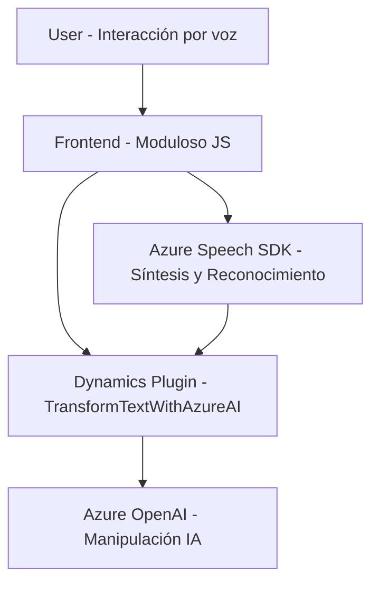

### Breve resumen técnico

El repositorio analiza soluciones que integran interacción por voz y transformación de texto, destinadas a Dynamics 365 y Azure. La funcionalidad incluye el uso de Azure Speech SDK para la síntesis y el reconocimiento de voz, además de insertar datos procesados en formularios. También se implementa un plugin en .NET/C# que extiende Dynamics CRM a través del procesamiento de texto en Azure OpenAI.

---

### Descripción de arquitectura

Este proyecto maneja una **arquitectura en capas integrada**. La solución organiza funcionalidades en diferentes niveles:

1. **Frontend (JavaScript):** Procesamiento local en el navegador, síntesis de voz y reconocimiento de voz interactuando con Azure Speech SDK. También realiza la manipulación de datos dependientes del formulario en Dynamics 365.
2. **API personalizada y plugins en Dynamics CRM:** Servicios extendidos que utilizan conectores y servicios externos (OpenAI en Azure) para datos procesados.
3. **Integraciones externas:** Comunicación con Microsoft Azure APIs (Speech SDK y OpenAI).

La comunicación ocurre entre el lado del cliente, el lado del servidor (Dynamics CRM) y los servicios en la nube, en un diseño modular basado en patrones de integración como "SDK Wrapper" y "Plugin Pattern". Si bien las capas están organizadas en un sistema n-capas, existe un acoplamiento moderado al sistema core (Dynamics CRM).

---

### Tecnologías usadas

1. **Frontend con JavaScript y SDK:**
   - **Azure Speech SDK**: Utilizado para interacción por voz (síntesis y reconocimiento).
   - **APIs del navegador:** Para integrar el SDK y manipular DOM.

2. **Backend:** 
   - **C# con .NET Framework**: Usado para desarrollar plugins que interactúan con Dynamics CRM.
   - **Microsoft Dynamics CRM SDK**: Para manipular datos en ciclos de ejecución como formularios y registros.
   - **Azure OpenAI**: Servicios externos para inteligencia artificial y transformación de texto.
   - **HttpClient**: Comunicaciones HTTP para interactuar con APIs.

3. **Herramientas adicionales:**
   - **System.Text.Json**: Manejo de datos en formato JSON.
   - **Regular Expressions (Regex):** Procesamiento de texto para validación y transformación.
   - **Microsoft.Linq**: Colecciones y filtros de datos.

---

### Diagrama Mermaid válido para GitHub

---

### Conclusión Final

El repositorio implementa una solución de **procesamiento por voz y manipulación de texto dinámica** en contextos de formularios dentro de Microsoft Dynamics 365. La interacción entre capas y la integración de servicios externos es clave para el éxito de la solución.

Las dependencias principales (Azure Speech SDK, OpenAI APIs y Dynamics Plugins) están conectadas horizontalmente mediante una estructura modular y estratégica. Sin embargo, podrían surgir retos relacionados con acoplamiento, limitación de escalabilidad y seguridad de credenciales (endpoint y claves en OpenAI o SDK). Un refactor futuro podría incluir mejoras de seguridad, test unitarios y separación lógica para desacoplar capas.