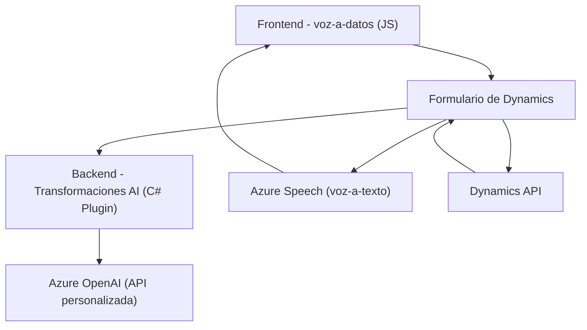

### Resumen técnico:

El repositorio contiene módulos enfocados en implementar funcionalidades críticas como reconocimiento de voz, síntesis mediante servicios de speech-to-text y procesamiento de datos utilizando IA (Azure Speech SDK y Azure OpenAI). Estas capacidades se integran con formularios y APIs de Dynamics 365.

### Descripción de arquitectura:

La solución implementa una arquitectura **en capas** y posee los siguientes componentes:
- **Frontend:** Scripts JS para formularios de Dynamics 365 con funciones que se encargan de gestionar la comunicación entre los datos del usuario (datos visibles en el formulario) y servicios de Azure Speech.
- **Backend:** Plugins en C#, integrados en Dynamics CRM, que procesan datos mediante Azure OpenAI y generan resultados estructurados aplicables a formularios.

### Tecnologías usadas:

1. **Frontend:**
   - **Azure Speech SDK:** Reconocimiento de voz y síntesis de texto a voz.
   - **Dynamics 365 Web API:** Manipulación de datos en formularios.
   - **JavaScript / ES6:** Desarrollo modular basado en funciones.

2. **Backend (Plugins en C#):**
   - **Azure OpenAI:** Transformación de texto según reglas.
   - **Microsoft Dynamics SDK (`IPlugin`, `IPluginExecutionContext`):** Extensibilidad en Dynamics CRM.
   - **HTTP / JSON (`System.Net.Http`, `System.Text.Json`):** Consumo y procesamiento de APIs externas.

### Diagrama Mermaid:

### Conclusión final:

La solución basa su arquitectura en un enfoque **en capas**, donde el frontend gestiona la experiencia interactiva de voz sincronizada con servicios externos (Azure Speech SDK), mientras el backend utiliza un plugin para aplicar procesos avanzados de transformación mediante Azure OpenAI y mapeo de datos en Dynamics 365. Esto demuestra una integración robusta que es ideal para entornos complejos como CRM y sistemas distribuidos.